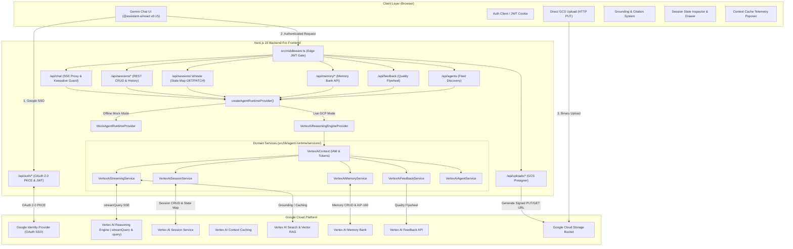
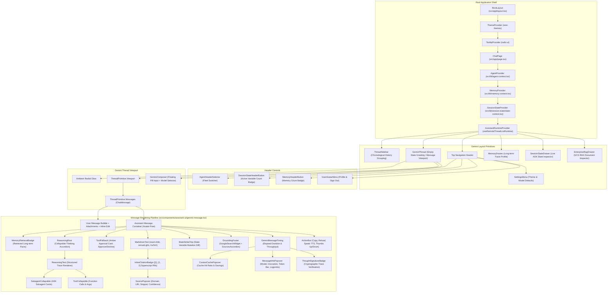
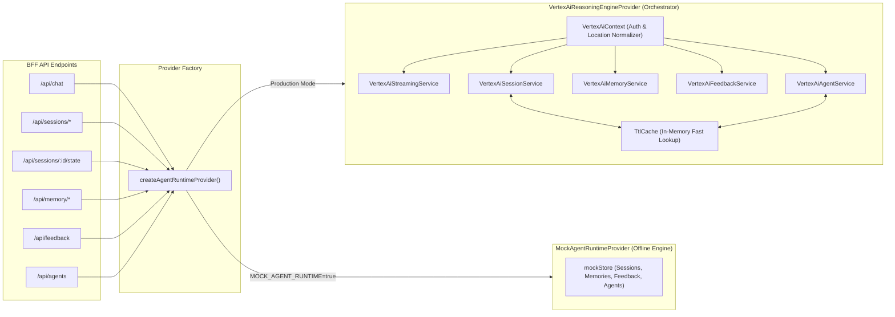
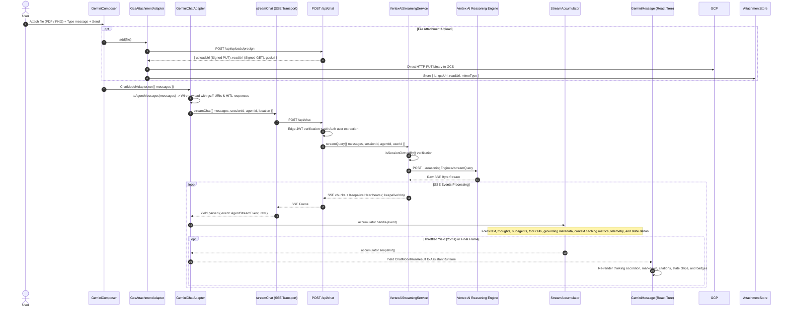
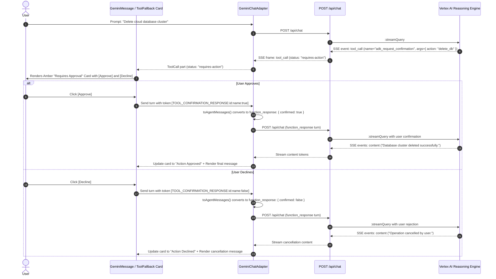

# Agent Runtime UI — Architecture & Contributor Guide

Welcome to the **Agent Runtime UI** architecture documentation. This guide provides a comprehensive, authoritative overview of the application's system design, component hierarchy, data flows, execution lifecycles, and a complete file-by-file index for contributors.

---

## 1. Executive Summary & Architectural Principles

**Agent Runtime UI** (`agent-runtime-ui`) is a production-grade, serverless web application styled after **Google Gemini**. It connects authenticated users to **ADK (Agent Development Kit)** agents hosted on **Google Cloud Agent Runtime** (Vertex AI Reasoning Engines).

```
┌────────────────────────────────────────────────────────────────────────────────────────┐
│                                CLIENT LAYER (Browser)                                  │
│  • Google Gemini Aesthetic (Pill Composer, Ambient Radial Glow, Avatar-Free Turns)     │
│  • @assistant-ui/react v0.15 Primitives + Custom Shiki Code & KaTeX Math Renderer     │
│  • Grounding & Citations ([1], [2] Badges, Google Search Widget, Enterprise RAG Drawer)│
│  • Context Caching & Session State Inspector (Cache Hit Badges, Live State Mutation)   │
│  • Telemetry & Cryptographic Verification (Message Info Popover, Thought Signatures)   │
│  • Multi-Agent Fleet Switcher, Multi-Thread Sidebar, Memory Bank Drawer, HITL Approval │
└──────────────────────────────────────────┬─────────────────────────────────────────────┘
                                           │ HTTPS / SSE Streams / Direct GCS PUTs
                                           ▼
┌────────────────────────────────────────────────────────────────────────────────────────┐
│                           BACKEND-FOR-FRONTEND (Next.js 15)                            │
│  • Edge Middleware & Stateless JWT Cookie Auth (Google Identity OAuth 2.0 PKCE)        │
│  • Modular Domain Services (Context, Streaming, Session, Memory, Feedback, Agent Fleet)│
│  • Provider Strategy Pattern (VertexAiReasoningEngineProvider vs. MockAgentRuntime)   │
│  • SSE Parser, Keepalive Guard & AIP-160 Event Normalization Pipeline                  │
│  • Session Ownership Verification (IDOR & CSRF Protection)                             │
└──────────────────────────────────────────┬─────────────────────────────────────────────┘
                                           │ IAM Bearer Tokens / REST APIs & SSE
                                           ▼
┌────────────────────────────────────────────────────────────────────────────────────────┐
│                                 GOOGLE CLOUD PLATFORM                                  │
│  • Vertex AI Reasoning Engines (:streamQuery & :query SSE Streaming)                   │
│  • Vertex AI Session Service (Multi-turn Multi-Thread Conversation Persistence)        │
│  • Vertex AI Context Caching (Cached Prompt Tokens & Latency Optimization)             │
│  • Vertex AI Search Grounding & Vector Search RAG (Web Search & Enterprise Knowledge)  │
│  • Vertex AI Memory Bank (:retrieve, :generate, Long-Term Fact Store)                  │
│  • Vertex AI Feedback API (Quality Flywheel Evaluation Logging)                        │
│  • Google Cloud Storage (Direct Multimodal Ingestion via Signed URLs)                  │
└────────────────────────────────────────────────────────────────────────────────────────┘
```

### Core Architectural Principles

1. **Backend-For-Frontend (BFF) Pattern**:
   The browser never communicates directly with GCP APIs or holds GCP Service Account private keys. Next.js App Router route handlers securely obtain IAM bearer tokens using `google-auth-library` and proxy requests to Vertex AI endpoints.
2. **Stateless Serverless Authentication**:
   Google Identity OAuth 2.0 PKCE flow issues cryptographically signed HMAC-SHA256 JWT cookies (`HttpOnly`, `SameSite=Lax`, Web Crypto API). Zero database is required, enabling multi-region serverless deployment on Google Cloud Run.
3. **Reactive SSE Streaming & Decoupled State Machine**:
   The chat pipeline streams model tokens (`content`), Gemini 2.0 thought tokens (`thought`), subagent execution traces (`agent_call` / `agent_response`), tool invocations (`tool_call` / `tool_result`), memory retrieval context (`retrieved_memories`), grounding metadata (`grounding_metadata`), and session state mutations (`state_delta`). Streaming transport (`sse-stream.ts`) is cleanly decoupled from state accumulation (`stream-accumulator.ts`) and view projection (`yield-content.ts`).
4. **Google Search Grounding & Enterprise RAG Citations**:
   Real-time search queries and corporate documents are parsed and anchored directly to generated markdown text via interactive inline superscript citation badges (`[1]`, `[1, 2]`), hovering source cards, the official Google Search attribution widget, and a deep-inspection Enterprise RAG drawer.
5. **Context Caching & ADK Session State Inspector**:
   Surfaces Vertex AI context caching telemetry (prompt caching hit ratio, token savings, cost reduction) and provides a dedicated slide-over Session State Inspector to view, filter, add, and live-mutate typed ADK session state variables (`session.state`).
6. **Deep Observability & Cryptographic Verification**:
   Inspect model execution metadata (model version, invocation ID, trace ID, token breakdown progress bar, confidence rating) and verify Gemini 2.0 reasoning traces against cryptographic thought signatures (`thought_signature`).
7. **Dual Execution Engine (Production vs. Offline Mock Mode)**:
   The application features a Strategy Pattern provider architecture. When `MOCK_AGENT_RUNTIME=true` or GCP credentials are absent in development, a fully featured in-memory mock engine emulates all Vertex AI APIs (reasoning engines, sessions, memories, subagent traces, tool calls, grounding, state deltas, and HITL approvals).
8. **Direct-to-Cloud Storage (GCS) Multimodal Ingestion**:
   Large attachments (PDFs, images, audio) bypass Next.js server payload limits via presigned GCS PUT URLs (`/api/uploads/presign`), passing `gs://bucket/...` URIs in the agent's `file_data` turn.

---

## 2. System Architecture Diagrams

### 2.1 End-to-End System Context & Cloud Topology



---

### 2.2 Frontend Component Hierarchy & Assistant UI Tree



---

### 2.3 Modular Agent Runtime & Services Layer Architecture



---

### 2.4 Chat Execution & Streaming Pipeline Architecture



---

### 2.5 Human-in-the-Loop (HITL) Tool Approval Workflow



---

## 3. Comprehensive File Index & Technical Explanations

### 3.1 Root Configuration & Build Files

| File Path                                                                                     | Description & Role                                                                                                                                                                                                                                                                                                              |
| :-------------------------------------------------------------------------------------------- | :------------------------------------------------------------------------------------------------------------------------------------------------------------------------------------------------------------------------------------------------------------------------------------------------------------------------------ |
| [`package.json`](file:///Users/mblanc/projects/agent-runtime-ui/package.json)                 | Declares project dependencies (`@assistant-ui/react` 0.15, Next.js 15, React 19, Tailwind CSS v3, Radix UI primitives, `google-auth-library`, `@google-cloud/storage`, `react-shiki`, `remark-gfm`, `katex`, Vitest, Playwright) and script tasks (`dev`, `build`, `test`, `test:e2e`, `check`, `lint`, `format`, `preflight`). |
| [`next.config.ts`](file:///Users/mblanc/projects/agent-runtime-ui/next.config.ts)             | Next.js configuration enabling standalone Docker output (`output: "standalone"`), server external packages (`google-auth-library`, `@google-cloud/storage`), and strict React mode.                                                                                                                                             |
| [`Dockerfile`](file:///Users/mblanc/projects/agent-runtime-ui/Dockerfile)                     | Multi-stage production container build using Bun and Node.js Alpine base image, packaging the Next.js standalone server for Google Cloud Run deployment.                                                                                                                                                                        |
| [`playwright.config.ts`](file:///Users/mblanc/projects/agent-runtime-ui/playwright.config.ts) | End-to-end test runner configuration with Chromium, Firefox, WebKit fixtures, local dev server auto-spawning, and trace artifact capturing.                                                                                                                                                                                     |
| [`eslint.config.mjs`](file:///Users/mblanc/projects/agent-runtime-ui/eslint.config.mjs)       | ESLint 9 Flat Config integrating `eslint-config-next` and Next.js Core Web Vitals rules.                                                                                                                                                                                                                                        |
| [`postcss.config.mjs`](file:///Users/mblanc/projects/agent-runtime-ui/postcss.config.mjs)     | PostCSS pipeline wiring Tailwind CSS and Autoprefixer.                                                                                                                                                                                                                                                                          |
| [`bun.lock`](file:///Users/mblanc/projects/agent-runtime-ui/bun.lock)                         | Reproducible lockfile for Bun package resolution.                                                                                                                                                                                                                                                                               |
| [`AGENTS.md`](file:///Users/mblanc/projects/agent-runtime-ui/AGENTS.md)                       | Central instructions, context engineering, coding standards, and architectural rules for AI agents modifying this codebase.                                                                                                                                                                                                     |
| [`README.md`](file:///Users/mblanc/projects/agent-runtime-ui/README.md)                       | Developer landing documentation covering quickstart, environment configuration, mock mode, and GCP Cloud Run deployment.                                                                                                                                                                                                        |

---

### 3.2 Security, Auth, Middleware & Shared Utilities

| File Path                                                                                                     | Description & Role                                                                                                                                                                                                                                                                                                                                                                        |
| :------------------------------------------------------------------------------------------------------------ | :---------------------------------------------------------------------------------------------------------------------------------------------------------------------------------------------------------------------------------------------------------------------------------------------------------------------------------------------------------------------------------------- |
| [`src/middleware.ts`](file:///Users/mblanc/projects/agent-runtime-ui/src/middleware.ts)                       | Edge-compatible Next.js routing middleware. Inspects incoming requests for the cryptographically signed `gemini_session` cookie via [`verifySessionToken`](file:///Users/mblanc/projects/agent-runtime-ui/src/lib/jwt.ts). Unauthenticated API requests receive `401 Unauthorized`; unauthenticated page requests redirect to `/login`. Authenticated visits to `/login` redirect to `/`. |
| [`src/lib/jwt.ts`](file:///Users/mblanc/projects/agent-runtime-ui/src/lib/jwt.ts)                             | Lightweight, zero-dependency JWT implementation using the Web Crypto API (`HMAC-SHA256`). Generates and validates cryptographically signed session tokens across edge middleware and serverless routes.                                                                                                                                                                                   |
| [`src/lib/auth.ts`](file:///Users/mblanc/projects/agent-runtime-ui/src/lib/auth.ts)                           | Server-side authentication helpers and Google OAuth 2.0 PKCE client configuration. Manages cookie encryption keys, PKCE state verification, and cookie lifetime settings.                                                                                                                                                                                                                 |
| [`src/lib/auth-client.ts`](file:///Users/mblanc/projects/agent-runtime-ui/src/lib/auth-client.ts)             | Client-side React authentication hook ([`useSession`](file:///Users/mblanc/projects/agent-runtime-ui/src/lib/auth-client.ts#L24)) querying `/api/auth/session` to provide user profile state and authentication status.                                                                                                                                                                   |
| [`src/lib/api-handler.ts`](file:///Users/mblanc/projects/agent-runtime-ui/src/lib/api-handler.ts)             | Higher-order route wrappers ([`withAuth`](file:///Users/mblanc/projects/agent-runtime-ui/src/lib/api-handler.ts) and [`withAuthDynamic`](file:///Users/mblanc/projects/agent-runtime-ui/src/lib/api-handler.ts)) enforcing user authentication on Next.js App Router endpoints, extracting user session claims (`userId`, `userEmail`), and providing structured JSON error handling.     |
| [`src/lib/session-ownership.ts`](file:///Users/mblanc/projects/agent-runtime-ui/src/lib/session-ownership.ts) | Strict authorization helper verifying that requested session resources belong to the caller (`isSessionOwnedBy`), preventing IDOR attacks across multi-tenant reasoning engine deployments.                                                                                                                                                                                               |
| [`src/lib/logger.ts`](file:///Users/mblanc/projects/agent-runtime-ui/src/lib/logger.ts)                       | Structured JSON logger format compatible with Google Cloud Logging (severity levels: `INFO`, `WARNING`, `ERROR`, with request ID tracking).                                                                                                                                                                                                                                               |
| [`src/lib/api-client.ts`](file:///Users/mblanc/projects/agent-runtime-ui/src/lib/api-client.ts)               | Standardized client-side fetch helper with typed JSON deserialization and error normalization.                                                                                                                                                                                                                                                                                            |
| [`src/lib/utils.ts`](file:///Users/mblanc/projects/agent-runtime-ui/src/lib/utils.ts)                         | General utility functions including the Tailwind CSS class merging helper [`cn()`](file:///Users/mblanc/projects/agent-runtime-ui/src/lib/utils.ts) and agent display name formatters.                                                                                                                                                                                                    |

---

### 3.3 Pages & Routing Layer (`src/app/`)

| File Path                                                                                         | Description & Role                                                                                                                                                                                                                                                                                                                                                                                                                                                                                                                                                                                                                                                                                         |
| :------------------------------------------------------------------------------------------------ | :--------------------------------------------------------------------------------------------------------------------------------------------------------------------------------------------------------------------------------------------------------------------------------------------------------------------------------------------------------------------------------------------------------------------------------------------------------------------------------------------------------------------------------------------------------------------------------------------------------------------------------------------------------------------------------------------------------- |
| [`src/app/layout.tsx`](file:///Users/mblanc/projects/agent-runtime-ui/src/app/layout.tsx)         | Root HTML shell with typography, dark/light theme provider ([`ThemeProvider`](file:///Users/mblanc/projects/agent-runtime-ui/src/components/theme/theme-provider.tsx)), KaTeX styles, and Radix UI [`TooltipProvider`](file:///Users/mblanc/projects/agent-runtime-ui/src/components/ui/tooltip.tsx).                                                                                                                                                                                                                                                                                                                                                                                                      |
| [`src/app/page.tsx`](file:///Users/mblanc/projects/agent-runtime-ui/src/app/page.tsx)             | Main Gemini chat view. Coordinates [`AgentProvider`](file:///Users/mblanc/projects/agent-runtime-ui/src/lib/agent-context.tsx), [`MemoryProvider`](file:///Users/mblanc/projects/agent-runtime-ui/src/lib/memory-context.tsx), [`SessionStateProvider`](file:///Users/mblanc/projects/agent-runtime-ui/src/lib/session-state/state-context.tsx), [`useRemoteThreadListRuntime`](file:///Users/mblanc/projects/agent-runtime-ui/src/app/page.tsx), [`GeminiThread`](file:///Users/mblanc/projects/agent-runtime-ui/src/components/assistant-ui/gemini-thread.tsx), [`ThreadSidebar`](file:///Users/mblanc/projects/agent-runtime-ui/src/components/assistant-ui/thread-sidebar.tsx), and inspector drawers. |
| [`src/app/login/page.tsx`](file:///Users/mblanc/projects/agent-runtime-ui/src/app/login/page.tsx) | Gemini-styled login page with ambient glow animation, brand greeting, and one-click Google SSO sign-in button.                                                                                                                                                                                                                                                                                                                                                                                                                                                                                                                                                                                             |
| [`src/app/globals.css`](file:///Users/mblanc/projects/agent-runtime-ui/src/app/globals.css)       | Global Tailwind CSS styling, ambient radial glow animation keyframes, scrollbar styling, and color variables.                                                                                                                                                                                                                                                                                                                                                                                                                                                                                                                                                                                              |

---

### 3.4 Backend-For-Frontend API Routes (`src/app/api/`)

| File Path                                                                                                                                           | HTTP Method & Route                    | Description & Role                                                                                                                                                                                                                                                     |
| :-------------------------------------------------------------------------------------------------------------------------------------------------- | :------------------------------------- | :--------------------------------------------------------------------------------------------------------------------------------------------------------------------------------------------------------------------------------------------------------------------- |
| [`src/app/api/chat/route.ts`](file:///Users/mblanc/projects/agent-runtime-ui/src/app/api/chat/route.ts)                                             | `POST /api/chat`                       | Primary Server-Sent Events (SSE) streaming proxy. Receives user message history and attachments, initiates `:streamQuery` on Vertex AI Reasoning Engines (or Mock Provider), inserts periodic keepalive heartbeats (`: keepalive\n\n`), and streams normalized chunks. |
| [`src/app/api/sessions/route.ts`](file:///Users/mblanc/projects/agent-runtime-ui/src/app/api/sessions/route.ts)                                     | `GET, POST /api/sessions`              | Multi-thread session service proxy. `GET` lists all active chat sessions for the authenticated user (scoped by `userId` and `agentId`); `POST` initializes a new session.                                                                                              |
| [`src/app/api/sessions/[sessionId]/route.ts`](file:///Users/mblanc/projects/agent-runtime-ui/src/app/api/sessions/[sessionId]/route.ts)             | `GET, PATCH, DELETE /api/sessions/:id` | Session lifecycle operations: `GET` loads multi-turn event history transformed into UI-ready message parts; `PATCH` updates session titles; `DELETE` removes the conversation.                                                                                         |
| [`src/app/api/sessions/[sessionId]/state/route.ts`](file:///Users/mblanc/projects/agent-runtime-ui/src/app/api/sessions/[sessionId]/state/route.ts) | `GET, PATCH /api/sessions/:id/state`   | Session state endpoint. `GET` returns current ADK session state key-value map (`session.state`); `PATCH` applies live mutations or creates new typed state variables.                                                                                                  |
| [`src/app/api/agents/route.ts`](file:///Users/mblanc/projects/agent-runtime-ui/src/app/api/agents/route.ts)                                         | `GET /api/agents`                      | Queries deployed Vertex AI Reasoning Engines across configured Google Cloud regions (`GOOGLE_CLOUD_LOCATIONS`) and returns the fleet for the agent switcher dropdown.                                                                                                  |
| [`src/app/api/memory/route.ts`](file:///Users/mblanc/projects/agent-runtime-ui/src/app/api/memory/route.ts)                                         | `GET, POST /api/memory`                | Memory Bank management endpoint. `GET` retrieves user memories filtered by topic; `POST` creates a new semantic fact under the user's scope.                                                                                                                           |
| [`src/app/api/memory/[memoryId]/route.ts`](file:///Users/mblanc/projects/agent-runtime-ui/src/app/api/memory/[memoryId]/route.ts)                   | `PATCH, DELETE /api/memory/:id`        | Updates or deletes an existing memory fact in the Memory Bank.                                                                                                                                                                                                         |
| [`src/app/api/memory/generate/route.ts`](file:///Users/mblanc/projects/agent-runtime-ui/src/app/api/memory/generate/route.ts)                       | `POST /api/memory/generate`            | Triggers Vertex AI Memory Bank `:generate` API to automatically extract key user preferences and profile facts from an active conversation session.                                                                                                                    |
| [`src/app/api/feedback/route.ts`](file:///Users/mblanc/projects/agent-runtime-ui/src/app/api/feedback/route.ts)                                     | `POST /api/feedback`                   | Forwards user thumbs-up/thumbs-down ratings and feedback metadata to the Vertex AI Session Feedback API to drive the Quality Flywheel.                                                                                                                                 |
| [`src/app/api/uploads/presign/route.ts`](file:///Users/mblanc/projects/agent-runtime-ui/src/app/api/uploads/presign/route.ts)                       | `POST /api/uploads/presign`            | Generates short-lived (5-minute) GCS V4 signed PUT upload URLs and signed GET preview URLs for direct-to-cloud multimodal file uploads.                                                                                                                                |
| [`src/app/api/uploads/signed-read/route.ts`](file:///Users/mblanc/projects/agent-runtime-ui/src/app/api/uploads/signed-read/route.ts)               | `POST /api/uploads/signed-read`        | Generates on-demand signed read URLs for existing `gs://...` URIs so media can render securely in the browser.                                                                                                                                                         |
| [`src/app/api/uploads/mock-upload/route.ts`](file:///Users/mblanc/projects/agent-runtime-ui/src/app/api/uploads/mock-upload/route.ts)               | `PUT /api/uploads/mock-upload`         | Local in-memory endpoint that accepts file uploads during mock mode without active GCP storage buckets.                                                                                                                                                                |
| [`src/app/api/auth/sign-in/google/route.ts`](file:///Users/mblanc/projects/agent-runtime-ui/src/app/api/auth/sign-in/google/route.ts)               | `GET /api/auth/sign-in/google`         | Initiates Google OAuth 2.0 PKCE flow, generating cryptographic `state`, `code_verifier`, and redirecting the browser to Google SSO.                                                                                                                                    |
| [`src/app/api/auth/callback/google/route.ts`](file:///Users/mblanc/projects/agent-runtime-ui/src/app/api/auth/callback/google/route.ts)             | `GET /api/auth/callback/google`        | Handles OAuth redirect, exchanges authorization code for Google ID token, verifies user identity, and sets the secure `gemini_session` JWT cookie.                                                                                                                     |
| [`src/app/api/auth/session/route.ts`](file:///Users/mblanc/projects/agent-runtime-ui/src/app/api/auth/session/route.ts)                             | `GET /api/auth/session`                | Validates session cookie and returns current user profile (ID, name, email, avatar).                                                                                                                                                                                   |
| [`src/app/api/auth/sign-out/route.ts`](file:///Users/mblanc/projects/agent-runtime-ui/src/app/api/auth/sign-out/route.ts)                           | `POST /api/auth/sign-out`              | Clears the session cookie and signs the user out.                                                                                                                                                                                                                      |

---

### 3.5 Modular Agent Runtime Backend Services (`src/lib/agent-runtime/`)

| File Path                                                                                                                                                   | Description & Role                                                                                                                                                                                                                                                                                                                  |
| :---------------------------------------------------------------------------------------------------------------------------------------------------------- | :---------------------------------------------------------------------------------------------------------------------------------------------------------------------------------------------------------------------------------------------------------------------------------------------------------------------------------- |
| [`src/lib/agent-runtime/types.ts`](file:///Users/mblanc/projects/agent-runtime-ui/src/lib/agent-runtime/types.ts)                                           | Defines the [`IAgentRuntimeProvider`](file:///Users/mblanc/projects/agent-runtime-ui/src/lib/agent-runtime/types.ts) interface contract defining standard operations for any runtime backend (streaming queries, session CRUD, state mutation, memory management, feedback submission).                                             |
| [`src/lib/agent-runtime/factory.ts`](file:///Users/mblanc/projects/agent-runtime-ui/src/lib/agent-runtime/factory.ts)                                       | Factory method [`createAgentRuntimeProvider`](file:///Users/mblanc/projects/agent-runtime-ui/src/lib/agent-runtime/factory.ts) inspecting environment variables (`MOCK_AGENT_RUNTIME`, `GOOGLE_CLOUD_PROJECT`, `GOOGLE_REASONING_ENGINE_ID`) to instantiate either `VertexAiReasoningEngineProvider` or `MockAgentRuntimeProvider`. |
| [`src/lib/agent-runtime/client.ts`](file:///Users/mblanc/projects/agent-runtime-ui/src/lib/agent-runtime/client.ts)                                         | Orchestrator implementing `IAgentRuntimeProvider` by composing domain-specific sub-services (`VertexAiContext`, `VertexAiStreamingService`, `VertexAiSessionService`, `VertexAiMemoryService`, `VertexAiFeedbackService`, `VertexAiAgentService`).                                                                                  |
| [`src/lib/agent-runtime/services/context.ts`](file:///Users/mblanc/projects/agent-runtime-ui/src/lib/agent-runtime/services/context.ts)                     | Core context service managing GoogleAuth IAM bearer token minting, project/location defaults, and engine resource name normalization.                                                                                                                                                                                               |
| [`src/lib/agent-runtime/services/streaming-service.ts`](file:///Users/mblanc/projects/agent-runtime-ui/src/lib/agent-runtime/services/streaming-service.ts) | Domain service executing Vertex AI Reasoning Engine `:streamQuery` (with fallback to `:query`), handling regional endpoint routing, session ownership validation, and SSE byte streaming.                                                                                                                                           |
| [`src/lib/agent-runtime/services/session-service.ts`](file:///Users/mblanc/projects/agent-runtime-ui/src/lib/agent-runtime/services/session-service.ts)     | Domain service managing Vertex AI Session Service REST API (listing sessions, creating sessions, fetching turn event history, patching session titles, deleting sessions, and inspecting/mutating `session.state`).                                                                                                                 |
| [`src/lib/agent-runtime/services/memory-service.ts`](file:///Users/mblanc/projects/agent-runtime-ui/src/lib/agent-runtime/services/memory-service.ts)       | Domain service communicating with Vertex AI Memory Bank (`:retrieve`, `:generate`, fact CRUD with AIP-160 topic filters).                                                                                                                                                                                                           |
| [`src/lib/agent-runtime/services/feedback-service.ts`](file:///Users/mblanc/projects/agent-runtime-ui/src/lib/agent-runtime/services/feedback-service.ts)   | Domain service submitting thumbs-up/thumbs-down evaluation feedback entries to the Vertex AI Feedback API.                                                                                                                                                                                                                          |
| [`src/lib/agent-runtime/services/agent-service.ts`](file:///Users/mblanc/projects/agent-runtime-ui/src/lib/agent-runtime/services/agent-service.ts)         | Domain service querying and discovering deployed Vertex AI Reasoning Engines across multiple configured GCP regions.                                                                                                                                                                                                                |
| [`src/lib/agent-runtime/services/ttl-cache.ts`](file:///Users/mblanc/projects/agent-runtime-ui/src/lib/agent-runtime/services/ttl-cache.ts)                 | In-memory time-to-live caching utility for caching agent discovery lists and regional endpoint metadata.                                                                                                                                                                                                                            |
| [`src/lib/agent-runtime/sse-parser.ts`](file:///Users/mblanc/projects/agent-runtime-ui/src/lib/agent-runtime/sse-parser.ts)                                 | Asynchronous generator converting raw Server-Sent Event byte chunks into strongly typed `AgentStreamEvent` objects.                                                                                                                                                                                                                 |
| [`src/lib/agent-runtime/parse-event.ts`](file:///Users/mblanc/projects/agent-runtime-ui/src/lib/agent-runtime/parse-event.ts)                               | Chunk parser transforming individual JSON SSE data payloads into normalized `AgentStreamEvent` structures.                                                                                                                                                                                                                          |
| [`src/lib/agent-runtime/event-normalizer.ts`](file:///Users/mblanc/projects/agent-runtime-ui/src/lib/agent-runtime/event-normalizer.ts)                     | Utility functions for normalizing raw Vertex AI session events and history payloads.                                                                                                                                                                                                                                                |
| [`src/lib/agent-runtime/group-turns.ts`](file:///Users/mblanc/projects/agent-runtime-ui/src/lib/agent-runtime/group-turns.ts)                               | Turn grouping algorithm that collapses multi-event Vertex AI session turns into unified user and assistant turns.                                                                                                                                                                                                                   |
| [`src/lib/agent-runtime/reasoning-directives.ts`](file:///Users/mblanc/projects/agent-runtime-ui/src/lib/agent-runtime/reasoning-directives.ts)             | Formatting directives for structured reasoning traces and collapsible subagent/tool blocks.                                                                                                                                                                                                                                         |
| [`src/lib/agent-runtime/to-thread-messages.ts`](file:///Users/mblanc/projects/agent-runtime-ui/src/lib/agent-runtime/to-thread-messages.ts)                 | Converter transforming normalized session turn history into `@assistant-ui/react` `ThreadMessage` objects for rehydration.                                                                                                                                                                                                          |
| [`src/lib/agent-runtime/mock/mock-provider.ts`](file:///Users/mblanc/projects/agent-runtime-ui/src/lib/agent-runtime/mock/mock-provider.ts)                 | Full in-memory implementation of `IAgentRuntimeProvider` emulating multi-step reasoning, subagents, tool calls, grounding, state deltas, and HITL confirmations.                                                                                                                                                                    |
| [`src/lib/agent-runtime/mock/mock-store.ts`](file:///Users/mblanc/projects/agent-runtime-ui/src/lib/agent-runtime/mock/mock-store.ts)                       | In-memory collections backing mock mode (sessions, state maps, memories, feedback, deployed engines).                                                                                                                                                                                                                               |
| [`src/lib/agent-runtime-client.ts`](file:///Users/mblanc/projects/agent-runtime-ui/src/lib/agent-runtime-client.ts)                                         | Backward-compatible facade delegating calls to `IAgentRuntimeProvider`.                                                                                                                                                                                                                                                             |

---

### 3.6 Chat Adapters & Streaming Pipeline (`src/lib/adapters/`)

| File Path                                                                                                                                 | Description & Role                                                                                                                                                                                                                             |
| :---------------------------------------------------------------------------------------------------------------------------------------- | :--------------------------------------------------------------------------------------------------------------------------------------------------------------------------------------------------------------------------------------------- |
| [`src/lib/adapters/chat-adapter.ts`](file:///Users/mblanc/projects/agent-runtime-ui/src/lib/adapters/chat-adapter.ts)                     | Core `ChatModelAdapter` implementation. Transforms assistant-ui thread messages into `AgentMessage` wire format via `toAgentMessages`, drives the streaming run loop, and delegates accumulator snapshots.                                     |
| [`src/lib/adapters/stream-accumulator.ts`](file:///Users/mblanc/projects/agent-runtime-ui/src/lib/adapters/stream-accumulator.ts)         | Robust state machine managing streaming turn state. Accumulates text chunks, thinking traces, subagent cards, tool calls, memory items, grounding metadata, context cache metrics, and state deltas, yielding throttled snapshots (25ms).      |
| [`src/lib/adapters/sse-stream.ts`](file:///Users/mblanc/projects/agent-runtime-ui/src/lib/adapters/sse-stream.ts)                         | SSE HTTP transport layer reading streamed chunks from `/api/chat` via `ReadableStreamDefaultReader` and emitting parsed frames.                                                                                                                |
| [`src/lib/adapters/yield-content.ts`](file:///Users/mblanc/projects/agent-runtime-ui/src/lib/adapters/yield-content.ts)                   | Pure builder constructing `@assistant-ui/react` `ChatModelRunResult` snapshots from accumulator state.                                                                                                                                         |
| [`src/lib/adapters/debug-stream.ts`](file:///Users/mblanc/projects/agent-runtime-ui/src/lib/adapters/debug-stream.ts)                     | Diagnostic logging utility for stream events and transport lifecycle events.                                                                                                                                                                   |
| [`src/lib/adapters/feedback-adapter.ts`](file:///Users/mblanc/projects/agent-runtime-ui/src/lib/adapters/feedback-adapter.ts)             | Implements `@assistant-ui/react` `FeedbackAdapter`, forwarding thumbs up/down user reactions to `/api/feedback`.                                                                                                                               |
| [`src/lib/adapters/gcs-attachment-adapter.ts`](file:///Users/mblanc/projects/agent-runtime-ui/src/lib/adapters/gcs-attachment-adapter.ts) | Implements `@assistant-ui/react` `AttachmentAdapter`. Handles file picker interactions, requests presigned upload URLs from `/api/uploads/presign`, performs direct HTTP PUT to GCS, and converts files to `file_data` message attachments.    |
| [`src/lib/adapters/speech-adapters.ts`](file:///Users/mblanc/projects/agent-runtime-ui/src/lib/adapters/speech-adapters.ts)               | Web Speech API wrappers providing browser-native Speech-to-Text (`WebSpeechDictationAdapter`) and Text-to-Speech (`WebSpeechSynthesisAdapter`).                                                                                                |
| [`src/lib/session-adapter.tsx`](file:///Users/mblanc/projects/agent-runtime-ui/src/lib/session-adapter.tsx)                               | Implements `@assistant-ui/react` v0.15 `RemoteThreadListAdapter` and `ThreadHistoryAdapter`, synchronizing thread list, thread creation, deletion, renaming, automatic title generation, and message loading with the backend Session Service. |
| [`src/lib/attachments/attachment-store.ts`](file:///Users/mblanc/projects/agent-runtime-ui/src/lib/attachments/attachment-store.ts)       | In-memory registry associating client attachment IDs with GCS URIs, presigned read URLs, and MIME types across composer turns.                                                                                                                 |
| [`src/lib/attachments/mime-types.ts`](file:///Users/mblanc/projects/agent-runtime-ui/src/lib/attachments/mime-types.ts)                   | MIME type detection, file extension mapping, and upload size validation.                                                                                                                                                                       |

---

### 3.7 Assistant UI & Gemini Chat Components (`src/components/assistant-ui/`)

| File Path                                                                                                                                                           | Description & Role                                                                                                                                                                                                                              |
| :------------------------------------------------------------------------------------------------------------------------------------------------------------------ | :---------------------------------------------------------------------------------------------------------------------------------------------------------------------------------------------------------------------------------------------- |
| [`src/components/assistant-ui/gemini-thread.tsx`](file:///Users/mblanc/projects/agent-runtime-ui/src/components/assistant-ui/gemini-thread.tsx)                     | Main thread view container. Renders the centered Gemini ambient glow greeting with suggested starter prompts in empty state, scrollable message viewport, and floating pill composer.                                                           |
| [`src/components/assistant-ui/gemini-composer.tsx`](file:///Users/mblanc/projects/agent-runtime-ui/src/components/assistant-ui/gemini-composer.tsx)                 | Single-row pill composer with `+` tools menu, dynamic auto-resizing input, model selector (`Flash` / `Pro`), voice dictation button, attachment chips, and stateful send/stop button.                                                           |
| [`src/components/assistant-ui/gemini-message.tsx`](file:///Users/mblanc/projects/agent-runtime-ui/src/components/assistant-ui/gemini-message.tsx)                   | Message rendering pipeline: right-aligned warm-grey user bubbles with inline editing, full-width avatar-free assistant turns, thinking accordion, subagent/tool cards, markdown text, citations, grounding footer, state chips, and action bar. |
| [`src/components/assistant-ui/gemini-message-timing.tsx`](file:///Users/mblanc/projects/agent-runtime-ui/src/components/assistant-ui/gemini-message-timing.tsx)     | Renders generation duration, token throughput (tokens/sec), context cache savings badge, message info popover trigger, and thought signature verification badge.                                                                                |
| [`src/components/assistant-ui/message-info-popover.tsx`](file:///Users/mblanc/projects/agent-runtime-ui/src/components/assistant-ui/message-info-popover.tsx)       | Floating popover displaying model version, invocation ID, execution trace ID, token breakdown progress bar (prompt, candidate, cached), and model confidence rating.                                                                            |
| [`src/components/assistant-ui/thought-signature-badge.tsx`](file:///Users/mblanc/projects/agent-runtime-ui/src/components/assistant-ui/thought-signature-badge.tsx) | Cryptographic reasoning trace verification badge and signature inspection popover for Gemini 2.0 thought integrity.                                                                                                                             |
| [`src/components/assistant-ui/reasoning.tsx`](file:///Users/mblanc/projects/agent-runtime-ui/src/components/assistant-ui/reasoning.tsx)                             | Primitives for the collapsible thinking accordion (`ReasoningRoot`, `ReasoningTrigger`, `ReasoningContent`, `ReasoningText`).                                                                                                                   |
| [`src/components/assistant-ui/thought-collapsible.tsx`](file:///Users/mblanc/projects/agent-runtime-ui/src/components/assistant-ui/thought-collapsible.tsx)         | Individual collapsible thought block container.                                                                                                                                                                                                 |
| [`src/components/assistant-ui/subagent-collapsible.tsx`](file:///Users/mblanc/projects/agent-runtime-ui/src/components/assistant-ui/subagent-collapsible.tsx)       | Subagent execution trace card displaying subagent name, status indicator (running/complete), input task, and structured response.                                                                                                               |
| [`src/components/assistant-ui/tool-collapsible.tsx`](file:///Users/mblanc/projects/agent-runtime-ui/src/components/assistant-ui/tool-collapsible.tsx)               | Tool execution card displaying tool name, JSON arguments, and execution result payload.                                                                                                                                                         |
| [`src/components/assistant-ui/tool-fallback.tsx`](file:///Users/mblanc/projects/agent-runtime-ui/src/components/assistant-ui/tool-fallback.tsx)                     | General tool renderer and Human-in-the-Loop (HITL) amber confirmation card with **[Approve]** and **[Decline]** action buttons.                                                                                                                 |
| [`src/components/assistant-ui/tool-group.tsx`](file:///Users/mblanc/projects/agent-runtime-ui/src/components/assistant-ui/tool-group.tsx)                           | Container grouping multiple concurrent tool calls within a reasoning block.                                                                                                                                                                     |
| [`src/components/assistant-ui/tooltip-icon-button.tsx`](file:///Users/mblanc/projects/agent-runtime-ui/src/components/assistant-ui/tooltip-icon-button.tsx)         | Accessible icon button with Radix UI hover tooltip.                                                                                                                                                                                             |
| [`src/components/assistant-ui/markdown-text.tsx`](file:///Users/mblanc/projects/agent-runtime-ui/src/components/assistant-ui/markdown-text.tsx)                     | Markdown renderer integrating `react-shiki` syntax highlighting, `remark-gfm`, and citation parsing that injects `InlineCitationBadge` components into text nodes.                                                                              |
| [`src/components/assistant-ui/shiki-highlighter.tsx`](file:///Users/mblanc/projects/agent-runtime-ui/src/components/assistant-ui/shiki-highlighter.tsx)             | Code block syntax highlighter powered by Shiki with dark/light theme switching and one-click code copy button.                                                                                                                                  |
| [`src/components/assistant-ui/thread-sidebar.tsx`](file:///Users/mblanc/projects/agent-runtime-ui/src/components/assistant-ui/thread-sidebar.tsx)                   | Multi-thread history sidebar with chronological grouping (Today, Yesterday, Older), thread switching, renaming, deletion, and new chat creation.                                                                                                |

---

### 3.8 Grounding & Citations Subsystem (`src/components/grounding/` & `src/lib/grounding/`)

| File Path                                                                                                                                                             | Description & Role                                                                                                                               |
| :-------------------------------------------------------------------------------------------------------------------------------------------------------------------- | :----------------------------------------------------------------------------------------------------------------------------------------------- |
| [`src/components/grounding/inline-citation-badge.tsx`](file:///Users/mblanc/projects/agent-runtime-ui/src/components/grounding/inline-citation-badge.tsx)             | Interactive superscript citation pill (`[1]`, `[1, 2]`) rendered inline within markdown text, with hover/click popovers and keyboard navigation. |
| [`src/components/grounding/source-popover.tsx`](file:///Users/mblanc/projects/agent-runtime-ui/src/components/grounding/source-popover.tsx)                           | Detailed floating popover displaying source title, domain badge, GCS URI, snippet text, and confidence score.                                    |
| [`src/components/grounding/google-search-widget.tsx`](file:///Users/mblanc/projects/agent-runtime-ui/src/components/grounding/google-search-widget.tsx)               | Sanitized Google Search Grounding attribution container rendering official search suggestions (`searchEntryPoint.renderedContent`).              |
| [`src/components/grounding/grounding-sources-accordion.tsx`](file:///Users/mblanc/projects/agent-runtime-ui/src/components/grounding/grounding-sources-accordion.tsx) | Expandable sources accordion detailing search queries, web source links, and corporate RAG documents.                                            |
| [`src/components/grounding/enterprise-rag-drawer.tsx`](file:///Users/mblanc/projects/agent-runtime-ui/src/components/grounding/enterprise-rag-drawer.tsx)             | Slide-over drawer for deep inspection of enterprise RAG document text excerpts, chunk metadata, and GCS source URIs.                             |
| [`src/components/grounding/grounding-footer.tsx`](file:///Users/mblanc/projects/agent-runtime-ui/src/components/grounding/grounding-footer.tsx)                       | Composite footer component integrating the sources accordion, Google Search widget, and RAG drawer trigger.                                      |
| [`src/components/grounding/grounding-context.tsx`](file:///Users/mblanc/projects/agent-runtime-ui/src/components/grounding/grounding-context.tsx)                     | React Context Provider and hook managing active citation state and RAG drawer visibility.                                                        |
| [`src/lib/grounding/citation-parser.ts`](file:///Users/mblanc/projects/agent-runtime-ui/src/lib/grounding/citation-parser.ts)                                         | Core parser extracting grounding metadata, resolving 1-based citation indices, extracting domains/GCS paths, and merging multi-chunk metadata.   |

---

### 3.9 Context Caching & ADK Session State Subsystem (`src/components/session-state/` & `src/components/context-caching/`)

| File Path                                                                                                                                                                     | Description & Role                                                                                                                                                                                                                      |
| :---------------------------------------------------------------------------------------------------------------------------------------------------------------------------- | :-------------------------------------------------------------------------------------------------------------------------------------------------------------------------------------------------------------------------------------- |
| [`src/components/context-caching/context-cache-popover.tsx`](file:///Users/mblanc/projects/agent-runtime-ui/src/components/context-caching/context-cache-popover.tsx)         | Floating popover and timing badge displaying cache hit ratio, token savings, and estimated cost reduction.                                                                                                                              |
| [`src/lib/context-caching/cache-metrics.ts`](file:///Users/mblanc/projects/agent-runtime-ui/src/lib/context-caching/cache-metrics.ts)                                         | Pure metric calculation functions determining cache hit ratio, token savings, and cost efficiency.                                                                                                                                      |
| [`src/components/session-state/session-state-drawer.tsx`](file:///Users/mblanc/projects/agent-runtime-ui/src/components/session-state/session-state-drawer.tsx)               | Slide-over inspector drawer for viewing, filtering, searching, and live-mutating ADK session state variables (`session.state`).                                                                                                         |
| [`src/components/session-state/session-state-header-button.tsx`](file:///Users/mblanc/projects/agent-runtime-ui/src/components/session-state/session-state-header-button.tsx) | Top navigation header button with live state variable count badge.                                                                                                                                                                      |
| [`src/components/session-state/state-delta-chip.tsx`](file:///Users/mblanc/projects/agent-runtime-ui/src/components/session-state/state-delta-chip.tsx)                       | In-chat pill chip rendered under assistant messages when session state variables are mutated, opening the inspector drawer on click.                                                                                                    |
| [`src/components/session-state/state-variable-card.tsx`](file:///Users/mblanc/projects/agent-runtime-ui/src/components/session-state/state-variable-card.tsx)                 | Individual state variable card with type badges (`string`, `number`, `boolean`, `object`, `array`), copy actions, and inline JSON editing.                                                                                              |
| [`src/components/session-state/add-state-variable-modal.tsx`](file:///Users/mblanc/projects/agent-runtime-ui/src/components/session-state/add-state-variable-modal.tsx)       | Modal dialog for creating new typed state variables.                                                                                                                                                                                    |
| [`src/lib/session-state/state-context.tsx`](file:///Users/mblanc/projects/agent-runtime-ui/src/lib/session-state/state-context.tsx)                                           | React Context Provider and hook ([`useSessionState`](file:///Users/mblanc/projects/agent-runtime-ui/src/lib/session-state/state-context.tsx)) managing state variables, optimistic updates, search filtering, and REST synchronization. |
| [`src/lib/session-state/state-diff.ts`](file:///Users/mblanc/projects/agent-runtime-ui/src/lib/session-state/state-diff.ts)                                                   | Structural state delta diffing and runtime type inference utilities.                                                                                                                                                                    |

---

### 3.10 Memory Bank & Settings UI (`src/components/memory/` & `src/components/settings/`)

| File Path                                                                                                                                                           | Description & Role                                                                                                                                                                            |
| :------------------------------------------------------------------------------------------------------------------------------------------------------------------ | :-------------------------------------------------------------------------------------------------------------------------------------------------------------------------------------------- |
| [`src/components/memory/memory-drawer.tsx`](file:///Users/mblanc/projects/agent-runtime-ui/src/components/memory/memory-drawer.tsx)                                 | Slide-over drawer for inspecting, filtering, adding, editing, and deleting long-term Memory Bank facts.                                                                                       |
| [`src/components/memory/memory-header-button.tsx`](file:///Users/mblanc/projects/agent-runtime-ui/src/components/memory/memory-header-button.tsx)                   | Top navigation header button displaying stored memory count badge.                                                                                                                            |
| [`src/components/memory/memory-item-card.tsx`](file:///Users/mblanc/projects/agent-runtime-ui/src/components/memory/memory-item-card.tsx)                           | Individual fact card with topic badges, copy button, and delete confirmation.                                                                                                                 |
| [`src/components/memory/add-memory-modal.tsx`](file:///Users/mblanc/projects/agent-runtime-ui/src/components/memory/add-memory-modal.tsx)                           | Modal form for creating new long-term facts with custom topics.                                                                                                                               |
| [`src/components/memory/memory-retrieval-badge.tsx`](file:///Users/mblanc/projects/agent-runtime-ui/src/components/memory/memory-retrieval-badge.tsx)               | In-chat badge displaying count of memories retrieved for an assistant turn, with hover inspection popover.                                                                                    |
| [`src/lib/memory-context.tsx`](file:///Users/mblanc/projects/agent-runtime-ui/src/lib/memory-context.tsx)                                                           | React Context Provider and hook ([`useMemory`](file:///Users/mblanc/projects/agent-runtime-ui/src/lib/memory-context.tsx)) managing Memory Bank facts, topic filtering, and optimistic CRUD.  |
| [`src/components/settings/settings-menu.tsx`](file:///Users/mblanc/projects/agent-runtime-ui/src/components/settings/settings-menu.tsx)                             | Modal dialog for theme selection and default model preferences.                                                                                                                               |
| [`src/components/agent-switcher/agent-header-selector.tsx`](file:///Users/mblanc/projects/agent-runtime-ui/src/components/agent-switcher/agent-header-selector.tsx) | Header dropdown selector for switching between deployed Vertex AI reasoning engines and regions.                                                                                              |
| [`src/lib/agent-context.tsx`](file:///Users/mblanc/projects/agent-runtime-ui/src/lib/agent-context.tsx)                                                             | React Context Provider and hook ([`useActiveAgent`](file:///Users/mblanc/projects/agent-runtime-ui/src/lib/agent-context.tsx)) managing deployed agent fleet and persisting active selection. |

---

### 3.11 Types & Data Contracts (`src/types/agent/`)

| File Path                                                                                                             | Description & Role                                                                                                                                                            |
| :-------------------------------------------------------------------------------------------------------------------- | :---------------------------------------------------------------------------------------------------------------------------------------------------------------------------- |
| [`src/types/agent.ts`](file:///Users/mblanc/projects/agent-runtime-ui/src/types/agent.ts)                             | Aggregating barrel export file providing a unified single import site for all type contracts.                                                                                 |
| [`src/types/agent/stream.ts`](file:///Users/mblanc/projects/agent-runtime-ui/src/types/agent/stream.ts)               | Data contracts for SSE streaming events: `AgentStreamEvent`, `AgentUsageMetadata`, `AgentActionsDelta`, `AgentNodeInfo`.                                                      |
| [`src/types/agent/messages.ts`](file:///Users/mblanc/projects/agent-runtime-ui/src/types/agent/messages.ts)           | Wire message contracts: `AgentMessage`, `AgentSession`, `AgentSessionEvent`, `ChatRequestBody`.                                                                               |
| [`src/types/agent/message-parts.ts`](file:///Users/mblanc/projects/agent-runtime-ui/src/types/agent/message-parts.ts) | Message part types and type guards (`AgentMessagePart`, `AgentFileData`, `AgentFunctionCall`, `AgentFunctionResponse`, `isTextPart`, `isFileDataPart`, `isFunctionCallPart`). |
| [`src/types/agent/grounding.ts`](file:///Users/mblanc/projects/agent-runtime-ui/src/types/agent/grounding.ts)         | Grounding data structures: `GroundingMetadata`, `GroundingChunk`, `GroundingSupport`, `SearchEntryPoint`, `WebSource`, `RagDocument`.                                         |
| [`src/types/agent/metadata.ts`](file:///Users/mblanc/projects/agent-runtime-ui/src/types/agent/metadata.ts)           | Custom assistant-ui message metadata contracts: `AgentMessageInfoMetadata`, `ReasoningTraceEntry`, `SessionStateMap`.                                                         |
| [`src/types/agent/agents.ts`](file:///Users/mblanc/projects/agent-runtime-ui/src/types/agent/agents.ts)               | Deployed reasoning engine data contracts: `DeployedAgent`, `ListAgentsResponse`.                                                                                              |
| [`src/types/agent/memory.ts`](file:///Users/mblanc/projects/agent-runtime-ui/src/types/agent/memory.ts)               | Memory Bank contracts: `AgentMemory`, `MemoryRetrievalItem`, `ListMemoriesResponse`, `CreateMemoryRequest`.                                                                   |
| [`src/types/agent/feedback.ts`](file:///Users/mblanc/projects/agent-runtime-ui/src/types/agent/feedback.ts)           | Evaluation feedback contracts: `AgentFeedbackRequest`, `AgentFeedbackResponse`.                                                                                               |
| [`src/types/agent/uploads.ts`](file:///Users/mblanc/projects/agent-runtime-ui/src/types/agent/uploads.ts)             | Multimodal upload contracts: `PresignBatchRequest`, `PresignedUploadItem`, `PresignBatchResponse`.                                                                            |

---

### 3.12 Test Suite & Quality Harnesses (`tests/`)

The test suite contains **61 test files** with **604 passing unit and component tests**, plus Playwright E2E tests:

| Test File                                                                                                                           | Test Scope & Coverage                                                                                                    |
| :---------------------------------------------------------------------------------------------------------------------------------- | :----------------------------------------------------------------------------------------------------------------------- |
| [`tests/chat-api.test.ts`](file:///Users/mblanc/projects/agent-runtime-ui/tests/chat-api.test.ts)                                   | Unit tests for `/api/chat` SSE stream proxy, authentication validation, and error serialization.                         |
| [`tests/sessions-api.test.ts`](file:///Users/mblanc/projects/agent-runtime-ui/tests/sessions-api.test.ts)                           | Tests for `/api/sessions` and `/api/sessions/[sessionId]` (list, create, get, rename, delete).                           |
| [`tests/session-state-api.test.ts`](file:///Users/mblanc/projects/agent-runtime-ui/tests/session-state-api.test.ts)                 | REST API integration tests for `/api/sessions/[sessionId]/state` (`GET`, `PATCH`).                                       |
| [`tests/session-state-adapter.test.ts`](file:///Users/mblanc/projects/agent-runtime-ui/tests/session-state-adapter.test.ts)         | Stream parsing and event normalization tests for state deltas and cached tokens.                                         |
| [`tests/session-state-context.test.tsx`](file:///Users/mblanc/projects/agent-runtime-ui/tests/session-state-context.test.tsx)       | Session state diffing, type parsing, and context provider tests.                                                         |
| [`tests/session-state-ui.test.tsx`](file:///Users/mblanc/projects/agent-runtime-ui/tests/session-state-ui.test.tsx)                 | Component tests for `StateDeltaChip`, `StateVariableCard`, `AddStateVariableModal`, and `SessionStateDrawer`.            |
| [`tests/session-state-concurrency.test.ts`](file:///Users/mblanc/projects/agent-runtime-ui/tests/session-state-concurrency.test.ts) | Tests concurrent state mutations and race condition handling.                                                            |
| [`tests/context-caching.test.ts`](file:///Users/mblanc/projects/agent-runtime-ui/tests/context-caching.test.ts)                     | Pure calculation unit tests for context cache hit ratio and metrics.                                                     |
| [`tests/context-caching-ui.test.tsx`](file:///Users/mblanc/projects/agent-runtime-ui/tests/context-caching-ui.test.tsx)             | UI component tests for context caching badge and savings popover.                                                        |
| [`tests/grounding-parser.test.ts`](file:///Users/mblanc/projects/agent-runtime-ui/tests/grounding-parser.test.ts)                   | Unit tests for citation regex parsing, 1-based index resolution, and grounding normalization.                            |
| [`tests/grounding-stream.test.ts`](file:///Users/mblanc/projects/agent-runtime-ui/tests/grounding-stream.test.ts)                   | Integration tests for grounding stream SSE interception, chat adapter metadata, and multi-turn persistence.              |
| [`tests/grounding-ui.test.tsx`](file:///Users/mblanc/projects/agent-runtime-ui/tests/grounding-ui.test.tsx)                         | Component tests for citation badges, popovers, Google Search widget, and RAG drawer.                                     |
| [`tests/message-info.test.tsx`](file:///Users/mblanc/projects/agent-runtime-ui/tests/message-info.test.tsx)                         | Component and interaction tests for `MessageInfoPopover` and `ThoughtSignatureBadge`.                                    |
| [`tests/stream-accumulator.test.ts`](file:///Users/mblanc/projects/agent-runtime-ui/tests/stream-accumulator.test.ts)               | State machine tests for `StreamAccumulator` handling thoughts, subagents, tools, metadata carry-forward, and throttling. |
| [`tests/parallel-tool-calls.test.ts`](file:///Users/mblanc/projects/agent-runtime-ui/tests/parallel-tool-calls.test.ts)             | Tests streaming and accumulation of multiple concurrent tool invocations.                                                |
| [`tests/reasoning-trace.test.tsx`](file:///Users/mblanc/projects/agent-runtime-ui/tests/reasoning-trace.test.tsx)                   | Component tests for collapsible reasoning traces and subagent trees.                                                     |
| [`tests/session-ownership.test.ts`](file:///Users/mblanc/projects/agent-runtime-ui/tests/session-ownership.test.ts)                 | Tests authorization and IDOR protection across multi-user sessions.                                                      |
| [`tests/gcs-uri-resolution.test.ts`](file:///Users/mblanc/projects/agent-runtime-ui/tests/gcs-uri-resolution.test.ts)               | Tests `resolveGcsUri` resolution ladder across candidate strings, attachment IDs, and store lookups.                     |
| [`tests/ssrf-routing-params.test.ts`](file:///Users/mblanc/projects/agent-runtime-ui/tests/ssrf-routing-params.test.ts)             | Security tests preventing SSRF via regional endpoint and engine ID parameters.                                           |
| [`tests/tools-hitl.test.tsx`](file:///Users/mblanc/projects/agent-runtime-ui/tests/tools-hitl.test.tsx)                             | Tests `ToolFallback` HITL approval flow and confirmation response token generation.                                      |
| [`tests/thread-sidebar.test.tsx`](file:///Users/mblanc/projects/agent-runtime-ui/tests/thread-sidebar.test.tsx)                     | Tests `ThreadSidebar` session listing, chronological grouping, switching, and deleting.                                  |
| [`tests/components.test.tsx`](file:///Users/mblanc/projects/agent-runtime-ui/tests/components.test.tsx)                             | Tests `GeminiThread`, `GeminiComposer`, and `ChatMessage`.                                                               |
| [`tests/e2e/`](file:///Users/mblanc/projects/agent-runtime-ui/tests/e2e)                                                            | Playwright end-to-end test suite (`hitl-confirmation`, `multimodal-upload`, `session-switching`, `subagents`, `tools`).  |

---

## 4. Key Execution Workflows & Chat Deep Dive

### 4.1 End-to-End Chat Execution: What Happens, What Each Component Does, and Why

When a user chats with an agent, data flows across 10 coordinated subsystems:

```
[1. GeminiComposer] ──► [2. GcsAttachmentAdapter] ──► [3. toAgentMessages]
                                                               │
                                                               ▼
[6. Vertex AI Reasoning Engine] ◄── [5. VertexAiStreamingService] ◄── [4. /api/chat + withAuth]
         │
         ▼ (:streamQuery SSE chunks)
[7. streamChat (SSE Transport)]
         │
         ▼ (parsed AgentStreamEvent)
[8. StreamAccumulator (State Machine)]
         │
         ▼ (createYieldContent snapshot)
[9. @assistant-ui/react Runtime Engine]
         │
         ▼ (React Context / Render Tree)
[10. GeminiMessage + MarkdownText + Citations + State Chips + Timing/Signatures]
```

#### Step 1: User Input & Multimodal Ingestion

- **Component**: [`GeminiComposer`](file:///Users/mblanc/projects/agent-runtime-ui/src/components/assistant-ui/gemini-composer.tsx) & [`GcsAttachmentAdapter`](file:///Users/mblanc/projects/agent-runtime-ui/src/lib/adapters/gcs-attachment-adapter.ts).
- **What it does**: Captures text input, voice dictation, and attached files (PDFs, images). For files, `GcsAttachmentAdapter` calls `POST /api/uploads/presign` to get a 5-minute signed GCS PUT URL, uploads binary directly to Cloud Storage, and stores metadata in [`AttachmentStore`](file:///Users/mblanc/projects/agent-runtime-ui/src/lib/attachments/attachment-store.ts).
- **Why**: Keeps the Next.js server payload small and avoids HTTP timeout limits when uploading large documents.

#### Step 2: Wire Payload Transformation

- **Component**: [`toAgentMessages()`](file:///Users/mblanc/projects/agent-runtime-ui/src/lib/adapters/chat-adapter.ts).
- **What it does**: Translates `@assistant-ui/react` `ThreadMessage` structures into Vertex AI `AgentMessage` format, resolving attachment references to `gs://` URIs via `resolveGcsUri()` and parsing HITL confirmation tokens (`[TOOL_CONFIRMATION_RESPONSE:...]`) into structured `function_response` turns.
- **Why**: Ensures Vertex AI Reasoning Engines receive clean AIP-160 compliant payloads without leaking client-specific UI structures.

#### Step 3: Network Dispatch & Edge JWT Gate

- **Component**: [`streamChat()`](file:///Users/mblanc/projects/agent-runtime-ui/src/lib/adapters/sse-stream.ts), [`src/middleware.ts`](file:///Users/mblanc/projects/agent-runtime-ui/src/middleware.ts), [`withAuth`](file:///Users/mblanc/projects/agent-runtime-ui/src/lib/api-handler.ts).
- **What it does**: Dispatches `POST /api/chat`. The edge middleware verifies the `gemini_session` HMAC-SHA256 cookie, and `withAuth` injects authenticated user claims (`userId`, `userEmail`).
- **Why**: 100% database-free, stateless authentication that protects API routes from unauthorized access.

#### Step 4: Backend Service Orchestration & Reasoning Engine Invocation

- **Component**: [`VertexAiStreamingService`](file:///Users/mblanc/projects/agent-runtime-ui/src/lib/agent-runtime/services/streaming-service.ts) & [`VertexAiContext`](file:///Users/mblanc/projects/agent-runtime-ui/src/lib/agent-runtime/services/context.ts).
- **What it does**: Verifies session ownership via `isSessionOwnedBy()`, fetches Google IAM bearer tokens using `google-auth-library`, and initiates an HTTP POST to `https://{location}-aiplatform.googleapis.com/.../reasoningEngines/{engineId}:streamQuery`.
- **Why**: Protects GCP IAM credentials on the server and provides multi-region routing.

#### Step 5: Streaming Transport & Keepalive Heartbeats

- **Component**: [`src/app/api/chat/route.ts`](file:///Users/mblanc/projects/agent-runtime-ui/src/app/api/chat/route.ts) & [`parseSseStream()`](file:///Users/mblanc/projects/agent-runtime-ui/src/lib/agent-runtime/sse-parser.ts).
- **What it does**: Streams SSE chunks to the client while injecting periodic `: keepalive\n\n` comments if the model takes time during long reasoning or tool execution steps.
- **Why**: Prevents intermediate proxies (Cloud Run, load balancers, corporate firewalls) from closing idle connections during heavy agent processing.

#### Step 6: Client-side Stream Accumulation & State Machine

- **Component**: [`StreamAccumulator`](file:///Users/mblanc/projects/agent-runtime-ui/src/lib/adapters/stream-accumulator.ts).
- **What it does**: Folds incoming stream events into structured state:
  - `thought` ──► Accumulated into thinking trace entries (`ReasoningTraceEntry`).
  - `agent_call` / `agent_response` ──► Subagent execution cards with live running/complete status.
  - `tool_call` / `tool_result` ──► Tool execution cards (or HITL `requires-action` approval prompt).
  - `grounding_metadata` ──► Merged web search queries and enterprise RAG document references.
  - `usageMetadata` ──► Prompt, candidate, and cached token metrics for context caching.
  - `actions.state_delta` ──► Tracks mutations to ADK session state variables.
  - `thoughtSignature` / `avgLogprobs` ──► Cryptographic hash and confidence telemetry.
  - `content` ──► Appended to markdown text.
- **Why**: Isolates complex streaming mutations in a testable, decoupled state machine with a 25ms render throttling barrier to prevent UI jank.

#### Step 7: UI Rendering & Interactive Primitives

- **Component**: [`GeminiMessage`](file:///Users/mblanc/projects/agent-runtime-ui/src/components/assistant-ui/gemini-message.tsx), [`MarkdownText`](file:///Users/mblanc/projects/agent-runtime-ui/src/components/assistant-ui/markdown-text.tsx), [`InlineCitationBadge`](file:///Users/mblanc/projects/agent-runtime-ui/src/components/grounding/inline-citation-badge.tsx), [`GroundingFooter`](file:///Users/mblanc/projects/agent-runtime-ui/src/components/grounding/grounding-footer.tsx), [`StateDeltaChip`](file:///Users/mblanc/projects/agent-runtime-ui/src/components/session-state/state-delta-chip.tsx), [`GeminiMessageTiming`](file:///Users/mblanc/projects/agent-runtime-ui/src/components/assistant-ui/gemini-message-timing.tsx).
- **What it does**: Renders the avatar-free assistant response:
  - Collapsible **Thinking Process** accordion with animated shimmering loader while streaming.
  - Interactive **Inline Citation Badges** (`[1]`, `[1, 2]`) linked to source hover cards.
  - **Grounding Footer** with Google Search suggestions and Enterprise RAG drawer triggers.
  - **Session State Delta Chips** showing live key mutations.
  - **Timing & Telemetry Bar** with context caching savings popover, message info modal, and thought signature verification badge.
  - **Action Bar** with copy, speech synthesis (TTS), reload, and thumbs up/down feedback.
- **Why**: Delivers the authentic Google Gemini aesthetic with enterprise-grade explainability, governance, and transparency.

---

### 4.2 Multi-Turn Session Persistence Lifecycle

```
1. Sidebar Mount:
   useSessionThreadListAdapter queries GET /api/sessions?agentId=...
   └── Sessions populates ThreadSidebar chronologically (Today, Yesterday, Older).

2. Switch Thread:
   User clicks thread in sidebar.
   └── useSessionThreadHistoryAdapter queries GET /api/sessions/[sessionId].
   └── listSessionEvents returns turn events -> groupTurnSessionEvents transforms to ThreadMessages.

3. New Thread Creation:
   User clicks "New chat" (+) in sidebar.
   └── switchToNewThread() creates in-memory thread.
   └── First message triggers initialize() -> POST /api/sessions creates remote session.

4. Auto-Title Generation:
   First user turn generates title summary -> PATCH /api/sessions/[sessionId] updates remote session.
```

---

### 4.3 Direct-to-GCS Multimodal Ingestion Lifecycle

```
1. User selects file (PDF / PNG / JPG / Audio) in GeminiComposer.
   │
   ▼
2. GcsAttachmentAdapter triggers POST /api/uploads/presign.
   └── Server generates GCS V4 Signed Upload URL (HTTP PUT, 5 min TTL).
   └── Server generates GCS V4 Signed Read URL (HTTP GET, 1 hour TTL).
   │
   ▼
3. Browser performs direct HTTP PUT of binary file to Google Cloud Storage.
   │
   ▼
4. GcsAttachmentAdapter caches { gcsUri: "gs://bucket/users/...", readUrl } in AttachmentStore.
   │
   ▼
5. User clicks Send -> ChatAdapter formats attachment into message turn:
   parts: [{ file_data: { file_uri: "gs://bucket/...", mime_type: "application/pdf" } }]
   │
   ▼
6. Vertex AI Reasoning Engine reads multimodal file directly from Cloud Storage.
```

---

## 5. Contributor Guide & Development Workflows

### 5.1 Local Setup & Prerequisites

- **Bun** (v1.3 or higher)
- **Node.js** (v20 or higher)

```bash
# 1. Clone repository
git clone https://github.com/your-org/agent-runtime-ui.git
cd agent-runtime-ui

# 2. Install dependencies
bun install

# 3. Configure environment
cp .env.example .env.local
```

### 5.2 Environment Variables Reference

| Variable                     | Required in Prod? |         Default         | Description                                                         |
| :--------------------------- | :---------------: | :---------------------: | :------------------------------------------------------------------ |
| `MOCK_AGENT_RUNTIME`         |        No         |         `false`         | When `true`, enables offline mock mode with simulated GCP services. |
| `GOOGLE_CLOUD_PROJECT`       |        Yes        |            —            | GCP Project ID hosting Vertex AI Reasoning Engines.                 |
| `GOOGLE_CLOUD_LOCATION`      |        Yes        |      `us-central1`      | Default GCP region for Vertex AI Reasoning Engines.                 |
| `GOOGLE_CLOUD_LOCATIONS`     |        No         |      `us-central1`      | Comma-separated list of regions to query in the Agent Switcher.     |
| `GOOGLE_REASONING_ENGINE_ID` |        Yes        |            —            | Reasoning Engine numeric ID or full resource name (`projects/...`). |
| `GOOGLE_STORAGE_BUCKET`      |    For Uploads    |            —            | Cloud Storage bucket name for multimodal file storage.              |
| `GOOGLE_CLIENT_ID`           |        Yes        |            —            | Google OAuth 2.0 Client ID for Google Identity SSO.                 |
| `GOOGLE_CLIENT_SECRET`       |        Yes        |            —            | Google OAuth 2.0 Client Secret.                                     |
| `SESSION_SECRET`             |        Yes        |            —            | Minimum 32-character secret for HMAC-SHA256 JWT cookie signing.     |
| `NEXT_PUBLIC_APP_URL`        |        No         | `http://localhost:3000` | Public URL of the application for OAuth redirect validation.        |

### 5.3 Quality Gates & Testing

Always run the full preflight quality gate before submitting PRs:

```bash
# Run complete preflight (formatter + typecheck + linter + unit tests in parallel)
bun run preflight

# Individual quality commands
bun run check        # TypeScript type checking (tsc --noEmit)
bun run lint         # ESLint checking
bun run format       # Prettier code formatting
bun run test         # Vitest unit & component test suite (61 test files)
bun run test:e2e     # Playwright end-to-end test suite
```

### 5.4 Coding Standards & Conventions

1. **Strict TypeScript Typing**:
   Never use `any`. Always define explicit data types in [`src/types/agent/`](file:///Users/mblanc/projects/agent-runtime-ui/src/types/agent/) and re-export them via [`src/types/agent.ts`](file:///Users/mblanc/projects/agent-runtime-ui/src/types/agent.ts).
2. **Follow `@assistant-ui/react` v0.15 Patterns**:
   Use unified accessor hooks (`useAui()`, `useAuiState()`) and property accessors (`aui.thread`, `aui.composer`, `aui.message`). Never use deprecated v0.12 hooks (`useAssistantRuntime`, `useThreadRuntime`, `useMessage`, `useComposer`).
3. **Stateless Serverless Architecture**:
   Never add stateful database dependencies. Keep user identity encapsulated in cryptographic JWT cookies. All backend API routes must verify user authentication with [`withAuth`](file:///Users/mblanc/projects/agent-runtime-ui/src/lib/api-handler.ts) and verify resource ownership with [`isSessionOwnedBy`](file:///Users/mblanc/projects/agent-runtime-ui/src/lib/session-ownership.ts).
4. **Offline Mock Parity**:
   Whenever introducing new stream events, tools, or memory features, update [`MockAgentRuntimeProvider`](file:///Users/mblanc/projects/agent-runtime-ui/src/lib/agent-runtime/mock/mock-provider.ts) and [`mockAgentsStore`](file:///Users/mblanc/projects/agent-runtime-ui/src/lib/agent-runtime/mock/mock-store.ts) so offline development remains 100% functional.
