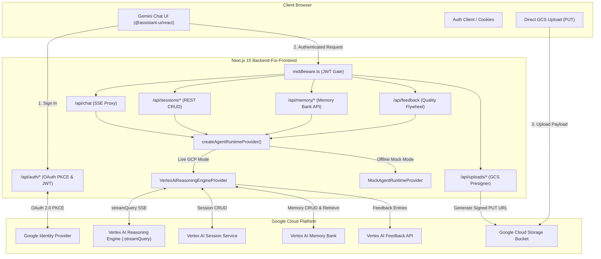
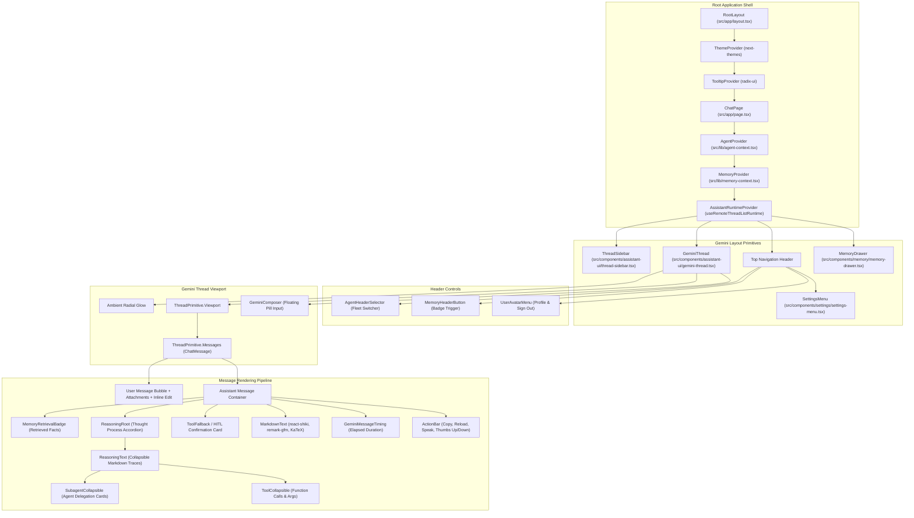
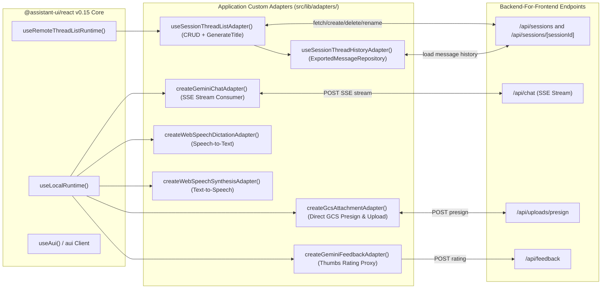
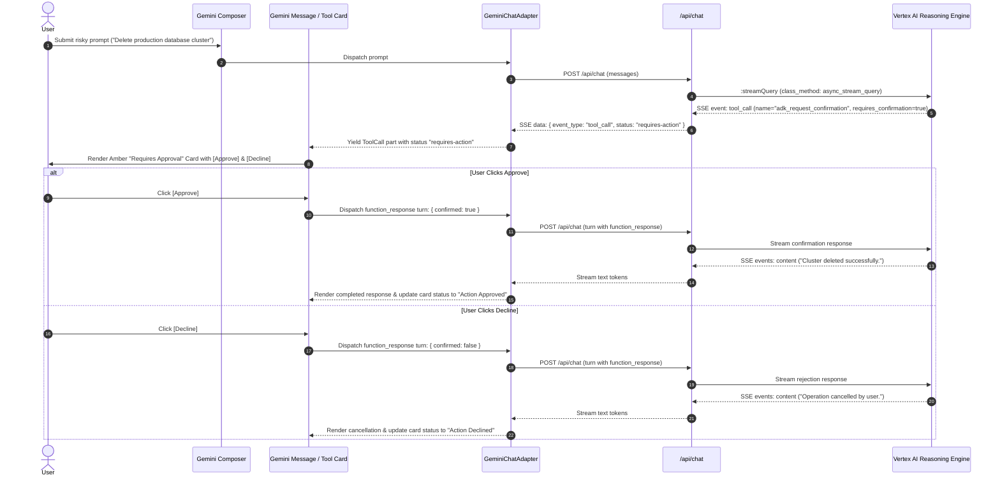

# Agent Runtime UI — Architecture & Contributor Guide

Welcome to the **Agent Runtime UI** architecture documentation. This guide provides a comprehensive overview of how the application is designed, how data flows through each layer, and detailed explanations of every file across the codebase.

---

## 1. Executive Summary & Architectural Principles

**Agent Runtime UI** (`agent-runtime-ui`) is a serverless, production-grade web application styled after **Google Gemini**. It connects authenticated users to **ADK (Agent Development Kit)** agents hosted on **Google Cloud Agent Runtime** (Vertex AI Reasoning Engines).

```
┌───────────────────────────────────────────────────────────────────────────────────────┐
│                                   CLIENT LAYER (Browser)                              │
│  • Google Gemini Aesthetic (Pill Composer, Ambient Glow, Avatar-Free Assistant Turns) │
│  • assistant-ui v0.15 Primitive Tree + Custom Markdown & Math/Shiki Highlight         │
│  • Agent Switcher, Multi-Thread Sidebar, Memory Bank Drawer, HITL Approval Cards      │
└──────────────────────────────────────────┬────────────────────────────────────────────┘
                                           │ HTTPS / SSE Streams / Signed GCS PUTs
                                           ▼
┌───────────────────────────────────────────────────────────────────────────────────────┐
│                            BACKEND-FOR-FRONTEND (Next.js 15)                          │
│  • Edge Middleware & Stateless JWT Cookie Auth (Google Identity OAuth 2.0 PKCE)      │
│  • BFF Proxy Handlers (/api/chat, /api/sessions, /api/memory, /api/feedback, etc.)    │
│  • Runtime Client Strategy (VertexAiReasoningEngineProvider vs. MockProvider)         │
│  • SSE Parser & AIP-160 Event Normalizer                                              │
└──────────────────────────────────────────┬────────────────────────────────────────────┘
                                           │ IAM Bearer Tokens / REST API & SSE
                                           ▼
┌───────────────────────────────────────────────────────────────────────────────────────┐
│                                GOOGLE CLOUD PLATFORM                                  │
│  • Vertex AI Reasoning Engines (:streamQuery & :query)                                │
│  • Vertex AI Session Service (Multi-turn Conversation Persistence)                    │
│  • Vertex AI Memory Bank (:retrieve, :generate, AIP-160 scopes)                       │
│  • Vertex AI Feedback API (Quality Flywheel Logging)                                  │
│  • Google Cloud Storage (GCS Resumable & Signed Multimodal Uploads)                   │
└───────────────────────────────────────────────────────────────────────────────────────┘
```

### Core Architectural Patterns

1. **Backend-For-Frontend (BFF) Pattern**:
   The browser never communicates directly with GCP APIs or holds GCP Service Account keys. Next.js App Router route handlers securely mint IAM bearer tokens using `google-auth-library` and proxy requests to Vertex AI.

2. **Stateless Serverless Authentication**:
   Google Identity OAuth 2.0 PKCE flow issues cryptographically signed HMAC-SHA256 JWT cookies (`HttpOnly`, `SameSite=Lax`, Web Crypto API). Zero database is required, enabling multi-region serverless deployment on Google Cloud Run.

3. **Real-Time SSE Streaming with Rich Event Taxonomy**:
   The chat pipeline streams model tokens (`content`), Gemini 2.0 thought tokens (`thought`), subagent execution traces (`agent_call` / `agent_response`), tool invocations (`tool_call` / `tool_result`), and memory retrieval context (`retrieved_memories`).

4. **Dual Execution Engine (Production vs. Mock Mode)**:
   The application features a Strategy Pattern provider architecture. When `MOCK_AGENT_RUNTIME=true` or GCP credentials are absent in development, a fully featured in-memory mock engine emulates all Vertex AI APIs (sessions, memories, subagent traces, tool calls, and HITL approvals).

5. **Direct-to-Cloud Storage (GCS) Multimodal Ingestion**:
   Large attachments (PDFs, images, audio) bypass the Next.js server payload limits via presigned GCS PUT URLs (`/api/uploads/presign`), passing `gs://bucket/...` URIs in the agent's `file_data` turn.

---

## 2. System Architecture Diagrams

### 2.1 End-to-End System Context & Cloud Topology



---

### 2.2 Frontend Component Hierarchy & Assistant UI Tree



---

### 2.3 Runtime Adapter Integration Architecture



---

### 2.4 Human-in-the-Loop (HITL) Tool Approval Workflow



---

## 3. Comprehensive File Index & Technical Explanations

### 3.1 Root Configuration & Build Files

| File Path                                                                                     | Description & Role                                                                                                                                                                                                                                                                                                     |
| :-------------------------------------------------------------------------------------------- | :--------------------------------------------------------------------------------------------------------------------------------------------------------------------------------------------------------------------------------------------------------------------------------------------------------------------- |
| [`package.json`](file:///Users/mblanc/projects/agent-runtime-ui/package.json)                 | Declares project dependencies (`@assistant-ui/react` 0.15, Next.js 15, React 19, Tailwind CSS v3, Radix UI primitives, `google-auth-library`, `@google-cloud/storage`, `react-shiki`, `streamdown`, Vitest, Playwright) and script tasks (`dev`, `build`, `test`, `test:e2e`, `check`, `lint`, `format`, `preflight`). |
| [`next.config.ts`](file:///Users/mblanc/projects/agent-runtime-ui/next.config.ts)             | Next.js configuration enabling standalone Docker output (`output: "standalone"`), server external packages (`google-auth-library`, `@google-cloud/storage`), and strict React mode.                                                                                                                                    |
| [`Dockerfile`](file:///Users/mblanc/projects/agent-runtime-ui/Dockerfile)                     | Multi-stage production container build using Bun and Node.js Alpine base image, packaging the Next.js standalone server for Google Cloud Run deployment.                                                                                                                                                               |
| [`playwright.config.ts`](file:///Users/mblanc/projects/agent-runtime-ui/playwright.config.ts) | End-to-end test runner configuration with Chromium, Firefox, WebKit fixtures, local dev server auto-spawning, and trace artifact capturing.                                                                                                                                                                            |
| [`eslint.config.mjs`](file:///Users/mblanc/projects/agent-runtime-ui/eslint.config.mjs)       | ESLint 9 Flat Config integrating `eslint-config-next` and Next.js Core Web Vitals rules.                                                                                                                                                                                                                               |
| [`postcss.config.mjs`](file:///Users/mblanc/projects/agent-runtime-ui/postcss.config.mjs)     | PostCSS pipeline wiring Tailwind CSS and Autoprefixer.                                                                                                                                                                                                                                                                 |
| [`bun.lock`](file:///Users/mblanc/projects/agent-runtime-ui/bun.lock)                         | Reproducible lockfile for Bun package resolution.                                                                                                                                                                                                                                                                      |
| [`AGENTS.md`](file:///Users/mblanc/projects/agent-runtime-ui/AGENTS.md)                       | Central instructions, context engineering, coding standards, and architectural rules for AI agents modifying this codebase.                                                                                                                                                                                            |
| [`README.md`](file:///Users/mblanc/projects/agent-runtime-ui/README.md)                       | Developer landing documentation covering quickstart, environment configuration, mock mode, and GCP Cloud Run deployment.                                                                                                                                                                                               |

---

### 3.2 Security, Middleware & Core Entrypoints

| File Path                                                                                         | Description & Role                                                                                                                                                                                                                                                                                                                                                                            |
| :------------------------------------------------------------------------------------------------ | :-------------------------------------------------------------------------------------------------------------------------------------------------------------------------------------------------------------------------------------------------------------------------------------------------------------------------------------------------------------------------------------------- |
| [`src/middleware.ts`](file:///Users/mblanc/projects/agent-runtime-ui/src/middleware.ts)           | Edge-compatible Next.js routing middleware. Inspects incoming requests for the cryptographically signed `gemini_session` cookie via [`verifySessionToken`](file:///Users/mblanc/projects/agent-runtime-ui/src/lib/jwt.ts). Unauthenticated API requests receive `401 Unauthorized`; unauthenticated page requests redirect to `/login`. Authenticated visits to `/login` redirect to `/`.     |
| [`src/types/agent.ts`](file:///Users/mblanc/projects/agent-runtime-ui/src/types/agent.ts)         | Single source of truth for all TypeScript data contracts: `AgentStreamEvent`, `AgentMessage`, `AgentMessagePart`, `AgentSession`, `AgentSessionEvent`, `DeployedAgent`, `AgentMemory`, `MemoryRetrievalItem`, `PresignBatchRequest`, `PresignedUploadItem`, `AgentFeedbackRequest`, and type guards (`isTextPart`, `isReasoningPart`, `isFileDataPart`, `isFunctionCallPart`).                |
| [`src/lib/api-handler.ts`](file:///Users/mblanc/projects/agent-runtime-ui/src/lib/api-handler.ts) | Higher-order route wrappers ([`withAuth`](file:///Users/mblanc/projects/agent-runtime-ui/src/lib/api-handler.ts#L43) and [`withAuthDynamic`](file:///Users/mblanc/projects/agent-runtime-ui/src/lib/api-handler.ts#L59)) enforcing user authentication on Next.js App Router endpoints, extracting user session claims (`userId`, `userEmail`), and providing structured JSON error handling. |
| [`src/lib/auth.ts`](file:///Users/mblanc/projects/agent-runtime-ui/src/lib/auth.ts)               | Server-side authentication helpers and Google OAuth 2.0 PKCE client configuration. Manages cookie encryption keys, PKCE state verification, and cookie lifetime settings.                                                                                                                                                                                                                     |
| [`src/lib/auth-client.ts`](file:///Users/mblanc/projects/agent-runtime-ui/src/lib/auth-client.ts) | Client-side React authentication hook ([`useSession`](file:///Users/mblanc/projects/agent-runtime-ui/src/lib/auth-client.ts#L24)) querying `/api/auth/session` to provide user profile state and authentication status.                                                                                                                                                                       |
| [`src/lib/jwt.ts`](file:///Users/mblanc/projects/agent-runtime-ui/src/lib/jwt.ts)                 | Lightweight, zero-dependency JWT implementation using the Web Crypto API (`HMAC-SHA256`). Generates and validates cryptographically signed session tokens across edge middleware and serverless routes.                                                                                                                                                                                       |
| [`src/lib/utils.ts`](file:///Users/mblanc/projects/agent-runtime-ui/src/lib/utils.ts)             | General utility functions including the Tailwind CSS class merging helper [`cn()`](file:///Users/mblanc/projects/agent-runtime-ui/src/lib/utils.ts#L6) and agent display name formatters.                                                                                                                                                                                                     |

---

### 3.3 Pages & Routing Layer (`src/app/`)

| File Path                                                                                         | Description & Role                                                                                                                                                                                                                                                                                                                                                                                                                                                                                                                                                                                                                                                                  |
| :------------------------------------------------------------------------------------------------ | :---------------------------------------------------------------------------------------------------------------------------------------------------------------------------------------------------------------------------------------------------------------------------------------------------------------------------------------------------------------------------------------------------------------------------------------------------------------------------------------------------------------------------------------------------------------------------------------------------------------------------------------------------------------------------------- |
| [`src/app/layout.tsx`](file:///Users/mblanc/projects/agent-runtime-ui/src/app/layout.tsx)         | Root HTML shell with typography, dark/light theme provider ([`ThemeProvider`](file:///Users/mblanc/projects/agent-runtime-ui/src/components/theme/theme-provider.tsx)), KaTeX styles, and Radix UI [`TooltipProvider`](file:///Users/mblanc/projects/agent-runtime-ui/src/components/ui/tooltip.tsx).                                                                                                                                                                                                                                                                                                                                                                               |
| [`src/app/page.tsx`](file:///Users/mblanc/projects/agent-runtime-ui/src/app/page.tsx)             | Main Gemini chat view. Coordinates [`AgentProvider`](file:///Users/mblanc/projects/agent-runtime-ui/src/lib/agent-context.tsx), [`MemoryProvider`](file:///Users/mblanc/projects/agent-runtime-ui/src/lib/memory-context.tsx), [`useRemoteThreadListRuntime`](file:///Users/mblanc/projects/agent-runtime-ui/src/app/page.tsx#L92), [`GeminiThread`](file:///Users/mblanc/projects/agent-runtime-ui/src/components/assistant-ui/gemini-thread.tsx), [`ThreadSidebar`](file:///Users/mblanc/projects/agent-runtime-ui/src/components/assistant-ui/thread-sidebar.tsx), and [`MemoryDrawer`](file:///Users/mblanc/projects/agent-runtime-ui/src/components/memory/memory-drawer.tsx). |
| [`src/app/login/page.tsx`](file:///Users/mblanc/projects/agent-runtime-ui/src/app/login/page.tsx) | Gemini-styled login page with ambient glow animation, brand greeting, and one-click Google SSO sign-in button.                                                                                                                                                                                                                                                                                                                                                                                                                                                                                                                                                                      |
| [`src/app/globals.css`](file:///Users/mblanc/projects/agent-runtime-ui/src/app/globals.css)       | Global Tailwind CSS styling, ambient radial glow animation keyframes, scrollbar styling, and color variables.                                                                                                                                                                                                                                                                                                                                                                                                                                                                                                                                                                       |

---

### 3.4 Backend-For-Frontend API Routes (`src/app/api/`)

| File Path                                                                                                                               | HTTP Method & Route                    | Description & Role                                                                                                                                                                                                                                                     |
| :-------------------------------------------------------------------------------------------------------------------------------------- | :------------------------------------- | :--------------------------------------------------------------------------------------------------------------------------------------------------------------------------------------------------------------------------------------------------------------------- |
| [`src/app/api/chat/route.ts`](file:///Users/mblanc/projects/agent-runtime-ui/src/app/api/chat/route.ts)                                 | `POST /api/chat`                       | Primary Server-Sent Events (SSE) streaming proxy. Receives user message history and attachments, initiates `:streamQuery` on Vertex AI Reasoning Engines (or Mock Provider), inserts periodic keepalive heartbeats (`: keepalive\n\n`), and streams normalized chunks. |
| [`src/app/api/sessions/route.ts`](file:///Users/mblanc/projects/agent-runtime-ui/src/app/api/sessions/route.ts)                         | `GET, POST /api/sessions`              | Multi-thread session service proxy. `GET` lists all active chat sessions for the authenticated user (scoped by `userId` and `agentId`); `POST` initializes a new session.                                                                                              |
| [`src/app/api/sessions/[sessionId]/route.ts`](file:///Users/mblanc/projects/agent-runtime-ui/src/app/api/sessions/[sessionId]/route.ts) | `GET, PATCH, DELETE /api/sessions/:id` | Session lifecycle operations: `GET` loads multi-turn event history transformed into UI-ready message parts; `PATCH` updates session titles; `DELETE` removes the conversation.                                                                                         |
| [`src/app/api/agents/route.ts`](file:///Users/mblanc/projects/agent-runtime-ui/src/app/api/agents/route.ts)                             | `GET /api/agents`                      | Queries deployed Vertex AI Reasoning Engines across configured Google Cloud regions (`GOOGLE_CLOUD_LOCATIONS`) and returns the fleet for the agent switcher dropdown.                                                                                                  |
| [`src/app/api/memory/route.ts`](file:///Users/mblanc/projects/agent-runtime-ui/src/app/api/memory/route.ts)                             | `GET, POST /api/memory`                | Memory Bank management endpoint. `GET` retrieves user memories filtered by topic; `POST` creates a new semantic fact under the user's scope.                                                                                                                           |
| [`src/app/api/memory/[memoryId]/route.ts`](file:///Users/mblanc/projects/agent-runtime-ui/src/app/api/memory/[memoryId]/route.ts)       | `PATCH, DELETE /api/memory/:id`        | Updates or deletes an existing memory fact in the Memory Bank.                                                                                                                                                                                                         |
| [`src/app/api/memory/generate/route.ts`](file:///Users/mblanc/projects/agent-runtime-ui/src/app/api/memory/generate/route.ts)           | `POST /api/memory/generate`            | Triggers Vertex AI Memory Bank `:generate` API to automatically extract key user preferences and profile facts from an active conversation session.                                                                                                                    |
| [`src/app/api/feedback/route.ts`](file:///Users/mblanc/projects/agent-runtime-ui/src/app/api/feedback/route.ts)                         | `POST /api/feedback`                   | Forwards user thumbs-up/thumbs-down ratings and feedback metadata to the Vertex AI Session Feedback API to drive the Quality Flywheel.                                                                                                                                 |
| [`src/app/api/uploads/presign/route.ts`](file:///Users/mblanc/projects/agent-runtime-ui/src/app/api/uploads/presign/route.ts)           | `POST /api/uploads/presign`            | Generates short-lived (5-minute) GCS V4 signed PUT upload URLs and signed GET preview URLs for direct-to-cloud multimodal file uploads.                                                                                                                                |
| [`src/app/api/uploads/signed-read/route.ts`](file:///Users/mblanc/projects/agent-runtime-ui/src/app/api/uploads/signed-read/route.ts)   | `POST /api/uploads/signed-read`        | Generates on-demand signed read URLs for existing `gs://...` URIs so media can render securely in the browser.                                                                                                                                                         |
| [`src/app/api/uploads/mock-upload/route.ts`](file:///Users/mblanc/projects/agent-runtime-ui/src/app/api/uploads/mock-upload/route.ts)   | `PUT /api/uploads/mock-upload`         | Local in-memory endpoint that accepts file uploads during mock mode without active GCP storage buckets.                                                                                                                                                                |
| [`src/app/api/auth/sign-in/google/route.ts`](file:///Users/mblanc/projects/agent-runtime-ui/src/app/api/auth/sign-in/google/route.ts)   | `GET /api/auth/sign-in/google`         | Initiates Google OAuth 2.0 PKCE flow, generating cryptographic `state`, `code_verifier`, and redirecting the browser to Google SSO.                                                                                                                                    |
| [`src/app/api/auth/callback/google/route.ts`](file:///Users/mblanc/projects/agent-runtime-ui/src/app/api/auth/callback/google/route.ts) | `GET /api/auth/callback/google`        | Handles OAuth redirect, exchanges authorization code for Google ID token, verifies user identity, and sets the secure `gemini_session` JWT cookie.                                                                                                                     |
| [`src/app/api/auth/session/route.ts`](file:///Users/mblanc/projects/agent-runtime-ui/src/app/api/auth/session/route.ts)                 | `GET /api/auth/session`                | Validates session cookie and returns current user profile (ID, name, email, avatar).                                                                                                                                                                                   |
| [`src/app/api/auth/sign-out/route.ts`](file:///Users/mblanc/projects/agent-runtime-ui/src/app/api/auth/sign-out/route.ts)               | `POST /api/auth/sign-out`              | Clears the session cookie and signs the user out.                                                                                                                                                                                                                      |

---

### 3.5 Agent Runtime & Streaming Engine (`src/lib/agent-runtime/` & `src/lib/`)

| File Path                                                                                                                                   | Description & Role                                                                                                                                                                                                                                                                                                                     |
| :------------------------------------------------------------------------------------------------------------------------------------------ | :------------------------------------------------------------------------------------------------------------------------------------------------------------------------------------------------------------------------------------------------------------------------------------------------------------------------------------- |
| [`src/lib/agent-runtime/types.ts`](file:///Users/mblanc/projects/agent-runtime-ui/src/lib/agent-runtime/types.ts)                           | Defines the [`IAgentRuntimeProvider`](file:///Users/mblanc/projects/agent-runtime-ui/src/lib/agent-runtime/types.ts#L13) interface defining standard operations for any runtime backend (streaming queries, session CRUD, memory management, feedback submission).                                                                     |
| [`src/lib/agent-runtime/factory.ts`](file:///Users/mblanc/projects/agent-runtime-ui/src/lib/agent-runtime/factory.ts)                       | Factory method [`createAgentRuntimeProvider`](file:///Users/mblanc/projects/agent-runtime-ui/src/lib/agent-runtime/factory.ts#L5) inspecting environment variables (`MOCK_AGENT_RUNTIME`, `GOOGLE_CLOUD_PROJECT`, `GOOGLE_REASONING_ENGINE_ID`) to instantiate either `VertexAiReasoningEngineProvider` or `MockAgentRuntimeProvider`. |
| [`src/lib/agent-runtime/client.ts`](file:///Users/mblanc/projects/agent-runtime-ui/src/lib/agent-runtime/client.ts)                         | Implementation of [`VertexAiReasoningEngineProvider`](file:///Users/mblanc/projects/agent-runtime-ui/src/lib/agent-runtime/client.ts#L26). Directly communicates with Google Cloud Vertex AI REST APIs using IAM bearer tokens obtained via `GoogleAuth`. Handles engine ID resolution, AIP-160 filter syntax, and SSE stream parsing. |
| [`src/lib/agent-runtime/sse-parser.ts`](file:///Users/mblanc/projects/agent-runtime-ui/src/lib/agent-runtime/sse-parser.ts)                 | Robust asynchronous generator parser converting raw Server-Sent Event byte streams from Vertex AI `:streamQuery` into strongly typed [`AgentStreamEvent`](file:///Users/mblanc/projects/agent-runtime-ui/src/types/agent.ts#L253) objects.                                                                                             |
| [`src/lib/agent-runtime/event-normalizer.ts`](file:///Users/mblanc/projects/agent-runtime-ui/src/lib/agent-runtime/event-normalizer.ts)     | Normalization utilities that transform raw Vertex AI session event payloads, query responses, and resource strings into standardized UI formats. Implements multi-event turn grouping via [`groupTurnSessionEvents`](file:///Users/mblanc/projects/agent-runtime-ui/src/lib/agent-runtime/event-normalizer.ts#L125).                   |
| [`src/lib/agent-runtime/mock/mock-provider.ts`](file:///Users/mblanc/projects/agent-runtime-ui/src/lib/agent-runtime/mock/mock-provider.ts) | Full in-memory implementation of `IAgentRuntimeProvider` for offline development and testing. Simulates multi-step reasoning, subagent delegation, tool calls, HITL confirmation prompts, and memory extraction.                                                                                                                       |
| [`src/lib/agent-runtime/mock/mock-store.ts`](file:///Users/mblanc/projects/agent-runtime-ui/src/lib/agent-runtime/mock/mock-store.ts)       | In-memory storage collections for mock sessions, memories, feedback entries, and available reasoning engines.                                                                                                                                                                                                                          |
| [`src/lib/agent-runtime-client.ts`](file:///Users/mblanc/projects/agent-runtime-ui/src/lib/agent-runtime-client.ts)                         | Backward-compatible facade class delegating calls to `IAgentRuntimeProvider`.                                                                                                                                                                                                                                                          |

---

### 3.6 Adapters & State Contexts (`src/lib/adapters/`, `src/lib/attachments/`, Contexts)

| File Path                                                                                                                                 | Description & Role                                                                                                                                                                                                                                                                                                                                                                                                                                                |
| :---------------------------------------------------------------------------------------------------------------------------------------- | :---------------------------------------------------------------------------------------------------------------------------------------------------------------------------------------------------------------------------------------------------------------------------------------------------------------------------------------------------------------------------------------------------------------------------------------------------------------- |
| [`src/lib/agent-context.tsx`](file:///Users/mblanc/projects/agent-runtime-ui/src/lib/agent-context.tsx)                                   | React Context Provider ([`AgentProvider`](file:///Users/mblanc/projects/agent-runtime-ui/src/lib/agent-context.tsx#L44)) and hooks ([`useActiveAgent`](file:///Users/mblanc/projects/agent-runtime-ui/src/lib/agent-context.tsx#L149), [`useOptionalActiveAgent`](file:///Users/mblanc/projects/agent-runtime-ui/src/lib/agent-context.tsx#L157)). Manages deployed agent list, current active reasoning engine selection, and persists choice to `localStorage`. |
| [`src/lib/memory-context.tsx`](file:///Users/mblanc/projects/agent-runtime-ui/src/lib/memory-context.tsx)                                 | React Context Provider ([`MemoryProvider`](file:///Users/mblanc/projects/agent-runtime-ui/src/lib/memory-context.tsx#L41)) and hook ([`useMemory`](file:///Users/mblanc/projects/agent-runtime-ui/src/lib/memory-context.tsx#L312)). Manages Memory Bank facts, topic filtering, optimistic CRUD updates, search queries, and memory drawer visibility.                                                                                                           |
| [`src/lib/session-adapter.tsx`](file:///Users/mblanc/projects/agent-runtime-ui/src/lib/session-adapter.tsx)                               | Implements `@assistant-ui/react` v0.15 [`RemoteThreadListAdapter`](file:///Users/mblanc/projects/agent-runtime-ui/src/lib/session-adapter.tsx#L240) and [`ThreadHistoryAdapter`](file:///Users/mblanc/projects/agent-runtime-ui/src/lib/session-adapter.tsx#L147). Synchronizes thread list, thread creation, deletion, renaming, automatic title generation, and message loading with the backend Session Service.                                               |
| [`src/lib/adapters/chat-adapter.ts`](file:///Users/mblanc/projects/agent-runtime-ui/src/lib/adapters/chat-adapter.ts)                     | Core ChatModelAdapter translating `/api/chat` SSE events into `@assistant-ui/react` message parts (`text`, `reasoning`, `tool-call`). Handles subagent delegation markers, tool arguments, HITL approval state, and memory metadata injection.                                                                                                                                                                                                                    |
| [`src/lib/adapters/feedback-adapter.ts`](file:///Users/mblanc/projects/agent-runtime-ui/src/lib/adapters/feedback-adapter.ts)             | Implements `@assistant-ui/react` `FeedbackAdapter`, forwarding thumbs up/down user reactions to `/api/feedback`.                                                                                                                                                                                                                                                                                                                                                  |
| [`src/lib/adapters/gcs-attachment-adapter.ts`](file:///Users/mblanc/projects/agent-runtime-ui/src/lib/adapters/gcs-attachment-adapter.ts) | Implements `@assistant-ui/react` `AttachmentAdapter`. Handles file picker interactions, requests presigned upload URLs from `/api/uploads/presign`, performs direct HTTP PUT to GCS, and converts files to `file_data` message attachments.                                                                                                                                                                                                                       |
| [`src/lib/adapters/speech-adapters.ts`](file:///Users/mblanc/projects/agent-runtime-ui/src/lib/adapters/speech-adapters.ts)               | Web Speech API wrappers providing browser-native Speech-to-Text (`WebSpeechDictationAdapter`) and Text-to-Speech (`WebSpeechSynthesisAdapter`).                                                                                                                                                                                                                                                                                                                   |
| [`src/lib/attachments/attachment-store.ts`](file:///Users/mblanc/projects/agent-runtime-ui/src/lib/attachments/attachment-store.ts)       | In-memory registry associating client attachment IDs with GCS URIs, presigned read URLs, and MIME types across composer turns.                                                                                                                                                                                                                                                                                                                                    |
| [`src/lib/attachments/mime-types.ts`](file:///Users/mblanc/projects/agent-runtime-ui/src/lib/attachments/mime-types.ts)                   | MIME type detection, file extension mapping, and category categorization (images vs. documents vs. code).                                                                                                                                                                                                                                                                                                                                                         |

---

### 3.7 Assistant UI Components (`src/components/assistant-ui/`)

| File Path                                                                                                                           | Description & Role                                                                                                                                                                                                  |
| :---------------------------------------------------------------------------------------------------------------------------------- | :------------------------------------------------------------------------------------------------------------------------------------------------------------------------------------------------------------------ |
| [`gemini-thread.tsx`](file:///Users/mblanc/projects/agent-runtime-ui/src/components/assistant-ui/gemini-thread.tsx)                 | The primary chat viewport. Features the centered Gemini empty-state greeting ("How can I help you today?"), ambient radial glow effect, message list viewport, and floating pill composer.                          |
| [`gemini-composer.tsx`](file:///Users/mblanc/projects/agent-runtime-ui/src/components/assistant-ui/gemini-composer.tsx)             | Floating pill input component. Supports auto-resizing text input, file attachment button (`+`), file dropzone, model tier selector (`Flash` / `Pro`), voice dictation button, and stateful send/stop button.        |
| [`gemini-message.tsx`](file:///Users/mblanc/projects/agent-runtime-ui/src/components/assistant-ui/gemini-message.tsx)               | Renders conversation turns: right-aligned warm-grey user bubbles with inline editing, avatar-free assistant turns, thinking traces, retrieved memory badges, and hover action bars (copy, reload, speak, feedback). |
| [`gemini-message-timing.tsx`](file:///Users/mblanc/projects/agent-runtime-ui/src/components/assistant-ui/gemini-message-timing.tsx) | Displays subtle generation time and token performance metrics at the bottom of assistant message turns.                                                                                                             |
| [`thread-sidebar.tsx`](file:///Users/mblanc/projects/agent-runtime-ui/src/components/assistant-ui/thread-sidebar.tsx)               | Left collapsible history sidebar. Groups conversations chronologically (Today, Yesterday, Previous 7 Days, Older), provides new chat creation, session deletion, and user profile footer.                           |
| [`markdown-text.tsx`](file:///Users/mblanc/projects/agent-runtime-ui/src/components/assistant-ui/markdown-text.tsx)                 | Assistant message markdown renderer with GFM tables, math syntax (`remark-math`, KaTeX), and syntax highlighting.                                                                                                   |
| [`shiki-highlighter.tsx`](file:///Users/mblanc/projects/agent-runtime-ui/src/components/assistant-ui/shiki-highlighter.tsx)         | Code syntax highlighting component with language tags and one-click copy button powered by `react-shiki`.                                                                                                           |
| [`reasoning.tsx`](file:///Users/mblanc/projects/agent-runtime-ui/src/components/assistant-ui/reasoning.tsx)                         | Main collapsible reasoning accordion container with pulsating sparkle icon and animated open/close state.                                                                                                           |
| [`thought-collapsible.tsx`](file:///Users/mblanc/projects/agent-runtime-ui/src/components/assistant-ui/thought-collapsible.tsx)     | Specialized collapsible step for internal chain-of-thought tokens and planning stages.                                                                                                                              |
| [`subagent-collapsible.tsx`](file:///Users/mblanc/projects/agent-runtime-ui/src/components/assistant-ui/subagent-collapsible.tsx)   | Visual trace accordion for multi-agent delegation, displaying subagent name, status, inputs, and responses.                                                                                                         |
| [`tool-collapsible.tsx`](file:///Users/mblanc/projects/agent-runtime-ui/src/components/assistant-ui/tool-collapsible.tsx)           | Structured card displaying tool invocations, input JSON arguments, and execution output inside reasoning blocks.                                                                                                    |
| [`tool-group.tsx`](file:///Users/mblanc/projects/agent-runtime-ui/src/components/assistant-ui/tool-group.tsx)                       | Aggregates multiple consecutive tool executions into a single compact collapsible group.                                                                                                                            |
| [`tool-fallback.tsx`](file:///Users/mblanc/projects/agent-runtime-ui/src/components/assistant-ui/tool-fallback.tsx)                 | Fallback tool renderer and **Human-in-the-Loop (HITL)** approval card with interactive **[Approve]** and **[Decline]** buttons.                                                                                     |
| [`tooltip-icon-button.tsx`](file:///Users/mblanc/projects/agent-runtime-ui/src/components/assistant-ui/tooltip-icon-button.tsx)     | Reusable accessible button primitive wrapped with Radix UI tooltip.                                                                                                                                                 |

---

### 3.8 Memory, Agent Switcher, Auth & Theme Components

| File Path                                                                                                                                                           | Description & Role                                                                                                                                                      |
| :------------------------------------------------------------------------------------------------------------------------------------------------------------------ | :---------------------------------------------------------------------------------------------------------------------------------------------------------------------- |
| [`src/components/agent-switcher/agent-header-selector.tsx`](file:///Users/mblanc/projects/agent-runtime-ui/src/components/agent-switcher/agent-header-selector.tsx) | Top navigation dropdown allowing users to switch between different deployed Vertex AI Reasoning Engines and regions.                                                    |
| [`src/components/memory/memory-drawer.tsx`](file:///Users/mblanc/projects/agent-runtime-ui/src/components/memory/memory-drawer.tsx)                                 | Slide-over drawer providing full management of the user's Memory Bank: list memories, filter by topic, search facts, create new memories, edit facts, and delete items. |
| [`src/components/memory/add-memory-modal.tsx`](file:///Users/mblanc/projects/agent-runtime-ui/src/components/memory/add-memory-modal.tsx)                           | Dialog modal for manually adding a fact and topic label to the Memory Bank.                                                                                             |
| [`src/components/memory/memory-item-card.tsx`](file:///Users/mblanc/projects/agent-runtime-ui/src/components/memory/memory-item-card.tsx)                           | Individual memory card displaying fact text, topic badge, timestamp, confidence score, and edit/delete actions.                                                         |
| [`src/components/memory/memory-header-button.tsx`](file:///Users/mblanc/projects/agent-runtime-ui/src/components/memory/memory-header-button.tsx)                   | Header action button showing total stored memory count and opening the Memory Drawer.                                                                                   |
| [`src/components/memory/memory-retrieval-badge.tsx`](file:///Users/mblanc/projects/agent-runtime-ui/src/components/memory/memory-retrieval-badge.tsx)               | In-chat badge rendered above assistant turns when relevant memories were retrieved for the turn, with a hover popover listing the applied facts.                        |
| [`src/components/auth/login-button.tsx`](file:///Users/mblanc/projects/agent-runtime-ui/src/components/auth/login-button.tsx)                                       | Branded Google Sign-In button initiating the OAuth 2.0 PKCE flow.                                                                                                       |
| [`src/components/auth/user-avatar-menu.tsx`](file:///Users/mblanc/projects/agent-runtime-ui/src/components/auth/user-avatar-menu.tsx)                               | User profile dropdown displaying user avatar, name, email, memory bank shortcut, theme toggle, and sign out action.                                                     |
| [`src/components/settings/settings-menu.tsx`](file:///Users/mblanc/projects/agent-runtime-ui/src/components/settings/settings-menu.tsx)                             | Settings dropdown offering quick access to dark/light theme switching and application information.                                                                      |
| [`src/components/theme/theme-provider.tsx`](file:///Users/mblanc/projects/agent-runtime-ui/src/components/theme/theme-provider.tsx)                                 | `next-themes` provider wrapper handling system, light, and dark mode class injection.                                                                                   |
| [`src/components/ui/button.tsx`](file:///Users/mblanc/projects/agent-runtime-ui/src/components/ui/button.tsx)                                                       | Radix UI button primitive with variant styling (`default`, `outline`, `ghost`, `link`, `secondary`, `destructive`).                                                     |
| [`src/components/ui/dropdown-menu.tsx`](file:///Users/mblanc/projects/agent-runtime-ui/src/components/ui/dropdown-menu.tsx)                                         | Radix UI dropdown menu primitives (Item, Trigger, Content, Separator, Label).                                                                                           |
| [`src/components/ui/avatar.tsx`](file:///Users/mblanc/projects/agent-runtime-ui/src/components/ui/avatar.tsx)                                                       | Radix UI avatar component with image loading fallback.                                                                                                                  |
| [`src/components/ui/tooltip.tsx`](file:///Users/mblanc/projects/agent-runtime-ui/src/components/ui/tooltip.tsx)                                                     | Radix UI tooltip primitive for accessible hover labels.                                                                                                                 |

---

### 3.9 Test Suite & Quality Harnesses (`tests/`)

| Test File                                                                                                                       | Test Scope & Coverage                                                                               |
| :------------------------------------------------------------------------------------------------------------------------------ | :-------------------------------------------------------------------------------------------------- |
| [`tests/chat-api.test.ts`](file:///Users/mblanc/projects/agent-runtime-ui/tests/chat-api.test.ts)                               | Unit tests for `/api/chat` SSE stream proxy, authentication validation, and error serialization.    |
| [`tests/sessions-api.test.ts`](file:///Users/mblanc/projects/agent-runtime-ui/tests/sessions-api.test.ts)                       | Tests for `/api/sessions` and `/api/sessions/[sessionId]` (list, create, get, rename, delete).      |
| [`tests/agents-api.test.ts`](file:///Users/mblanc/projects/agent-runtime-ui/tests/agents-api.test.ts)                           | Tests for `/api/agents` reasoning engine discovery and fallback listing.                            |
| [`tests/memory-api.test.ts`](file:///Users/mblanc/projects/agent-runtime-ui/tests/memory-api.test.ts)                           | Tests for `/api/memory`, `/api/memory/[memoryId]`, and `/api/memory/generate` endpoints.            |
| [`tests/memory-chat.test.ts`](file:///Users/mblanc/projects/agent-runtime-ui/tests/memory-chat.test.ts)                         | Tests memory retrieval injection during chat streaming.                                             |
| [`tests/memory-store.test.ts`](file:///Users/mblanc/projects/agent-runtime-ui/tests/memory-store.test.ts)                       | Tests in-memory memory bank operations and AIP-160 topic filtering.                                 |
| [`tests/memory-context.test.tsx`](file:///Users/mblanc/projects/agent-runtime-ui/tests/memory-context.test.tsx)                 | Component tests for `MemoryProvider` state, topic counts, search filtering, and optimistic updates. |
| [`tests/memory-ui.test.tsx`](file:///Users/mblanc/projects/agent-runtime-ui/tests/memory-ui.test.tsx)                           | Component tests for `MemoryDrawer`, `AddMemoryModal`, and `MemoryItemCard`.                         |
| [`tests/memory-badge.test.tsx`](file:///Users/mblanc/projects/agent-runtime-ui/tests/memory-badge.test.tsx)                     | Tests `MemoryRetrievalBadge` popover and rendering logic.                                           |
| [`tests/agent-client.test.ts`](file:///Users/mblanc/projects/agent-runtime-ui/tests/agent-client.test.ts)                       | Tests for `AgentRuntimeClient` and `VertexAiReasoningEngineProvider`.                               |
| [`tests/agent-context.test.tsx`](file:///Users/mblanc/projects/agent-runtime-ui/tests/agent-context.test.tsx)                   | Tests for `AgentProvider` and agent switching logic.                                                |
| [`tests/agent-switcher.test.tsx`](file:///Users/mblanc/projects/agent-runtime-ui/tests/agent-switcher.test.tsx)                 | React testing for `AgentHeaderSelector` dropdown interaction.                                       |
| [`tests/api-handler.test.ts`](file:///Users/mblanc/projects/agent-runtime-ui/tests/api-handler.test.ts)                         | Unit tests for `withAuth` and `withAuthDynamic` wrappers.                                           |
| [`tests/attachment-store.test.ts`](file:///Users/mblanc/projects/agent-runtime-ui/tests/attachment-store.test.ts)               | Tests for `defaultAttachmentStore` lookup, indexing, and TTL deletion.                              |
| [`tests/auth.test.tsx`](file:///Users/mblanc/projects/agent-runtime-ui/tests/auth.test.tsx)                                     | Tests for `useSession` hook and `UserAvatarMenu` rendering.                                         |
| [`tests/components.test.tsx`](file:///Users/mblanc/projects/agent-runtime-ui/tests/components.test.tsx)                         | Tests for `GeminiThread`, `GeminiComposer`, and `ChatMessage`.                                      |
| [`tests/event-normalizer.test.ts`](file:///Users/mblanc/projects/agent-runtime-ui/tests/event-normalizer.test.ts)               | Unit tests for event normalizer and session event grouping.                                         |
| [`tests/feedback-api.test.ts`](file:///Users/mblanc/projects/agent-runtime-ui/tests/feedback-api.test.ts)                       | Tests for `/api/feedback` endpoint and payload formatting.                                          |
| [`tests/feedback-ui.test.tsx`](file:///Users/mblanc/projects/agent-runtime-ui/tests/feedback-ui.test.tsx)                       | Tests for thumbs-up and thumbs-down action bar buttons.                                             |
| [`tests/linear-editing.test.tsx`](file:///Users/mblanc/projects/agent-runtime-ui/tests/linear-editing.test.tsx)                 | Tests for editing user messages inline and branching threads.                                       |
| [`tests/mime-types.test.ts`](file:///Users/mblanc/projects/agent-runtime-ui/tests/mime-types.test.ts)                           | Unit tests for MIME detection and file categorization.                                              |
| [`tests/multimodal-attachments.test.tsx`](file:///Users/mblanc/projects/agent-runtime-ui/tests/multimodal-attachments.test.tsx) | Tests file picker, attachment preview chips, and upload error handling.                             |
| [`tests/settings.test.tsx`](file:///Users/mblanc/projects/agent-runtime-ui/tests/settings.test.tsx)                             | Tests `SettingsMenu` and theme selection.                                                           |
| [`tests/sse-parser.test.ts`](file:///Users/mblanc/projects/agent-runtime-ui/tests/sse-parser.test.ts)                           | Tests stream parser handling chunked and split SSE frames.                                          |
| [`tests/thread-sidebar.test.tsx`](file:///Users/mblanc/projects/agent-runtime-ui/tests/thread-sidebar.test.tsx)                 | Tests `ThreadSidebar` session listing, switching, and deleting.                                     |
| [`tests/tools-hitl.test.tsx`](file:///Users/mblanc/projects/agent-runtime-ui/tests/tools-hitl.test.tsx)                         | Tests `ToolFallback` HITL approval flow and button dispatch.                                        |
| [`tests/uploads-api.test.ts`](file:///Users/mblanc/projects/agent-runtime-ui/tests/uploads-api.test.ts)                         | Tests `/api/uploads/presign` and `/api/uploads/signed-read`.                                        |
| [`tests/voice-tts.test.tsx`](file:///Users/mblanc/projects/agent-runtime-ui/tests/voice-tts.test.tsx)                           | Tests voice dictation button and read-aloud TTS actions.                                            |
| [`tests/e2e/hitl-confirmation.spec.ts`](file:///Users/mblanc/projects/agent-runtime-ui/tests/e2e/hitl-confirmation.spec.ts)     | Playwright E2E test for human-in-the-loop tool authorization.                                       |
| [`tests/e2e/multimodal-upload.spec.ts`](file:///Users/mblanc/projects/agent-runtime-ui/tests/e2e/multimodal-upload.spec.ts)     | Playwright E2E test for direct multimodal file uploads.                                             |
| [`tests/e2e/session-switching.spec.ts`](file:///Users/mblanc/projects/agent-runtime-ui/tests/e2e/session-switching.spec.ts)     | Playwright E2E test for multi-thread sidebar switching.                                             |
| [`tests/e2e/subagents.spec.ts`](file:///Users/mblanc/projects/agent-runtime-ui/tests/e2e/subagents.spec.ts)                     | Playwright E2E test for multi-agent delegation traces.                                              |
| [`tests/e2e/tools.spec.ts`](file:///Users/mblanc/projects/agent-runtime-ui/tests/e2e/tools.spec.ts)                             | Playwright E2E test for tool call rendering and execution cards.                                    |

---

## 4. Key Execution Workflows

### 4.1 Chat Query & Real-Time SSE Streaming

```
[User Input] ──► [GeminiComposer] ──► [GeminiChatAdapter]
                                              │
                                              ▼ (POST /api/chat)
                                     [Next.js withAuth]
                                              │
                                              ▼
                                   [AgentRuntimeClient]
                                              │
                                              ▼
                              [VertexAiReasoningEngineProvider]
                                              │
                                              ▼ (:streamQuery)
                             [Vertex AI Reasoning Engine]
                                              │
                                              ▼ (SSE byte stream)
                                     [parseSseStream()]
                                              │
 ┌────────────────────────────────────────────┴────────────────────────────────────────────┐
 │                                   SSE Stream Events                                     │
 │  • event_type: "thought"           ──► Accumulated into ReasoningRoot accordion        │
 │  • event_type: "agent_call"        ──► Formatted as SubagentCollapsible running card    │
 │  • event_type: "agent_response"    ──► Subagent card updated to complete                │
 │  • event_type: "tool_call"         ──► Tool card rendered (or HITL approval prompt)     │
 │  • event_type: "tool_result"       ──► Tool result card updated                         │
 │  • event_type: "retrieved_memories"──► MemoryRetrievalBadge attached to message         │
 │  • event_type: "content"           ──► MarkdownText rendered via react-shiki / KaTeX    │
 │  • event_type: "done"              ──► Stream finalized, status set to complete         │
 └─────────────────────────────────────────────────────────────────────────────────────────┘
```

---

### 4.2 Multi-Turn Session Persistence Lifecycle

1. **Initial Load**:
   - [`useSessionThreadListAdapter`](file:///Users/mblanc/projects/agent-runtime-ui/src/lib/session-adapter.tsx#L225) calls `GET /api/sessions?agentId=...`.
   - The backend lists the authenticated user's sessions from Vertex AI Session Service.
   - Threads populate the [`ThreadSidebar`](file:///Users/mblanc/projects/agent-runtime-ui/src/components/assistant-ui/thread-sidebar.tsx).

2. **Selecting a Thread**:
   - User clicks a conversation in the sidebar.
   - [`useSessionThreadHistoryAdapter`](file:///Users/mblanc/projects/agent-runtime-ui/src/lib/session-adapter.tsx#L137) queries `GET /api/sessions/[sessionId]`.
   - `listSessionEvents` fetches all turn events, normalizes them via `groupTurnSessionEvents`, and populates the `@assistant-ui/react` message state via `ExportedMessageRepository`.

3. **Creating a New Thread**:
   - User clicks **"New chat"** (`+`) in the sidebar or changes the active agent.
   - `switchToNewThread()` is invoked, creating a fresh active thread in memory.
   - On the first message, `initialize()` issues a `POST /api/sessions` call to create the remote session.

4. **Auto Title Generation**:
   - After the first user message, `generateTitle()` generates a concise capitalized summary from the prompt, immediately updating the sidebar and persisting it via `PATCH /api/sessions/[sessionId]`.

---

### 4.3 Direct-to-GCS Multimodal Ingestion Lifecycle

```
1. User attaches file (PDF / PNG / JPG / Audio) in GeminiComposer
   │
   ▼
2. GcsAttachmentAdapter intercepts file picker event
   │
   ▼
3. POST /api/uploads/presign
   └── Server generates GCS V4 Signed Upload URL (HTTP PUT, 5 min TTL)
   └── Server generates GCS V4 Signed Read URL (HTTP GET, 1 hour TTL)
   │
   ▼
4. Client performs direct HTTP PUT of raw binary file to Google Cloud Storage
   │
   ▼
5. GcsAttachmentAdapter stores { gcsUri: "gs://bucket/users/...", readUrl } in AttachmentStore
   │
   ▼
6. User clicks Send
   └── ChatAdapter formats attachment into message turn:
       parts: [{ file_data: { file_uri: "gs://bucket/...", mime_type: "application/pdf" } }]
   │
   ▼
7. Vertex AI Reasoning Engine processes multimodal file directly from Cloud Storage
```

---

## 5. Contributor Guide & Development Workflows

### 5.1 Local Setup & Prerequisites

- **Bun** (v1.3 or higher)
- **Node.js** (v20 or higher)

```bash
# 1. Clone repository
git clone https://github.com/your-org/agent-runtime-ui.git
cd agent-runtime-ui

# 2. Install dependencies
bun install

# 3. Configure environment
cp .env.example .env.local
```

### 5.2 Environment Variables Reference

| Variable                     | Required in Prod? |         Default         | Description                                                         |
| :--------------------------- | :---------------: | :---------------------: | :------------------------------------------------------------------ |
| `MOCK_AGENT_RUNTIME`         |        No         |         `false`         | When `true`, enables offline mock mode with simulated GCP services. |
| `GOOGLE_CLOUD_PROJECT`       |        Yes        |            —            | GCP Project ID hosting Vertex AI Reasoning Engines.                 |
| `GOOGLE_CLOUD_LOCATION`      |        Yes        |      `us-central1`      | Default GCP region for Vertex AI Reasoning Engines.                 |
| `GOOGLE_CLOUD_LOCATIONS`     |        No         |      `us-central1`      | Comma-separated list of regions to query in the Agent Switcher.     |
| `GOOGLE_REASONING_ENGINE_ID` |        Yes        |            —            | Reasoning Engine numeric ID or full resource name (`projects/...`). |
| `GOOGLE_STORAGE_BUCKET`      |    For Uploads    |            —            | Cloud Storage bucket name for multimodal file storage.              |
| `GOOGLE_CLIENT_ID`           |        Yes        |            —            | Google OAuth 2.0 Client ID for Google Identity SSO.                 |
| `GOOGLE_CLIENT_SECRET`       |        Yes        |            —            | Google OAuth 2.0 Client Secret.                                     |
| `SESSION_SECRET`             |        Yes        |            —            | Minimum 32-character secret for HMAC-SHA256 JWT cookie signing.     |
| `NEXT_PUBLIC_APP_URL`        |        No         | `http://localhost:3000` | Public URL of the application for OAuth redirect validation.        |

### 5.3 Quality Gates & Testing

Before submitting pull requests, always execute the full quality gate:

```bash
# Run complete preflight (formatter + typecheck + linter + unit tests in parallel)
bun run preflight

# Individual quality commands
bun run check        # TypeScript type checking (tsc --noEmit)
bun run lint         # ESLint checking
bun run format       # Prettier code formatting
bun run test         # Vitest unit & component test suite
bun run test:e2e     # Playwright end-to-end test suite
```

### 5.4 Coding Standards & Conventions

1. **Strict TypeScript Types**:
   - Never use `any`. Always define explicit data types in [`src/types/agent.ts`](file:///Users/mblanc/projects/agent-runtime-ui/src/types/agent.ts).
2. **Follow `@assistant-ui/react` v0.15 Patterns**:
   - Use unified accessor hooks (`useAui()`, `useAuiState()`) and property accessors (`aui.thread`, `aui.composer`, `aui.message`).
   - Do not use deprecated v0.12 hooks (`useAssistantRuntime`, `useThreadRuntime`, `useMessage`, `useComposer`).
3. **Stateless Serverless BFF**:
   - Never add stateful database dependencies. Keep user identity encapsulated in cryptographic JWT cookies.
   - All backend API routes must verify user authentication with [`withAuth`](file:///Users/mblanc/projects/agent-runtime-ui/src/lib/api-handler.ts) and scope operations strictly to `userId`.
4. **Offline Mock Parity**:
   - Whenever introducing new stream events, tools, or memory features, update [`MockAgentRuntimeProvider`](file:///Users/mblanc/projects/agent-runtime-ui/src/lib/agent-runtime/mock/mock-provider.ts) and [`mockAgentsStore`](file:///Users/mblanc/projects/agent-runtime-ui/src/lib/agent-runtime/mock/mock-store.ts) so offline development remains 100% functional.
