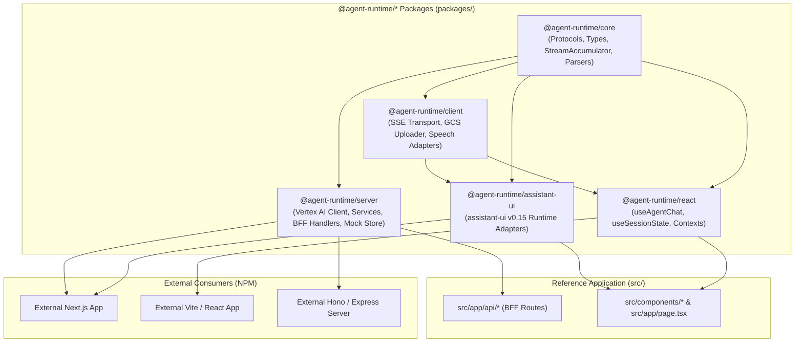

# Headless TypeScript SDK for Google Cloud Agent Runtime — Architecture & Specification

This specification outlines the architecture, package boundaries, API design, and extraction plan for converting the core logic of **Agent Runtime UI** into a standalone, headless TypeScript SDK (`@agent-runtime/*`) using a **Flat Monorepo Topology** (preserving the existing `src/` Next.js application at the root).

---

## 1. Executive Summary & Philosophy

The **Headless TypeScript SDK for Agent Runtime** enables any web application, frontend framework, or Node.js backend to easily connect to **ADK (Agent Development Kit)** agents deployed on **Google Cloud Agent Runtime** (Vertex AI Reasoning Engines).

### Core Design Principles

1. **Zero Disruptive File Churn**:
   The existing `src/` Next.js application remains at the repository root. Reusable capabilities are extracted into a root `packages/` directory.
2. **Framework-Agnostic & Zero UI Lock-in**:
   Pure TypeScript core with zero UI dependencies. Works seamlessly with custom React, Vue, Svelte, Angular, React Native, Vanilla JS, or UI component toolkits like `@assistant-ui/react` and `ai-sdk`.
3. **Universal Serverless Backend-For-Frontend (BFF)**:
   Modular server-side handlers that integrate with Next.js App Router, Hono, Express, Fastify, Cloudflare Workers, or Google Cloud Run.
4. **Comprehensive Enterprise Agent Capabilities**:
   Out-of-the-box support for Gemini 2.0 thinking traces, ADK subagent trees, function calling with Human-in-the-Loop (HITL) approvals, Google Search grounding & citations, context caching telemetry, ADK session state diffing, long-term memory bank, quality flywheel feedback, and direct GCS multimodal uploads.
5. **Dual Engine (Production & Offline Mock Parity)**:
   Includes an in-memory mock engine allowing developers to test and develop against complete agent capabilities without GCP credentials.

---

## 2. Flat Monorepo Topology (Root `src/` + `packages/*`)

Using **Bun Workspaces** with TypeScript path mappings, the existing `src/` Next.js application stays in place at the root while headless packages live in `packages/`:

```
agent-runtime-ui/
├── package.json                   # Root package.json ("workspaces": ["packages/*"])
├── tsconfig.json                  # Root tsconfig with path aliases to packages/*/src
├── next.config.ts                 # Next.js 15 standalone config
├── Dockerfile
├── bun.lock
│
├── packages/                      # Published Headless SDK Packages
│   ├── core/                      # @agent-runtime/core
│   │   ├── package.json
│   │   ├── tsconfig.json
│   │   └── src/                   # Types, protocols, stream parser, accumulator, parsers
│   │
│   ├── server/                    # @agent-runtime/server
│   │   ├── package.json
│   │   ├── tsconfig.json
│   │   └── src/                   # Vertex AI REST client, IAM auth, domain services, mock engine
│   │
│   ├── client/                    # @agent-runtime/client
│   │   ├── package.json
│   │   ├── tsconfig.json
│   │   └── src/                   # SSE transport reader, GCS presigned upload manager, speech
│   │
│   ├── react/                     # @agent-runtime/react
│   │   ├── package.json
│   │   ├── tsconfig.json
│   │   └── src/                   # useAgentChat, useSessionState, useMemoryBank, contexts
│   │
│   └── assistant-ui/              # @agent-runtime/assistant-ui
│       ├── package.json
│       ├── tsconfig.json
│       └── src/                   # ChatModelAdapter, ThreadListAdapter, AttachmentAdapter
│
└── src/                           # Flagship Reference Web Application (Next.js 15)
    ├── app/
    │   ├── api/                   # BFF endpoints using @agent-runtime/server
    │   ├── layout.tsx
    │   ├── page.tsx               # Chat UI using @agent-runtime/assistant-ui
    │   └── ...
    ├── components/                # Gemini styling, drawers, popovers, badges
    └── lib/                       # App-specific helpers (auth, jwt, theme)
```

### TypeScript Path Resolution Configuration

In the root `tsconfig.json`, paths map directly to package sources for instant hot-reloading:

```json
{
  "compilerOptions": {
    "baseUrl": ".",
    "paths": {
      "@/*": ["./src/*"],
      "@agent-runtime/core": ["./packages/core/src"],
      "@agent-runtime/server": ["./packages/server/src"],
      "@agent-runtime/client": ["./packages/client/src"],
      "@agent-runtime/react": ["./packages/react/src"],
      "@agent-runtime/assistant-ui": ["./packages/assistant-ui/src"]
    }
  }
}
```

---

## 3. Package Boundaries & Detailed Inventory



### 3.1 `@agent-runtime/core`

**Target**: Pure TypeScript, universal (browser + edge + nodejs), zero external dependencies.

- **Types & Contracts** (from [`src/types/agent/`](file:///Users/mblanc/projects/agent-runtime-ui/src/types/agent)):
  - `AgentStreamEvent`, `AgentMessage`, `AgentMessagePart`, `AgentSession`
  - `GroundingMetadata`, `GroundingChunk`, `SearchEntryPoint`
  - `AgentUsageMetadata`, `AgentActionsDelta`, `AgentNodeInfo`
  - `SessionStateMap`, `AgentMemory`, `AgentFeedbackRequest`
- **Stream State Machine** (from [`src/lib/adapters/stream-accumulator.ts`](file:///Users/mblanc/projects/agent-runtime-ui/src/lib/adapters/stream-accumulator.ts)):
  - `StreamAccumulator`: Accumulates incoming SSE frames, folds thoughts, subagent delegation trees, tool calls, grounding metadata, caching metrics, and state deltas with a 25ms render throttling barrier.
- **Grounding & Citations Engine** (from [`src/lib/grounding/citation-parser.ts`](file:///Users/mblanc/projects/agent-runtime-ui/src/lib/grounding/citation-parser.ts)):
  - `extractGroundingMetadata`, `mergeGroundingMetadata`, `parseMarkdownCitations`, domain/GCS URI resolution.
- **Context Caching Metrics** (from [`src/lib/context-caching/cache-metrics.ts`](file:///Users/mblanc/projects/agent-runtime-ui/src/lib/context-caching/cache-metrics.ts)):
  - `calculateCacheMetrics`: Prompt caching hit ratio, token savings, cost reduction.
- **ADK Session State Utilities** (from [`src/lib/session-state/state-diff.ts`](file:///Users/mblanc/projects/agent-runtime-ui/src/lib/session-state/state-diff.ts)):
  - `diffSessionState`, `inferVariableType`, value serializer/deserializer.

---

### 3.2 `@agent-runtime/server`

**Target**: Node.js & Edge environments (Next.js App Router, Hono, Express, Fastify, Cloud Run).

- **Vertex AI Client & IAM Context** (from [`src/lib/agent-runtime/services/context.ts`](file:///Users/mblanc/projects/agent-runtime-ui/src/lib/agent-runtime/services/context.ts)):
  - Automated Google Cloud IAM Bearer Token minting via `google-auth-library`.
  - Regional endpoint normalizer and resource name builders (`projects/.../locations/.../reasoningEngines/...`).
- **Domain Services** (from [`src/lib/agent-runtime/services/`](file:///Users/mblanc/projects/agent-runtime-ui/src/lib/agent-runtime/services)):
  - `VertexAiStreamingService`: `:streamQuery` execution with `:query` fallback and SSE streaming.
  - `VertexAiSessionService`: Multi-turn session CRUD, history event listing, and `session.state` GET/PATCH.
  - `VertexAiMemoryService`: Long-term Memory Bank CRUD and AIP-160 topic queries.
  - `VertexAiFeedbackService`: Thumbs-up/down quality flywheel submission.
  - `VertexAiAgentService`: Regional deployed agent fleet discovery with TTL caching.
- **Universal Route Handlers**:
  - Prebuilt HTTP request handlers for `/api/chat`, `/api/sessions`, `/api/memory`, `/api/feedback`, `/api/uploads/presign`.
  - Built-in keepalive heartbeat injector (`: keepalive\n\n`).
- **Security & Validation** (from [`src/lib/session-ownership.ts`](file:///Users/mblanc/projects/agent-runtime-ui/src/lib/session-ownership.ts)):
  - `isSessionOwnedBy`: IDOR defense across multi-tenant reasoning engines.
- **In-Memory Mock Engine** (from [`src/lib/agent-runtime/mock/`](file:///Users/mblanc/projects/agent-runtime-ui/src/lib/agent-runtime/mock)):
  - `MockAgentRuntimeProvider`: Complete offline emulation of all GCP Vertex AI APIs.

---

### 3.3 `@agent-runtime/client`

**Target**: Browser / Client-side TypeScript.

- **SSE Transport Reader** (from [`src/lib/adapters/sse-stream.ts`](file:///Users/mblanc/projects/agent-runtime-ui/src/lib/adapters/sse-stream.ts)):
  - `streamChat`: Async generator reading chunked SSE responses via `ReadableStreamDefaultReader` with malformed frame guard and keepalive comment filtering.
- **Direct-to-GCS Multimodal Uploader** (from [`src/lib/adapters/gcs-attachment-adapter.ts`](file:///Users/mblanc/projects/agent-runtime-ui/src/lib/adapters/gcs-attachment-adapter.ts)):
  - Direct HTTP PUT of binary files to Cloud Storage via presigned URLs, returning `gs://` URIs.
  - Attachment store with TTL cache (from [`src/lib/attachments/attachment-store.ts`](file:///Users/mblanc/projects/agent-runtime-ui/src/lib/attachments/attachment-store.ts)).
- **Web Speech Adapters** (from [`src/lib/adapters/speech-adapters.ts`](file:///Users/mblanc/projects/agent-runtime-ui/src/lib/adapters/speech-adapters.ts)):
  - Browser-native Speech-to-Text (STT) and Text-to-Speech (TTS) controllers.

---

### 3.4 `@agent-runtime/react`

**Target**: React 18 / 19 headless hooks and contexts.

- **`useAgentChat` Hook**:
  - Manages message list, active turn streaming, token accumulation, Gemini 2.0 thinking traces, subagent delegation cards, and HITL approvals.
- **`useSessionState` Hook** (from [`src/lib/session-state/state-context.tsx`](file:///Users/mblanc/projects/agent-runtime-ui/src/lib/session-state/state-context.tsx)):
  - Inspect, filter, add, and live-mutate typed ADK session state variables with optimistic updates.
- **`useMemoryBank` Hook** (from [`src/lib/memory-context.tsx`](file:///Users/mblanc/projects/agent-runtime-ui/src/lib/memory-context.tsx)):
  - Manage long-term semantic facts, topics, and memory generation from active chat.
- **`useAgentFleet` Hook** (from [`src/lib/agent-context.tsx`](file:///Users/mblanc/projects/agent-runtime-ui/src/lib/agent-context.tsx)):
  - Switch between deployed reasoning engines and regions.

---

### 3.5 `@agent-runtime/assistant-ui`

**Target**: Drop-in runtime adapters for `@assistant-ui/react` v0.15+.

- **`createGeminiChatAdapter`** (from [`src/lib/adapters/chat-adapter.ts`](file:///Users/mblanc/projects/agent-runtime-ui/src/lib/adapters/chat-adapter.ts)):
  - Implements `ChatModelAdapter` with wire message translation (`toAgentMessages`) and accumulator snapshot yields.
- **`useSessionThreadListAdapter`** (from [`src/lib/session-adapter.tsx`](file:///Users/mblanc/projects/agent-runtime-ui/src/lib/session-adapter.tsx)):
  - Implements `RemoteThreadListAdapter` and `ThreadHistoryAdapter` connecting thread sidebars to Vertex AI Session Service.
- **`createGcsAttachmentAdapter`**:
  - Implements `AttachmentAdapter` for drag-and-drop / file picker direct-to-GCS uploads.
- **`createGeminiFeedbackAdapter`**:
  - Implements `FeedbackAdapter` for thumbs up/down response ratings.

---

## 4. Developer Experience & API Examples

### 4.1 Server Setup in `src/app/api/chat/route.ts`

```typescript
// src/app/api/chat/route.ts
import { createAgentRuntimeServer } from "@agent-runtime/server";
import { getAuthSession } from "@/lib/auth";

const server = createAgentRuntimeServer({
  projectId: process.env.GOOGLE_CLOUD_PROJECT,
  location: process.env.GOOGLE_CLOUD_LOCATION || "us-central1",
  reasoningEngineId: process.env.GOOGLE_REASONING_ENGINE_ID,
  mockMode: process.env.MOCK_AGENT_RUNTIME === "true",
});

// Single call creates authenticated streaming SSE route handler
export const POST = server.createChatHandler({
  getUserId: async (req) => {
    const session = await getAuthSession();
    return session?.userId;
  },
});
```

### 4.2 Headless React Hook (Custom UI in Any Framework)

```tsx
import { useAgentChat, useSessionState } from "@agent-runtime/react";

export function CustomChat() {
  const {
    messages,
    sendMessage,
    isStreaming,
    reasoningTraces,
    subagents,
    pendingApproval,
    approveAction,
    declineAction,
    cacheMetrics,
  } = useAgentChat({ apiEndpoint: "/api/chat" });

  const { stateVariables, updateVariable } = useSessionState();

  return (
    <div className="chat-container">
      {cacheMetrics && (
        <div className="cache-badge">
          ⚡ {cacheMetrics.cachedTokens} cached ({cacheMetrics.hitRatio}%)
        </div>
      )}

      <div className="message-list">
        {messages.map((m) => (
          <div key={m.id} className={m.role}>
            {m.reasoning && <div className="thought">{m.reasoning}</div>}
            <p>{m.text}</p>
            {m.citations?.map((c) => (
              <a key={c.index} href={c.url}>
                [{c.index}]
              </a>
            ))}
          </div>
        ))}

        {pendingApproval && (
          <div className="hitl-card">
            <p>Approve tool: {pendingApproval.toolName}?</p>
            <button onClick={() => approveAction(pendingApproval.id)}>Approve</button>
            <button onClick={() => declineAction(pendingApproval.id)}>Decline</button>
          </div>
        )}
      </div>

      <input onKeyDown={(e) => e.key === "Enter" && sendMessage(e.currentTarget.value)} />
    </div>
  );
}
```

### 4.3 Assistant UI Integration (`src/app/page.tsx`)

```tsx
// src/app/page.tsx
import { AssistantRuntimeProvider } from "@assistant-ui/react";
import { useAgentRuntime } from "@agent-runtime/assistant-ui";
import { GeminiThread } from "@/components/assistant-ui/gemini-thread";

export default function ChatPage() {
  const runtime = useAgentRuntime({
    chatEndpoint: "/api/chat",
    sessionsEndpoint: "/api/sessions",
  });

  return (
    <AssistantRuntimeProvider runtime={runtime}>
      <GeminiThread />
    </AssistantRuntimeProvider>
  );
}
```

---

## 5. Phased Monorepo Migration Plan (Option 1)

| Phase                                     | Tasks & Deliverables                                                                                                                                                                                                                                                                                  | Verification Quality Gate                                           |
| :---------------------------------------- | :---------------------------------------------------------------------------------------------------------------------------------------------------------------------------------------------------------------------------------------------------------------------------------------------------- | :------------------------------------------------------------------ |
| **Phase 1: Workspace & Core Package**     | • Update root `package.json` with `"workspaces": ["packages/*"]` and `tsconfig.json` paths.<br/>• Create `packages/core` with tsconfig and build config.<br/>• Move types, `stream-accumulator.ts`, `citation-parser.ts`, `cache-metrics.ts`, `state-diff.ts` into `packages/core/src` and re-export. | `bun run check` & `bun test`                                        |
| **Phase 2: Server Package**               | • Create `packages/server` with `google-auth-library` dependency.<br/>• Move `src/lib/agent-runtime/` domain services, mock engine, and session ownership into `packages/server/src`.<br/>• Build universal route handler helpers.                                                                    | `bun test` (all API and backend tests pass)                         |
| **Phase 3: Client & React Packages**      | • Create `packages/client` (`sse-stream.ts`, `gcs-attachment-adapter.ts`, speech adapters).<br/>• Create `packages/react` (`useAgentChat`, `useSessionState`, `useMemoryBank`).                                                                                                                       | `bun test`                                                          |
| **Phase 4: Assistant-UI Adapter Package** | • Create `packages/assistant-ui` (`chat-adapter.ts`, `session-adapter.tsx`, `feedback-adapter.ts`).                                                                                                                                                                                                   | `bun test`                                                          |
| **Phase 5: Reconnecting Root `src/`**     | • Update imports in `src/` to import from `@agent-runtime/*` packages.<br/>• Verify the entire Gemini UI, sidebar, drawers, popovers, and Playwright E2E suite.                                                                                                                                       | `bun run preflight` (61 test files, 604 unit tests, Playwright E2E) |
