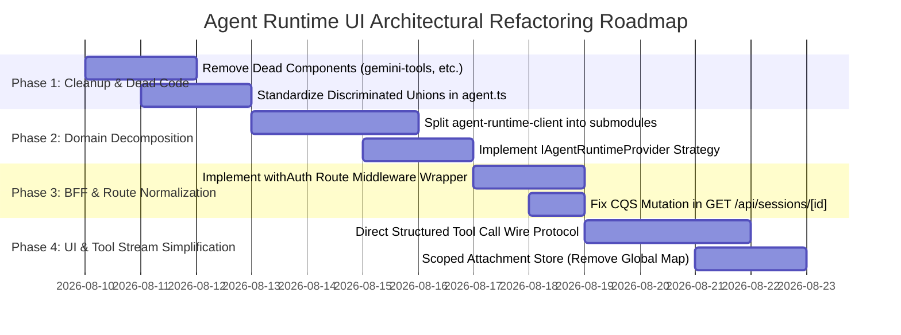

# Software Design Review & Architectural Improvements Roadmap

> **Target Project:** Agent Runtime UI (`agent-runtime-ui`)  
> **Evaluation Framework:** SOLID, Reduction Principles (DRY/YAGNI/KISS), Composition & Coupling (LoD/CQS/Cohesion), Separation of Concerns (SoC/PoLA/Fail-Fast/Encapsulate-What-Varies).  
> **Date:** August 2026  
> **Document Status:** Comprehensive Audit & Actionable Refactoring Blueprint

---

## Table of Contents

1. [Executive Summary & Architectural Scorecard](#1-executive-summary--architectural-scorecard)
2. [SOLID Principles Evaluation](#2-solid-principles-evaluation)
   - [2.1 S — Single Responsibility Principle (SRP)](#21-s--single-responsibility-principle-srp)
   - [2.2 O — Open / Closed Principle (OCP)](#22-o--open--closed-principle-ocp)
   - [2.3 L — Liskov Substitution Principle (LSP)](#23-l--liskov-substitution-principle-lsp)
   - [2.4 I — Interface Segregation Principle (ISP)](#24-i--interface-segregation-principle-isp)
   - [2.5 D — Dependency Inversion Principle (DIP)](#25-d--dependency-inversion-principle-dip)
3. [Reduction Principles Evaluation](#3-reduction-principles-evaluation)
   - [3.1 DRY — Don't Repeat Yourself](#31-dry--dont-repeat-yourself)
   - [3.2 YAGNI — You Aren't Gonna Need It](#32-yagni--you-arent-gonna-need-it)
   - [3.3 KISS — Keep It Simple](#33-kiss--keep-it-simple)
4. [Composition & Coupling Evaluation](#4-composition--coupling-evaluation)
   - [4.1 Composition over Inheritance](#41-composition-over-inheritance)
   - [4.2 Law of Demeter (LoD)](#42-law-of-demeter-lod)
   - [4.3 Command-Query Separation (CQS)](#43-command-query-separation-cqs)
   - [4.4 Low Coupling / High Cohesion](#44-low-coupling--high-cohesion)
5. [Separation of Concerns & Operational Principles](#5-separation-of-concerns--operational-principles)
   - [5.1 Separation of Concerns (SoC)](#51-separation-of-concerns-soc)
   - [5.2 Principle of Least Astonishment (PoLA)](#52-principle-of-least-astonishment-pola)
   - [5.3 Fail Fast](#53-fail-fast)
   - [5.4 Encapsulate What Varies](#54-encapsulate-what-varies)
6. [Detailed Code Smells & Architectural Deficiencies](#6-detailed-code-smells--architectural-deficiencies)
7. [Target Architecture & Refactoring Blueprints](#7-target-architecture--refactoring-blueprints)
   - [7.1 Decomposing `agent-runtime-client.ts` (Monolith to Micro-Modules)](#71-decomposing-agent-runtime-clientts-monolith-to-micro-modules)
   - [7.2 Introducing `IAgentRuntimeProvider` (Strategy Pattern)](#72-introducing-iagentruntimeprovider-strategy-pattern)
   - [7.3 Unifying Tool & Reasoning Wire Protocols (Eliminating String Regex Round-Tripping)](#73-unifying-tool--reasoning-wire-protocols-eliminating-string-regex-round-tripping)
   - [7.4 Eliminating Global Mutable State in Attachment Flow](#74-eliminating-global-mutable-state-in-attachment-flow)
   - [7.5 Shared BFF Middleware Wrapper (DRY & Fail-Fast Authentication)](#75-shared-bff-middleware-wrapper-dry--fail-fast-authentication)
8. [Phased Implementation Roadmap](#8-phased-implementation-roadmap)

---

## 1. Executive Summary & Architectural Scorecard

**Agent Runtime UI** is a production-grade, database-free Next.js application styled after Google Gemini that connects authenticated users to Google Cloud Agent Runtime (Vertex AI Reasoning Engines). It features robust stateless authentication via HMAC-SHA256 JWT cookies, real-time SSE streaming, Human-in-the-Loop (HITL) tool execution, multi-agent switching, and multimodal attachments via Google Cloud Storage (GCS).

While the application demonstrates high technical execution in its user experience, UI fidelity, and unit test coverage (176 tests passing), a deep architectural audit reveals significant **architectural debt** in module boundaries, separation of concerns, and single-responsibility violations. Specifically, core files have become "god modules" carrying multiple unrelated axes of change.

### Design Principles Scorecard

| Principle Category | Principle                            | Grade  |    Status     | Core Finding / Summary                                                                                                                                                                                                                                                                          |
| :----------------- | :----------------------------------- | :----: | :-----------: | :---------------------------------------------------------------------------------------------------------------------------------------------------------------------------------------------------------------------------------------------------------------------------------------------- |
| **SOLID**          | **SRP** (Single Responsibility)      | **D**  |  ⚠️ Critical  | [`agent-runtime-client.ts`](file:///Users/mblanc/projects/agent-runtime-ui/src/lib/agent-runtime-client.ts) (2,120 LOC) and [`gemini-runtime-adapter.ts`](file:///Users/mblanc/projects/agent-runtime-ui/src/lib/gemini-runtime-adapter.ts) (822 LOC) handle 7+ separate responsibilities each. |
|                    | **OCP** (Open / Closed)              | **C**  | ⚠️ Needs Work | Backend switching and mock modes rely on hardcoded `if/else` checks rather than pluggable strategy interfaces.                                                                                                                                                                                  |
|                    | **LSP** (Liskov Substitution)        | **A-** |    ✅ Good    | Mock runtime and live Vertex AI engine return compatible data shapes conforming to `AgentSession` and `AgentStreamEvent`.                                                                                                                                                                       |
|                    | **ISP** (Interface Segregation)      | **C+** | ⚠️ Needs Work | `AgentMessagePart` and `AgentSessionEvent` are fat polymorphic interfaces with duplicated casing variants (`file_data` vs `fileData`, `function_call` vs `functionCall`).                                                                                                                       |
|                    | **DIP** (Dependency Inversion)       | **C**  | ⚠️ Needs Work | BFF route handlers instantiate concrete `new AgentRuntimeClient()` directly without dependency injection or interface abstraction.                                                                                                                                                              |
| **Reduction**      | **DRY** (Don't Repeat)               | **B-** | ⚠️ Needs Work | Auth verification, local ID checking, title capitalization, and agent query param parsing are duplicated across 7 API routes.                                                                                                                                                                   |
|                    | **YAGNI** (You Aren't Gonna Need It) | **B**  | ⚠️ Needs Work | Multiple dead component files exist (`gemini-tools.tsx`, `gemini-reasoning.tsx`, `gemini-thinking-indicator.tsx`) that are superseded by newer primitives.                                                                                                                                      |
|                    | **KISS** (Keep It Simple)            | **C+** | ⚠️ Needs Work | High complexity in round-tripping structured tool and subagent data into pseudo-markdown tags (`:::tool[...]`) and parsing them back with regex.                                                                                                                                                |
| **Coupling**       | **Composition over Inheritance**     | **A**  | 🌟 Excellent  | Superb use of `@assistant-ui/react` Radix-style primitive composition, compound React components, and React Context.                                                                                                                                                                            |
|                    | **Law of Demeter** (LoD)             | **B**  |    ✅ Good    | Generally good; some deep object navigation in node graph inspection (`rawEvt.config.node_info.output_for`).                                                                                                                                                                                    |
|                    | **CQS** (Command-Query Separation)   | **C-** | ⚠️ Needs Work | `GET /api/sessions/[sessionId]` triggers a mutating `PATCH` command in the background to rename sessions with default titles.                                                                                                                                                                   |
|                    | **Coupling & Cohesion**              | **C**  | ⚠️ Needs Work | High coupling in `agent-runtime-client.ts`; low cohesion due to mixing mock storage, live REST calls, SSE decoders, and markdown tag formatting.                                                                                                                                                |
| **SoC & Ops**      | **SoC** (Separation of Concerns)     | **C+** | ⚠️ Needs Work | UI markdown rendering tags (`:::subagent`, `:::tool`) are constructed inside low-level backend event parsing utilities.                                                                                                                                                                         |
|                    | **PoLA** (Least Astonishment)        | **B**  |    ✅ Good    | Intuitive component naming, but silent side-effects in GET requests and empty `append: async () => {}` violate expectations.                                                                                                                                                                    |
|                    | **Fail Fast**                        | **B**  |    ✅ Good    | Good route-level boundary validation; however, missing production config causes silent fallback to mock mode rather than explicit failure.                                                                                                                                                      |
|                    | **Encapsulate What Varies**          | **C**  | ⚠️ Needs Work | Runtime backend selection, storage adapters, and tool rendering strategies are not encapsulated behind isolation boundaries.                                                                                                                                                                    |

---

## 2. SOLID Principles Evaluation

### 2.1 S — Single Responsibility Principle (SRP)

> _"A class or module should have one reason to change — one job, one owner, one axis of variation."_

#### Current State & Violations

1. **[`src/lib/agent-runtime-client.ts`](file:///Users/mblanc/projects/agent-runtime-ui/src/lib/agent-runtime-client.ts) (2,120 lines)**:
   This single file currently has **seven distinct reasons to change**:
   - **Axis 1 (Mock Store)**: Changes to offline test fixtures (`mockAgentsStore`, `mockSessionsStore`, `mockSessionEventsStore`).
   - **Axis 2 (GCP IAM Auth)**: Changes to Google Cloud authentication scopes, credential resolution, or token exchange.
   - **Axis 3 (Vertex AI Reasoning Engine REST Client)**: Changes to Google Cloud REST endpoints (`:listSessions`, `:createSession`, `:get`, `:patch`, `:delete`, `:listSessionEvents`, `:submitFeedback`).
   - **Axis 4 (GCP Session Event Parsing & Normalization)**: Heuristics extracting text, thoughts, subagent paths, and tool calls from nested Vertex AI JSON structures (`parseRawSessionEvent`, `safeParseJson`, `extractTextFromQueryOutput`, `isRootWorkflowOutput`, `isSubagentNode`).
   - **Axis 5 (Turn Grouping & Markdown Formatting)**: Grouping raw session events into conversational turns and building custom markdown strings (`:::subagent[...]`, `:::tool[...]`) (`groupTurnSessionEvents`, `formatSessionEventsToThreadMessages`).
   - **Axis 6 (Live SSE Stream Decoder)**: Byte decoding, buffer splitting, JSON parsing, and keepalive handling for the `:streamQuery` endpoint.
   - **Axis 7 (Mock Agent Simulator)**: An entire mock simulation engine with simulated timers, multimodal response generators, and HITL tool confirmation handlers (`mockStreamQuery`).

2. **[`src/lib/gemini-runtime-adapter.ts`](file:///Users/mblanc/projects/agent-runtime-ui/src/lib/gemini-runtime-adapter.ts) (822 lines)**:
   Combines:
   - Client-side SSE stream parsing and state synchronization for `@assistant-ui/react`.
   - String regex manipulation for injecting tool results and subagent responses into reasoning text.
   - Global mutable state management (`attachmentMetadataMap`).
   - Two-phase file upload orchestration (Presign -> HTTP PUT -> GCS metadata).
   - Web Speech API dictation and synthesis adapter instantiation.
   - Feedback submission adapter.

#### Impact

High blast radius. A change in mock test data or a tweak to the markdown formatting of subagent traces requires modifying the exact same file that manages live GCP IAM credentials and production streaming.

---

### 2.2 O — Open / Closed Principle (OCP)

> _"Open for extension, closed for modification. Add behaviour by adding code, not editing existing code."_

#### Current State & Violations

1. **Hardcoded Mock vs. Live Branching**:
   Every method in `AgentRuntimeClient` contains an `if (this.isMock) { ... } else { ... }` branch. If a team wants to add support for a third backend (e.g., direct Gemini 2.0 API, Cloud Run microservice, or LangGraph Agent Server), they cannot simply add a new provider class. They must modify every method in `AgentRuntimeClient`.
2. **Procedural Tool Parsing**:
   In [`src/components/assistant-ui/tool-fallback.tsx`](file:///Users/mblanc/projects/agent-runtime-ui/src/components/assistant-ui/tool-fallback.tsx), extracting human-readable descriptions for HITL confirmation relies on hardcoded field lookups:
   ```typescript
   const customPrompt =
     parsedArgs.prompt ||
     parsedArgs.action_description ||
     parsedArgs.actionDescription ||
     parsedArgs.description ||
     parsedArgs.message;
   ```
   Adding new tool schema formats requires editing the component rather than supplying a schema extractor strategy.

---

### 2.3 L — Liskov Substitution Principle (LSP)

> _"Subtypes must be substitutable for their base types without breaking the program."_

#### Current State & Analysis

- **Strengths**:
  - The runtime adapters (`ChatModelAdapter`, `FeedbackAdapter`, `AttachmentAdapter`, `RemoteThreadListAdapter`) strictly adhere to `@assistant-ui/react` contracts. They can be substituted without the UI breaking.
  - The mock store and live Vertex AI sessions both yield standardized `AgentSession` and `AgentSessionEvent` structures.
- **Subtle Violations**:
  - Session IDs in mock mode are short integers (`"1"`, `"2"`, `"3"`) whereas in live mode they are full UUIDs or resource names. This requires heuristic helpers like `isLocalSessionId` across the application rather than treating all session identifiers polymorphically.

---

### 2.4 I — Interface Segregation Principle (ISP)

> _"Clients shouldn't be forced to depend on interfaces they don't use. Prefer many small interfaces over one fat one."_

#### Current State & Violations

1. **Fat `AgentMessagePart` Interface** ([`src/types/agent.ts`](file:///Users/mblanc/projects/agent-runtime-ui/src/types/agent.ts#L8-L46)):
   ```typescript
   export interface AgentMessagePart {
     text?: string;
     thought?: boolean;
     file_data?: { file_uri: string; mime_type: string };
     fileData?: {
       file_uri?: string;
       fileUri?: string;
       mime_type?: string;
       mimeType?: string;
     };
     image?: string;
     file?: { filename?: string; data: string; mimeType: string };
     functionCall?: { name: string; args: Record<string, unknown> };
     functionResponse?: { id?: string; name: string; response: Record<string, unknown> };
     function_call?: { id?: string; name: string; args: Record<string, unknown> };
     function_response?: { id?: string; name: string; response: Record<string, unknown> };
   }
   ```
   This interface mixes snake_case and camelCase variants and forces every consumer to navigate optional properties for text, images, files, function calls, and function responses.
2. **Fat `AgentSessionEvent` Interface** ([`src/types/agent.ts`](file:///Users/mblanc/projects/agent-runtime-ui/src/types/agent.ts#L144-L172)):
   Contains both single and array forms (`tool_call` and `tool_calls`, `tool_result` and `tool_results`), forcing consumer code to check multiple fields.

---

### 2.5 D — Dependency Inversion Principle (DIP)

> _"High-level modules shouldn't depend on low-level modules. Both should depend on abstractions."_

#### Current State & Violations

1. **Direct Concrete Instantiation in API Routes**:
   [`src/app/api/chat/route.ts`](file:///Users/mblanc/projects/agent-runtime-ui/src/app/api/chat/route.ts), [`src/app/api/sessions/route.ts`](file:///Users/mblanc/projects/agent-runtime-ui/src/app/api/sessions/route.ts), and [`src/app/api/feedback/route.ts`](file:///Users/mblanc/projects/agent-runtime-ui/src/app/api/feedback/route.ts) all instantiate concrete `new AgentRuntimeClient(...)` directly:
   ```typescript
   // Direct dependency on concrete class rather than an IAgentRuntimeService interface
   const agentClient = new AgentRuntimeClient(customEngineId, customLocation);
   ```
2. **Direct Storage Instantiation**:
   [`src/app/api/uploads/presign/route.ts`](file:///Users/mblanc/projects/agent-runtime-ui/src/app/api/uploads/presign/route.ts#L112) directly instantiates Google Cloud Storage SDK (`new Storage(...)`) inside the route handler instead of relying on an `IStorageService` abstraction.

---

## 3. Reduction Principles Evaluation

### 3.1 DRY — Don't Repeat Yourself

> _"Every piece of knowledge should have a single, authoritative representation in the system."_

#### Identified Duplications

1. **Authentication Boilerplate**:
   The following 10-line block is copy-pasted across 7 API routes (`chat`, `sessions`, `sessions/[sessionId]`, `agents`, `feedback`, `uploads/presign`, `uploads/signed-read`):
   ```typescript
   const session = await auth.api.getSession({ headers: req.headers });
   if (!session?.user?.id) {
     return NextResponse.json({ error: "Unauthorized..." }, { status: 401 });
   }
   ```
2. **Local Session ID Filter**:
   `sessionId.startsWith("__LOCALID_") || sessionId.startsWith("local-")` is duplicated in `session-adapter.tsx`, `agent-runtime-client.ts`, and `api/sessions/[sessionId]/route.ts`.
3. **Session Title Formatting**:
   Capitalizing the first letter and truncating to 40 characters is implemented in both `useSessionThreadListAdapter.generateTitle` ([`session-adapter.tsx`](file:///Users/mblanc/projects/agent-runtime-ui/src/lib/session-adapter.tsx#L282)) and `GET /api/sessions/[sessionId]` ([`route.ts`](file:///Users/mblanc/projects/agent-runtime-ui/src/app/api/sessions/%5BsessionId%5D/route.ts#L77)).
4. **Agent Query Parameter Extraction**:
   Extracting `agentId` and `reasoningEngineId` from query params/headers is repeated across 4 files.

---

### 3.2 YAGNI — You Aren't Gonna Need It

> _"Don't implement something until you actually need it. Speculative generality creates dead weight."_

#### Dead Code & Speculative Weight

1. **Dead Component Files**:
   - [`src/components/assistant-ui/gemini-tools.tsx`](file:///Users/mblanc/projects/agent-runtime-ui/src/components/assistant-ui/gemini-tools.tsx) (108 lines): Defines `GeminiToolCall` and `GeminiReasoningTrace`, which are **never imported or rendered** anywhere in the application.
   - [`src/components/assistant-ui/gemini-reasoning.tsx`](file:///Users/mblanc/projects/agent-runtime-ui/src/components/assistant-ui/gemini-reasoning.tsx) (94 lines): Defines `GeminiReasoningAccordion`, which was superseded by `ReasoningRoot` in `reasoning.tsx`.
   - [`src/components/assistant-ui/gemini-thinking-indicator.tsx`](file:///Users/mblanc/projects/agent-runtime-ui/src/components/assistant-ui/gemini-thinking-indicator.tsx) (47 lines): Defines an unused standalone thinking indicator.
2. **Speculative Wire Casings**:
   `AgentMessagePart` supports 4 permutations of file data (`file_data.file_uri`, `fileData.file_uri`, `fileData.fileUri`, `file.data`). Standardizing on the official Vertex AI wire format eliminates unnecessary mapping branches.

---

### 3.3 KISS — Keep It Simple

> _"Favour the simplest solution that works. Complexity is a liability."_

#### Identified Architectural Over-Engineering

1. **Markdown String Serialization Impedance Mismatch**:
   - When the backend or stream client receives structured tool calls or subagent traces, it serializes them into custom markdown tags within the reasoning text:
     `:::subagent[Arch Advisor]{status="complete" agent="arch_advisor"}\n...:::`
     `:::tool[check_system_health]{status="complete"}\n**Arguments:**\n...\n:::`
   - Then, [`src/components/assistant-ui/reasoning.tsx`](file:///Users/mblanc/projects/agent-runtime-ui/src/components/assistant-ui/reasoning.tsx) runs complex regex matchers (`parseReasoningBlocks`, `parseToolBlockContent`, `parseSubAgentBlockContent`, `parseLegacyToolTraces`) to parse the string back into structured React elements.
   - **Simplification**: `@assistant-ui/react` v0.15 provides first-class support for `tool-call` and `data` content parts. Passing structured parts directly avoids string serialization and regex parsing completely.

---

## 4. Composition & Coupling Evaluation

### 4.1 Composition over Inheritance

> _"Build behaviour by composing small objects rather than deep inheritance hierarchies."_

#### Grade: **A (Exemplary)**

- The frontend architecture leverages React compound components and Radix primitive composition cleanly.
- `ToolGroupRoot`, `ToolGroupTrigger`, `ToolGroupContent` and `ReasoningRoot`, `ReasoningTrigger`, `ReasoningContent` provide clean slot-based composition without inheritance or prop drilling.
- Message rendering leverages `@assistant-ui/react` part composition (`MessagePrimitive.GroupedParts` with `groupPartByType`).

---

### 4.2 Law of Demeter (LoD)

> _"Only talk to your immediate collaborators. Don't chain deep into object graphs."_

#### Identified Violations

1. **Node Graph Traversal**:
   In `isRootWorkflowOutput` and `isSubagentNode` ([`agent-runtime-client.ts`](file:///Users/mblanc/projects/agent-runtime-ui/src/lib/agent-runtime-client.ts#L294-L312)):
   ```typescript
   const nodeInfo =
     rawEvt.node_info ||
     rawEvt.nodeInfo ||
     config.node_info ||
     config.nodeInfo ||
     rawEvent.node_info ||
     rawEvent.nodeInfo;
   const outputFor = nodeInfo.output_for || nodeInfo.outputFor;
   ```
   This code reaches deep into 6 layers of nested fallback dictionaries. Encapsulating this in a `WorkflowGraphNode` value object eliminates Demeter violations.
2. **Deep UI State Chaining**:
   In `SyntaxHighlighter` ([`shiki-highlighter.tsx`](file:///Users/mblanc/projects/agent-runtime-ui/src/components/assistant-ui/shiki-highlighter.tsx#L27-L37)), accessing `s.message.status.type` directly creates tight coupling to the internal structure of the store.

---

### 4.3 Command-Query Separation (CQS)

> _"A function either changes state (command) or returns data (query) — never both."_

#### Identified Violation: Mutation in `GET /api/sessions/[sessionId]`

In [`src/app/api/sessions/[sessionId]/route.ts`](file:///Users/mblanc/projects/agent-runtime-ui/src/app/api/sessions/%5BsessionId%5D/route.ts#L68-L90):

```typescript
// Query Handler (GET) performing a side-effect Command (PATCH)
if (!sessionDetails.title || sessionDetails.title === "New conversation") {
  const firstUserEvent = events.find((e) => e.role === "user");
  if (firstUserEvent) {
    const smartTitle = ...;
    sessionDetails.title = smartTitle;
    agentClient.updateSessionTitle(sessionId, smartTitle, ...); // MUTATION!
  }
}
```

**Why this is harmful**:

- Violates HTTP `GET` idempotency and safety semantics.
- Causes unexpected database/GCP API mutations during read operations (e.g., search engines, prefetching, or monitoring health checks).
- **Remedy**: Title updates should occur strictly via the `PATCH` route or be generated when persisting the first turn.

---

### 4.4 Low Coupling / High Cohesion

> _"Things that change together should live together. Things that change independently should be kept apart."_

#### Evaluation

- **High Cohesion**: [`src/lib/jwt.ts`](file:///Users/mblanc/projects/agent-runtime-ui/src/lib/jwt.ts) has single-purpose cohesion around cryptographic Web Crypto operations.
- **Low Cohesion & High Coupling**: [`src/lib/agent-runtime-client.ts`](file:///Users/mblanc/projects/agent-runtime-ui/src/lib/agent-runtime-client.ts) tightly bundles mock data structures, GCP IAM OAuth clients, REST HTTP calls, AST parsing, and SSE streaming into a single 2,120-line class.

---

## 5. Separation of Concerns & Operational Principles

### 5.1 Separation of Concerns (SoC)

> _"Different aspects of a problem should be handled by distinct parts of the codebase."_

#### Layering Architecture Audit

```
┌─────────────────────────────────────────────────────────────────────────┐
│                      Presentation Layer (React 19)                       │
│  GeminiThread, GeminiComposer, ChatMessage, ThreadSidebar, ToolFallback  │
└────────────────────────────────────┬────────────────────────────────────┘
                                     │ (Hooks & Adapters)
┌────────────────────────────────────▼────────────────────────────────────┐
│                       Adapter Layer (assistant-ui)                      │
│  createGeminiChatAdapter, useSessionThreadListAdapter, AgentProvider    │
└────────────────────────────────────┬────────────────────────────────────┘
                                     │ (HTTP / SSE Fetch)
┌────────────────────────────────────▼────────────────────────────────────┐
│                    BFF Layer (Next.js App Router API)                   │
│  /api/chat, /api/sessions, /api/agents, /api/feedback, /api/uploads     │
└────────────────────────────────────┬────────────────────────────────────┘
                                     │ (GCP Client SDKs)
┌────────────────────────────────────▼────────────────────────────────────┐
│                  Domain / Service Layer (Backend Clients)               │
│  AgentRuntimeClient, GoogleAuth, GCS Storage, JWT Session Engine        │
└─────────────────────────────────────────────────────────────────────────┘
```

#### Layer Leaks Identified

1. **Global Mutable State in Adapter Layer**:
   [`src/lib/gemini-runtime-adapter.ts`](file:///Users/mblanc/projects/agent-runtime-ui/src/lib/gemini-runtime-adapter.ts#L24) maintains `export const attachmentMetadataMap = new Map<string, AttachmentMetadata>()` at the module level. This leaks state across sessions and creates uncollectable memory growth in long-running browser tabs.
2. **UI Markup in Backend Service**:
   `AgentRuntimeClient.groupTurnSessionEvents` builds UI-specific markdown tags (`:::subagent[...]`, `:::tool[...]`). The backend service should return clean domain objects; UI formatting belongs in the presentation layer.

---

### 5.2 Principle of Least Astonishment (PoLA)

> _"Code should behave the way a reader expects. Surprises are bugs waiting to happen."_

- **Astonishment 1**: An HTTP `GET /api/sessions/[sessionId]` triggers a write operation in Vertex AI.
- **Astonishment 2**: `useSessionThreadHistoryAdapter.append` is an empty no-op function (`append: async () => {}`), which confuses developers expecting message persistence to flow through the history adapter.
- **Astonishment 3**: `gemini-tools.tsx` contains complete UI components that look active but are completely orphaned and never rendered.

---

### 5.3 Fail Fast

> _"Detect and surface errors as early and loudly as possible — don't let invalid state propagate."_

#### Current Strengths & Weaknesses

- **Strength**: API routes validate authentication and JSON payload schemas at the entry point, returning 400/401 immediately.
- **Weakness (Silent Mock Fallback)**:
  In `AgentRuntimeClient.constructor`:
  ```typescript
  this.isMock =
    process.env.MOCK_AGENT_RUNTIME === "true" ||
    !this.projectId ||
    !this.reasoningEngineId;
  ```
  If an engineer deploys to Cloud Run and forgets to configure `GOOGLE_REASONING_ENGINE_ID`, the app **silently switches to mock mode** instead of failing fast with an explicit configuration error. In production, missing credentials should throw an immediate error.

---

### 5.4 Encapsulate What Varies

> _"Identify what's likely to change and hide it behind an abstraction. Isolate volatility from stability."_

The aspects most likely to vary over time are:

1. **Agent Engine Providers** (Vertex AI Reasoning Engine vs. Direct Gemini API vs. Cloud Run ADK Agent vs. LangGraph).
2. **File Storage Providers** (Google Cloud Storage vs. Local Mock vs. AWS S3).
3. **Session Persistence Backends** (Vertex AI Session Service vs. PostgreSQL / Cloud SQL vs. Redis).

Currently, none of these 3 volatile subsystems are encapsulated behind abstract interfaces. Refactoring them to interface-driven services isolates volatility from the core application.

---

## 6. Detailed Code Smells & Architectural Deficiencies

### Summary of Identified Issues

```
├── 🚨 Critical Architectural Smells
│   ├── [S1] Monolithic AgentRuntimeClient (2,120 LOC) handling 7 distinct responsibilities.
│   ├── [S2] Monolithic gemini-runtime-adapter.ts (822 LOC) mixing uploads, speech, and chat.
│   └── [S3] Global mutable Map (attachmentMetadataMap) leaking memory and cross-session state.
│
├── ⚠️ Design & Clean Code Deficiencies
│   ├── [D1] Mutation-on-Read in GET /api/sessions/[sessionId] violating CQS.
│   ├── [D2] String markdown round-tripping for structured tool/subagent data (regex impedance).
│   ├── [D3] Fat polymorphic interfaces (AgentMessagePart, AgentSessionEvent) with redundant casings.
│   ├── [D4] Silent mock fallback when production environment variables are missing.
│   └── [D5] Duplicated auth, local ID, and title formatting boilerplate across 7 API routes.
│
└── 🗑️ Dead Code & Unused Assets
    ├── [U1] src/components/assistant-ui/gemini-tools.tsx (108 LOC, 0 imports).
    ├── [U2] src/components/assistant-ui/gemini-reasoning.tsx (94 LOC, 0 imports).
    └── [U3] src/components/assistant-ui/gemini-thinking-indicator.tsx (47 LOC, 0 imports).
```

---

## 7. Target Architecture & Refactoring Blueprints

### 7.1 Decomposing `agent-runtime-client.ts` (Monolith to Micro-Modules)

Split `src/lib/agent-runtime-client.ts` into a dedicated domain package under `src/lib/agent-runtime/`:

```
src/lib/agent-runtime/
├── index.ts                      # Clean facade exporting unified AgentRuntimeService
├── types.ts                      # Normalized domain types & discriminated unions
├── client.ts                     # Real Vertex AI Reasoning Engine REST Client
├── sse-parser.ts                 # Clean SSE chunk decoder & stream transformer
├── event-normalizer.ts           # Heuristics parsing raw GCP event payloads
├── mock/
│   ├── mock-store.ts             # In-memory mock sessions & agents data
│   └── mock-stream-generator.ts  # Mock streaming event simulator
└── storage/
    ├── storage-service.ts        # Storage interface contract
    └── gcs-storage-service.ts    # Google Cloud Storage implementation
```

#### Benefits

- Each file drops from 2,120 LOC to < 250 LOC.
- Mock logic is physically segregated from production GCP communication.
- Event parsing heuristics can be unit-tested in isolation without mocking HTTP requests.

---

### 7.2 Introducing `IAgentRuntimeProvider` (Strategy Pattern)

Define an explicit strategy contract for agent backends:

```typescript
// src/lib/agent-runtime/types.ts

export interface IAgentRuntimeProvider {
  listAgents(locations?: string[]): Promise<ListAgentsResponse>;
  listSessions(
    userId: string,
    userEmail?: string,
    agentId?: string
  ): Promise<AgentSession[]>;
  createSession(userId: string, title?: string, agentId?: string): Promise<AgentSession>;
  getSession(
    sessionId: string,
    agentId?: string,
    location?: string
  ): Promise<AgentSession | null>;
  updateSessionTitle(
    sessionId: string,
    title: string,
    userId?: string,
    agentId?: string,
    location?: string
  ): Promise<void>;
  deleteSession(sessionId: string, agentId?: string, location?: string): Promise<void>;
  listSessionEvents(
    sessionId: string,
    agentId?: string,
    location?: string
  ): Promise<AgentSessionEvent[]>;
  submitFeedback(
    request: AgentFeedbackRequest,
    userId: string
  ): Promise<AgentFeedbackResponse>;
  streamQuery(
    request: ChatRequestBody,
    userId: string
  ): AsyncGenerator<AgentStreamEvent, void, unknown>;
}
```

#### Provider Factory:

```typescript
// src/lib/agent-runtime/factory.ts

export function createAgentRuntimeProvider(
  agentId?: string,
  location?: string
): IAgentRuntimeProvider {
  const isMock = process.env.MOCK_AGENT_RUNTIME === "true";
  const isConfigured = Boolean(
    process.env.GOOGLE_CLOUD_PROJECT &&
    (agentId || process.env.GOOGLE_REASONING_ENGINE_ID)
  );

  if (!isMock && !isConfigured) {
    if (process.env.NODE_ENV === "production") {
      throw new Error(
        "Configuration Error: Missing GOOGLE_CLOUD_PROJECT or GOOGLE_REASONING_ENGINE_ID in production."
      );
    }
  }

  if (isMock || !isConfigured) {
    return new MockAgentRuntimeProvider(agentId, location);
  }

  return new VertexAiReasoningEngineProvider(agentId, location);
}
```

---

### 7.3 Unifying Tool & Reasoning Wire Protocols (Eliminating String Regex Round-Tripping)

Instead of formatting subagents and tool calls into markdown string tags (`:::tool[...]`), emit them as native structured parts:

```
[Backend Stream / Event Parser]
           │
           ▼ (Structured AgentStreamEvent with tool_call / agent_call)
[ChatModelAdapter / createGeminiChatAdapter]
           │
           ▼ (Native ChatModelRunResult part: { type: "tool-call", toolName, args, result })
[MessagePrimitive.GroupedParts]
           │
           ▼ (Direct React Component Rendering without string parsing)
[ToolFallback / SubAgentCollapsible Component]
```

#### Benefits

- Deletes 150+ lines of brittle regex logic in [`src/components/assistant-ui/reasoning.tsx`](file:///Users/mblanc/projects/agent-runtime-ui/src/components/assistant-ui/reasoning.tsx).
- Eliminates edge cases where user text containing markdown delimiters breaks tool rendering.
- Directly leverages `@assistant-ui/react` v0.15's native `ToolCallMessagePartProps`.

---

### 7.4 Eliminating Global Mutable State in Attachment Flow

Replace `export const attachmentMetadataMap = new Map<string, AttachmentMetadata>()` with a scoped attachment repository:

```typescript
// src/lib/attachments/attachment-store.ts

export interface IAttachmentMetadataStore {
  get(id: string): AttachmentMetadata | undefined;
  set(id: string, meta: AttachmentMetadata): void;
  delete(id: string): void;
}

export class SessionAttachmentStore implements IAttachmentMetadataStore {
  private store = new Map<string, AttachmentMetadata>();

  get(id: string) {
    return this.store.get(id);
  }
  set(id: string, meta: AttachmentMetadata) {
    this.store.set(id, meta);
  }
  delete(id: string) {
    const meta = this.store.get(id);
    if (meta?.previewUrl && typeof URL !== "undefined" && URL.revokeObjectURL) {
      URL.revokeObjectURL(meta.previewUrl);
    }
    this.store.delete(id);
  }
}
```

---

### 7.5 Shared BFF Middleware Wrapper (DRY & Fail-Fast Authentication)

Create a lightweight route handler wrapper (`withAuth` / `createAuthenticatedHandler`) to eliminate auth boilerplate across all 7 API routes:

```typescript
// src/lib/api-handler.ts
import { NextRequest, NextResponse } from "next/server";
import { auth, AuthSession } from "@/lib/auth";

type AuthenticatedHandler<T = unknown> = (
  req: NextRequest,
  context: { session: AuthSession; params?: T }
) => Promise<Response>;

export function withAuth<T = unknown>(handler: AuthenticatedHandler<T>) {
  return async (req: NextRequest, routeContext?: { params: Promise<T> }) => {
    try {
      const session = await auth.api.getSession({ headers: req.headers });
      if (!session?.user?.id) {
        return NextResponse.json(
          { error: "Unauthorized. Please sign in." },
          { status: 401 }
        );
      }

      const params = routeContext?.params ? await routeContext.params : undefined;
      return await handler(req, { session, params: params as T });
    } catch (err: unknown) {
      const message = err instanceof Error ? err.message : "Internal Server Error";
      console.error(`[API Error] ${req.nextUrl.pathname}:`, message);
      return NextResponse.json({ error: message }, { status: 500 });
    }
  };
}
```

#### Transformed Route Handler (Example `src/app/api/agents/route.ts`):

```typescript
// Before: 34 lines with manual try/catch and session checking
// After: 12 lines, clean, declarative, and type-safe
export const GET = withAuth(async (_req, { session }) => {
  const provider = createAgentRuntimeProvider();
  const result = await provider.listAgents();
  return NextResponse.json(result, {
    headers: { "Cache-Control": "no-store, max-age=0" },
  });
});
```

---

## 8. Phased Implementation Roadmap



### Phase 1: Immediate Hygiene & Dead Code Removal (Zero Risk)

> 📋 **Full Technical Specification:** [`docs/spec-phase-1-hygiene-and-types.md`](file:///Users/mblanc/projects/agent-runtime-ui/docs/spec-phase-1-hygiene-and-types.md)

1. Delete orphaned components:
   - `src/components/assistant-ui/gemini-tools.tsx`
   - `src/components/assistant-ui/gemini-reasoning.tsx`
   - `src/components/assistant-ui/gemini-thinking-indicator.tsx`
2. Clean up `AgentMessagePart` in `src/types/agent.ts` to use clean discriminated union types.
3. Run `bun run check` and `bun run test` to verify zero regression.

### Phase 2: Domain Layer Decomposition & Strategy Pattern

> 📋 **Full Technical Specification:** [`docs/spec-phase-2-domain-decomposition-and-strategy.md`](file:///Users/mblanc/projects/agent-runtime-ui/docs/spec-phase-2-domain-decomposition-and-strategy.md)

1. Create `src/lib/agent-runtime/` directory and extract:
   - `event-normalizer.ts`
   - `sse-parser.ts`
   - `mock-provider.ts`
   - `vertex-ai-provider.ts`
2. Expose `createAgentRuntimeProvider(agentId, location)` factory.
3. Update unit tests in `tests/agent-client.test.ts` to test providers independently.

### Phase 3: API Middleware & CQS Enforcement

> 📋 **Full Technical Specification:** [`docs/spec-phase-3-bff-middleware-and-cqs.md`](file:///Users/mblanc/projects/agent-runtime-ui/docs/spec-phase-3-bff-middleware-and-cqs.md)

1. Implement `withAuth` wrapper in `src/lib/api-handler.ts`.
2. Refactor all 7 API routes to use `withAuth`.
3. Remove mutating title `PATCH` side-effect from `GET /api/sessions/[sessionId]`. Move smart title generation strictly into the explicit `generateTitle` flow or initial session creation.

### Phase 4: Tool Streaming Simplification & Memory Management

> 📋 **Full Technical Specification:** [`docs/spec-phase-4-tool-stream-and-attachment-store.md`](file:///Users/mblanc/projects/agent-runtime-ui/docs/spec-phase-4-tool-stream-and-attachment-store.md)

1. Replace string pseudo-tags (`:::tool[...]`) with direct structured `tool-call` and `data` parts in `createGeminiChatAdapter`.
2. Simplify `reasoning.tsx` by removing string regex parsers.
3. Replace global `attachmentMetadataMap` with scoped attachment store instance.

---

## 9. Conclusion

Applying these design principles will transform **Agent Runtime UI** from an application with localized monolithic hotspots into a clean, decoupled, highly maintainable, and extensible architecture.

By strictly adhering to **SRP**, **OCP**, **DRY**, **CQS**, and **Encapsulate What Varies**, the blast radius of future changes will be tightly bounded: adding new AI agent backends, integrating new tool types, or supporting additional cloud storage providers will require adding isolated new classes rather than modifying monolithic existing files.
