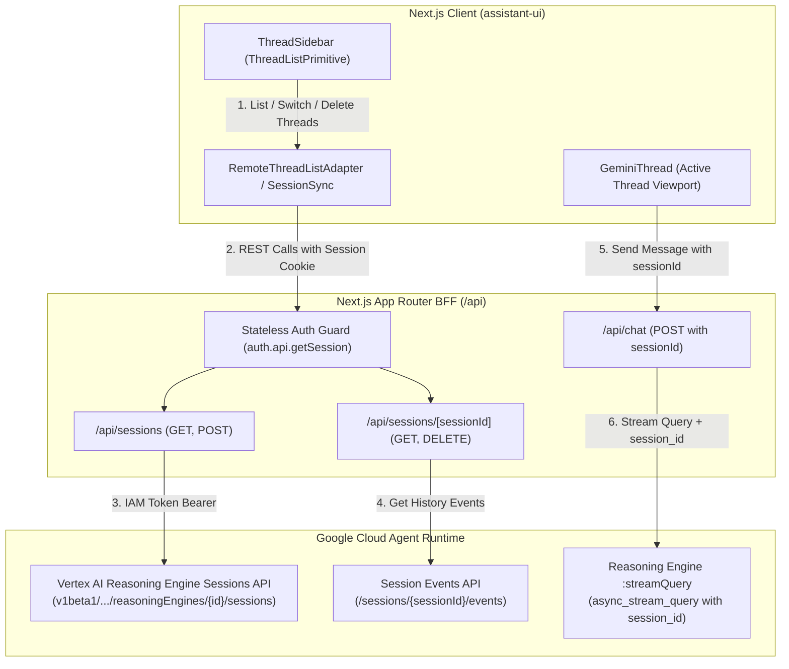

# Spec: Assistant-UI Thread List & Agent Runtime Session Service Integration

## Objective

Connect the Gemini-themed application's sidebar thread list to the **Google Cloud Agent Runtime Session Service** (Vertex AI Reasoning Engines Sessions API) using **`@assistant-ui/react`** thread list primitives and runtime adapters.

This replaces the static fake threads with real, persistent, per-user multi-turn conversation sessions stored directly on Google Cloud Agent Runtime, complete with:

1. Server-side session history management per authenticated user (`user_id`).
2. Seamless thread switching, historical message/event restoration, thread creation, and thread deletion.
3. Full compatibility with offline/local mock mode (`MOCK_AGENT_RUNTIME=true`).

---

## Assumptions

1. **User Identity Isolation**: Every session is scoped to the authenticated user's ID (`session.user.id` or `session.user.email`) extracted from the stateless cryptographic JWT session cookie on the BFF server.
2. **Backend Authentication**: The Next.js BFF uses Google Cloud Application Default Credentials (ADC) / Workload Identity via `google-auth-library` to query the Vertex AI Reasoning Engines Sessions REST API.
3. **Session ID Propagation**: When sending prompts to `/api/chat`, the active `sessionId` is passed in the request body so the ADK agent runtime preserves multi-turn context on Vertex AI.
4. **Mock Mode Parity**: When `MOCK_AGENT_RUNTIME=true` or when Google Cloud credentials are unconfigured, the app falls back to an in-memory/simulated session manager providing realistic mock session persistence.

---

## Architecture & Data Flow



---

## API & Data Contracts

### 1. Agent Runtime Session REST API Endpoints (Google Cloud)

- **List Sessions**: `GET https://{LOCATION}-aiplatform.googleapis.com/v1beta1/projects/{PROJECT_ID}/locations/{LOCATION}/reasoningEngines/{REASONING_ENGINE_ID}/sessions?filter=user_id="{USER_ID}"`
- **Create Session**: `POST https://{LOCATION}-aiplatform.googleapis.com/v1beta1/projects/{PROJECT_ID}/locations/{LOCATION}/reasoningEngines/{REASONING_ENGINE_ID}/sessions`
  - Body: `{"userId": "{USER_ID}", "displayName": "{TITLE}"}`
- **Get Session**: `GET https://{LOCATION}-aiplatform.googleapis.com/v1beta1/projects/{PROJECT_ID}/locations/{LOCATION}/reasoningEngines/{REASONING_ENGINE_ID}/sessions/{SESSION_ID}`
- **Delete Session**: `DELETE https://{LOCATION}-aiplatform.googleapis.com/v1beta1/projects/{PROJECT_ID}/locations/{LOCATION}/reasoningEngines/{REASONING_ENGINE_ID}/sessions/{SESSION_ID}`
- **List Events**: `GET https://{LOCATION}-aiplatform.googleapis.com/v1beta1/projects/{PROJECT_ID}/locations/{LOCATION}/reasoningEngines/{REASONING_ENGINE_ID}/sessions/{SESSION_ID}/events`

### 2. Next.js BFF Endpoints

#### `GET /api/sessions`

- **Auth**: Required (`HttpOnly` session cookie)
- **Response**:
  ```json
  {
    "sessions": [
      {
        "id": "session-abc123",
        "title": "ADK Agent Architecture Review",
        "createdAt": "2026-08-06T10:00:00.000Z",
        "updatedAt": "2026-08-06T10:30:00.000Z"
      }
    ]
  }
  ```

#### `POST /api/sessions`

- **Auth**: Required
- **Body** (optional): `{ "title": "New conversation" }`
- **Response**: `{ "session": { "id": "session-xyz789", "title": "New conversation", "createdAt": "..." } }`

#### `GET /api/sessions/[sessionId]`

- **Auth**: Required
- **Response**:
  ```json
  {
    "session": {
      "id": "session-abc123",
      "title": "ADK Agent Architecture Review",
      "createdAt": "...",
      "messages": [
        {
          "id": "msg-1",
          "role": "user",
          "content": "How do I structure ADK tools?"
        },
        {
          "id": "msg-2",
          "role": "assistant",
          "content": "In Google Cloud ADK...",
          "reasoning": "Inspecting ADK tool schemas..."
        }
      ]
    }
  }
  ```

#### `DELETE /api/sessions/[sessionId]`

- **Auth**: Required
- **Response**: `{ "success": true, "deletedSessionId": "session-abc123" }`

#### `POST /api/chat` (Updated)

- **Body**:
  ```json
  {
    "messages": [{ "role": "user", "content": "..." }],
    "sessionId": "session-abc123",
    "modelTier": "pro"
  }
  ```

---

## Tech Stack & Dependencies

- **UI & Primitives**: `@assistant-ui/react` (`ThreadListPrimitive`, `ThreadListItemPrimitive`, `useRemoteThreadListRuntime`), Lucide icons, Radix UI.
- **Client State**: React 19, `@assistant-ui/react` runtime hooks.
- **BFF / Server**: Next.js 15 App Router (`/api/sessions/*`, `/api/chat`).
- **GCP Client**: `google-auth-library` (`GoogleAuth`, IAM bearer token caching).
- **Testing**: Vitest (`vitest run`), `@testing-library/react`, `jsdom`.

---

## Commands

```bash
# Development
bun run dev

# Testing
bun run test

# Typecheck & Lint
bun run check
bun run lint

# Preflight Check
bun run preflight
```

---

## Project Structure & Touched Files

```
src/
├── app/
│   ├── api/
│   │   ├── chat/
│   │   │   └── route.ts                       # Pass sessionId to streamQuery
│   │   └── sessions/
│   │       ├── route.ts                       # GET (list), POST (create)
│   │       └── [sessionId]/
│   │           └── route.ts                   # GET (details/events), DELETE
│   └── page.tsx                               # Wire RemoteThreadListRuntime / Session state
├── components/
│   └── assistant-ui/
│       ├── thread-sidebar.tsx                 # ThreadListPrimitive integration + Gemini UI
│       ├── thread-list-item.tsx               # Individual thread item with delete/rename
│       └── gemini-thread.tsx                  # Active thread header / empty state
├── lib/
│   ├── agent-runtime-client.ts                # Session CRUD methods + session_id streaming
│   └── session-adapter.ts                     # Assistant-UI RemoteThreadListAdapter implementation
└── types/
    └── agent.ts                               # Session & Event type definitions
tests/
├── sessions-api.test.ts                       # API route integration tests
└── thread-sidebar.test.tsx                    # Component & thread list tests
```

---

## Testing Strategy

1. **Unit & API Tests (`tests/sessions-api.test.ts`)**:
   - `GET /api/sessions`: returns user's sessions; rejects unauthenticated requests with 401.
   - `POST /api/sessions`: creates a session with generated ID and returns 201.
   - `DELETE /api/sessions/[sessionId]`: deletes session; handles non-existent session safely.
   - `GET /api/sessions/[sessionId]`: retrieves history events and converts them to assistant-ui message format.
2. **Component Tests (`tests/thread-sidebar.test.tsx`)**:
   - Renders thread list with active selection.
   - Clicking "New chat" triggers new session creation.
   - Deleting a thread triggers confirmation and updates the list.
   - Collapses and expands cleanly without breaking layout.
3. **Preflight Validation**:
   - `bun run preflight` passes 100% with zero linter or type errors.

---

## Boundaries

- **Always**:
  - Authenticate every `/api/sessions/*` request against the signed stateless session cookie.
  - Enforce `user_id` filtering so users only see their own sessions.
  - Provide complete mock implementations when `MOCK_AGENT_RUNTIME=true`.
  - Maintain the clean Google Gemini aesthetic (rounded corners, dark/light theme, subtle hover states).
- **Ask First**:
  - Adding external database dependencies (we remain 100% serverless on Vertex AI Sessions Service).
  - Modifying the core auth cookie structure.
- **Never**:
  - Expose Google Cloud IAM access tokens or project credentials to the client browser.
  - Hardcode project IDs or locations.
  - Remove existing tests or break existing chat streaming functionality.

---

## Success Criteria

1. Authenticated users see their past sessions listed in the sidebar under chronological buckets (Today, Yesterday, Older).
2. Clicking a session switches active thread and displays previous messages and reasoning traces fetched from Agent Runtime session events.
3. Clicking "New chat" creates a fresh session and clears the conversation viewport.
4. Hovering on a session displays a delete action that successfully removes the session from the Agent Runtime Session Service.
5. In mock mode, sessions are stored in an in-memory mock store that survives client interactions within the dev session.
6. `bun run preflight` passes with all tests green.
