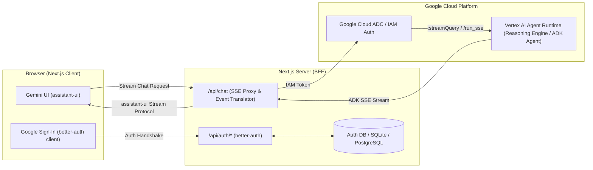

# Spec: LLM Council UI (Gemini-Themed Webapp for Google Cloud Agent Runtime)

## Objective

Build a production-ready, high-fidelity web application styled after Google Gemini that connects authenticated users to an ADK (Agent Development Kit) agent hosted on Google Cloud Agent Runtime (Vertex AI Reasoning Engines).

### Target Audience & User Stories

- **End User**: Authenticates via Google Single Sign-On (SSO), initiates conversations with the AI agent, receives real-time streaming answers, views reasoning/thought traces, interacts with tool executions, and manages multi-thread conversation history.
- **Developer/Admin**: Easily configures Google Cloud credentials (ADC / Workload Identity), connects any deployed Agent Runtime reasoning engine ID, and deploys the frontend cleanly to Google Cloud Run or modern hosting platforms.

---

## Architecture & System Flow



---

## Tech Stack

- **Package Manager & Runtime**: Bun (v1.3+)
- **Framework**: Next.js 15 (App Router), React 19 / 18, TypeScript (strict mode)
- **UI & Components**:
  - `@assistant-ui/react` (Gemini Clone layout & primitives)
  - `tailwindcss` v4 / v3, `@tailwindcss/typography`
  - `shadcn/ui` (Radix UI primitives, Lucide icons, dropdowns, tooltips, dialogs)
  - `lucide-react`
- **Authentication**:
  - `better-auth` with Google OAuth Provider (Google Identity)
  - `better-sqlite3` / Drizzle ORM (lightweight local DB, scalable to Cloud SQL / Postgres)
- **Google Cloud Backend Integration**:
  - `google-auth-library` (Application Default Credentials & GCP Access Token generation)
  - Custom streaming SSE proxy connecting to Vertex AI Reasoning Engine `:streamQuery` or Agent Runtime HTTP `/run_sse` passthrough.
- **Code Quality & Tooling**:
  - `eslint` (Next.js ESLint configuration)
  - `prettier` (Code formatter)
  - `concurrently` (Parallel runner for preflight checks)
  - `vitest` (Fast unit and component test runner with jsdom and @testing-library/react)

---

## Commands

```bash
# Development
bun install
bun run dev

# Code Quality & Formatting
bun run format      # Prettier code format
bun run check       # TypeScript type checking (tsc --noEmit)
bun run lint        # ESLint check
bun run test        # Bun test runner

# Unified Preflight Validation
bun run preflight   # Runs format then concurrently executes check, lint, and test

# Production Build & Start
bun run build
bun run start

# Docker (Cloud Run ready)
docker build -t llm-council-ui .
docker run -p 3000:3000 --env-file .env.local llm-council-ui
```

---

## Project Structure

```
llm-council-ui/
├── src/
│   ├── app/
│   │   ├── api/
│   │   │   ├── auth/
│   │   │   │   └── [...all]/route.ts       # better-auth API handler
│   │   │   └── chat/
│   │   │       └── route.ts               # Streaming proxy to Vertex AI Agent Runtime
│   │   ├── login/
│   │   │   └── page.tsx                   # Gemini-styled Google SSO login page
│   │   ├── globals.css                    # Tailwind setup & Gemini ambient glow styles
│   │   ├── layout.tsx                     # Root layout with session & theme providers
│   │   └── page.tsx                       # Main Gemini chat interface
│   ├── components/
│   │   ├── assistant-ui/
│   │   │   ├── gemini-thread.tsx          # Full Gemini layout (Empty greeting + Thread)
│   │   │   ├── gemini-composer.tsx        # Single-row pill composer (+ menu, mic, send states)
│   │   │   ├── gemini-message.tsx         # Full-width markdown assistant reply & user bubble
│   │   │   ├── gemini-attachment.tsx      # File & photo attachment chips
│   │   │   ├── gemini-tools.tsx           # Tool execution chips & reasoning accordions
│   │   │   └── thread-sidebar.tsx         # Collapsible thread history sidebar
│   │   ├── auth/
│   │   │   ├── user-avatar-menu.tsx       # User profile dropdown with logout
│   │   │   └── login-button.tsx           # Google Sign-In button
│   │   └── ui/                            # shadcn/ui components (button, dropdown, tooltip, dialog)
│   ├── lib/
│   │   ├── auth.ts                        # better-auth server configuration
│   │   ├── auth-client.ts                 # better-auth client hooks
│   │   ├── agent-runtime-client.ts        # Vertex AI Reasoning Engine stream handler
│   │   └── utils.ts                       # cn and styling helpers
│   └── types/
│       └── agent.ts                       # ADK event types and message schemas
├── docs/
│   └── spec.md                            # Living specification document
├── tasks/
│   ├── plan.md                            # Architecture & implementation plan
│   └── todo.md                            # Atomic task breakdown
├── tests/
│   ├── unit/                              # Component & auth unit tests
│   └── integration/                       # Agent Runtime mock streaming tests
├── .env.example                           # Template environment variables
├── next.config.ts                         # Next.js configuration
├── tailwind.config.ts                     # Tailwind theme tokens & animations
├── package.json
└── tsconfig.json
```

---

## UI / UX Design Specifications (Gemini Clone)

### 1. Visual Atmosphere & Aesthetics

- **Empty State**:
  - Centered headline: _"How can I help you today?"_ (`text-4xl font-normal text-[#1f1f1f] dark:text-white`).
  - Ambient radial glow underneath the headline (`bg-[#a9d1fb]/60 dark:bg-[#1b2f9c]/50 blur-[90px] rounded-[140px]`).
- **Single-Row Pill Composer**:
  - Floating pill container (`rounded-4xl bg-white dark:bg-[#1e1f20] shadow-[0_2px_10px_-2px_rgba(0,0,0,0.18)]`).
  - Left: `+` combined menu (Upload file, Deep Research, Tools).
  - Center: Elastic auto-resizing text input (`Ask Gemini`).
  - Right: Model selector (`Flash` / `Pro`), Voice/Mic trigger button, Dynamic Send/Stop button.
- **Dynamic Send States**:
  - Empty: Disabled grey arrow button.
  - Active text: Vibrant blue circular send button (`bg-[#d3e3fd] text-[#062e6f]`).
  - Streaming: Stop square cancel button (`ComposerPrimitive.Cancel`).
- **Message Rendering**:
  - **User**: Compact rounded-3xl grey bubble (`bg-[#f0f4f9] dark:bg-[#282a2c]`), right-aligned.
  - **Assistant**: Full-width avatar-free rich markdown with syntax highlighting, copy button, and collapsible thought/reasoning blocks.
  - **Tool Executions**: Interactive chips displaying function call name, parameters, and collapsible output payload.

---

## Authentication & Security (`better-auth` + Google Identity)

- **Identity Provider**: Google OAuth 2.0 (Sign in with Google / Google Workspace). Users log in directly with their Google identity.
- **Provider Configuration**:
  ```ts
  socialProviders: {
    google: {
      clientId: process.env.GOOGLE_CLIENT_ID!,
      clientSecret: process.env.GOOGLE_CLIENT_SECRET!,
    },
  }
  ```
- **Session Handling**: Secure HTTP-only session cookies managed by `better-auth` with server-side session validation on all protected routes and the `/api/chat` endpoint.
- **User & Session Storage**: SQLite (`auth.db`) for lightweight local development, ready for PostgreSQL / Google Cloud SQL in production.
- **GCP IAM Security**:
  - Browser never receives Google Cloud Service Account credentials.
  - The Next.js server uses Application Default Credentials (`google-auth-library`) to fetch scoped Google Cloud IAM access tokens to securely communicate with the Vertex AI Reasoning Engine API.

---

## Agent Runtime Integration & Streaming Contract

### Vertex AI Reasoning Engine Endpoint

- Target URL:
  `https://{LOCATION}-aiplatform.googleapis.com/v1/{RESOURCE_NAME}:streamQuery`
  _(where RESOURCE_NAME is `projects/{PROJECT}/locations/{LOCATION}/reasoningEngines/{ENGINE_ID}`)_
- Alternative Container Route via Passthrough:
  `https://{LOCATION}-aiplatform.googleapis.com/reasoningEngines/v1/{RESOURCE_NAME}/api/run_sse`

### Streaming Translation

1. Client sends message payload to `/api/chat`.
2. Server verifies `better-auth` user session.
3. Server generates GCP Bearer Token using ADC.
4. Server initiates streaming request to Agent Runtime.
5. Server transforms raw ADK JSON stream events (Text, Thoughts, Tool Calls, Artifacts) into Server-Sent Events (SSE) compatible with `assistant-ui`.

---

## Boundaries & Constraints

- **Always do**:
  - Enforce strict TypeScript types with zero `any`.
  - Validate user session before proxying any request to Agent Runtime.
  - Support both Light and Dark modes seamlessly.
  - Handle SSE connection errors, timeouts, and network disconnects gracefully with user-friendly alerts.
- **Ask first**:
  - Switching database engines (e.g. SQLite to PostgreSQL / Cloud SQL).
  - Adding heavy external UI libraries beyond Tailwind/shadcn.
- **Never do**:
  - Hardcode Google Cloud Service Account private keys or credentials in client bundles.
  - Expose raw GCP API errors or internal stack traces to the frontend UI.

---

## Success Criteria

- [ ] User can sign in with Google SSO via `better-auth`.
- [ ] Interface renders the exact Gemini aesthetic (ambient glow, centered greeting, single-row pill composer, avatar-free markdown replies).
- [ ] Chat sends prompts to the backend and renders streaming tokens smoothly in real time.
- [ ] Model selector, tool execution traces, and collapsible reasoning blocks render correctly.
- [ ] Session is protected, resilient to refresh, and deployable to Cloud Run via Docker.

---

## Open Questions & Assumptions for Approval

1. **Agent Runtime Resource ID**: What is your Google Cloud Project ID, Location (e.g. `us-central1`), and Reasoning Engine ID? (We will provide `.env.example` placeholders so you can plug in any engine).
2. **Local Database**: For `better-auth` user tables, SQLite (`better-sqlite3`) is configured by default for zero-setup local dev. Is this suitable for your dev phase before moving to PostgreSQL?
