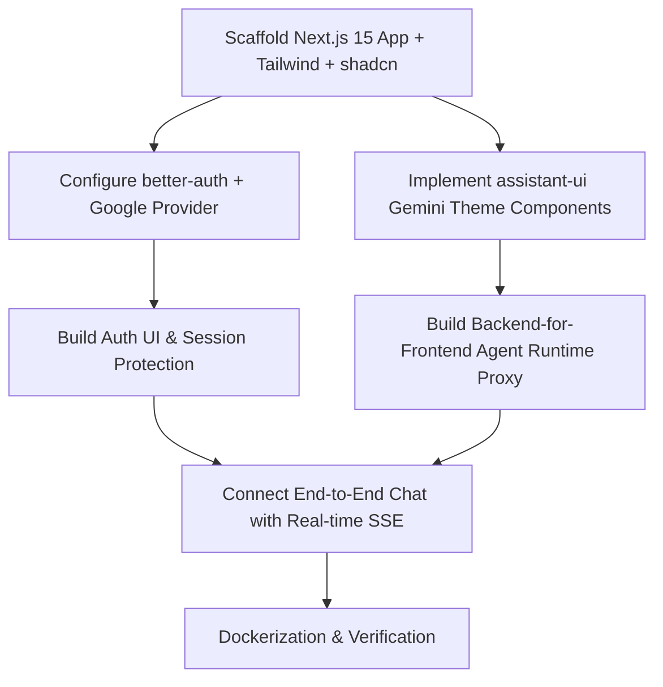

# Implementation Plan: LLM Council UI (Gemini Clone + better-auth + Agent Runtime)

## Overview

This plan implements the Next.js web application specified in [docs/spec.md](file:///Users/mblanc/projects/llm-council-ui/docs/spec.md). It establishes the scaffolding, `better-auth` integration with Google OAuth, the `assistant-ui` Gemini-themed frontend, and the secure Backend-For-Frontend (BFF) streaming proxy connecting to Google Cloud Agent Runtime.

---

## Architecture & Dependency Flow

---

## Phases & Checkpoints

### Phase 1: Foundation, Scaffolding & Tooling

- Initialize project with Bun, Next.js 15 App Router, TypeScript, and Tailwind CSS.
- Configure `eslint`, `prettier`, and `concurrently`.
- Setup the unified validation script: `"preflight": "bun run format && concurrently --kill-others-on-fail -n check,lint,test \"bun run check\" \"bun run lint\" \"bun run test\""`.
- Install and configure `@assistant-ui/react`, `@assistant-ui/react-markdown`, `lucide-react`, `better-auth`, `google-auth-library`.
- **Verification**: `bun run preflight` and `bun run build` succeed on clean scaffolding.

### Phase 2: Authentication Layer (`better-auth`)

- Setup `src/lib/auth.ts` with SQLite database adapter and Google OAuth configuration.
- Implement `/api/auth/[...all]` route handler.
- Setup `src/lib/auth-client.ts` with React client hooks.
- Create `/login` page with Google SSO button and auth guard for protected chat routes.
- **Verification**: Local auth flow initiates and session state is exposed to React context.

### Phase 3: Gemini UI Experience (`assistant-ui`)

- Implement `gemini-thread.tsx` with:
  - Empty state with centered _"How can I help you today?"_ headline and soft ambient radial glow.
  - Single-row pill composer (`gemini-composer.tsx`) with `+` tools menu, dynamic resize input, model switcher, and stateful send/stop button.
  - Avatar-free full-width markdown assistant reply (`gemini-message.tsx`).
  - Right-aligned rounded warm-grey user message bubbles.
  - Collapsible reasoning/thought trace blocks and tool call cards.
  - Sidebar for multi-thread conversation history.
- **Verification**: UI renders identical to the Gemini clone specification in light and dark modes.

### Phase 4: Google Cloud Agent Runtime Integration (BFF)

- Implement `src/lib/agent-runtime-client.ts` using `google-auth-library` to generate IAM Bearer tokens.
- Implement `/api/chat/route.ts` streaming route handler:
  - Session verification with `better-auth`.
  - Transform request into Vertex AI Reasoning Engine `:streamQuery` or `/run_sse` passthrough format.
  - Stream parsed SSE chunks (text, thoughts, tool executions) back to `@assistant-ui/react`.
  - Include a local mock mode for development without active GCP credentials.
- **Verification**: Chat streaming works end-to-end, parsing text and reasoning traces without dropped tokens.

### Phase 5: Production Readiness & Packaging

- Create multi-stage production `Dockerfile` optimized for Google Cloud Run.
- Setup `.env.example` with documented config variables.
- Write smoke and integration tests.
- **Verification**: Production build and container run smoothly.
