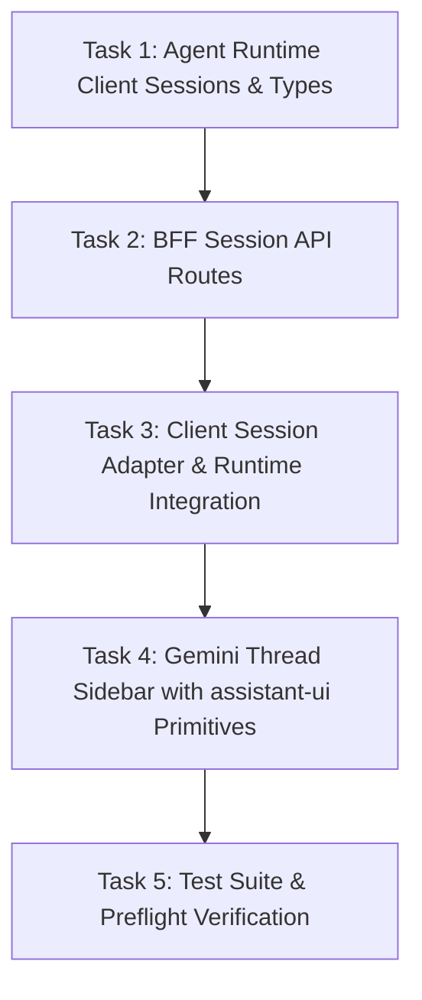

# Implementation Plan: Assistant-UI Thread List & Agent Runtime Session Service Integration

## Overview

Connect the Gemini-themed application's sidebar thread list to the **Google Cloud Agent Runtime Session Service** (Vertex AI Reasoning Engines Sessions API) using **`@assistant-ui/react`** thread list primitives and Next.js Backend-For-Frontend (BFF) routes.

---

## Architecture Decisions

1. **User Identity Isolation**: Use `session.user.id` (canonical Google OAuth `sub`) for all session partitioning and API queries (`filter=user_id="{userId}"`), ensuring security and immutability.
2. **Stateless BFF Layer**: The Next.js server validates the signed cryptographic session cookie, mints Google Cloud IAM bearer tokens via `google-auth-library` (ADC), and queries Vertex AI Reasoning Engines REST endpoints. No external database is needed.
3. **Session ID in Stream Queries**: When chatting, the active `sessionId` is passed into `POST /api/chat` and dispatched to `async_stream_query` input (`session_id`) on Vertex AI.
4. **Mock Parity for Local Dev**: Full in-memory session CRUD simulation when `MOCK_AGENT_RUNTIME=true` or when Google Cloud credentials are not configured.

---

## Dependency & Implementation Order

---

## Phase 1: Foundation & Backend Services

### Task 1: Agent Runtime Client Sessions & Types

- **Description**: Add session and event schemas to `src/types/agent.ts` and implement session management methods (`listSessions`, `createSession`, `getSession`, `deleteSession`, `listSessionEvents`) in `src/lib/agent-runtime-client.ts`, supporting both live GCP REST calls and local mock mode.
- **Acceptance Criteria**:
  - `src/types/agent.ts` defines `AgentSession`, `AgentSessionEvent`, and updated `ChatRequestBody`.
  - `AgentRuntimeClient` can list, create, get, and delete sessions on Vertex AI Reasoning Engines or mock storage.
  - `streamQuery` accepts `sessionId` and forwards `session_id` to `async_stream_query`.
- **Verification**: `bun run test tests/agent-client.test.ts`
- **Files**: `src/types/agent.ts`, `src/lib/agent-runtime-client.ts`, `tests/agent-client.test.ts`

### Task 2: Next.js BFF Session API Routes (`/api/sessions/*`)

- **Description**: Implement authenticated API route handlers for session listing, creation, event history retrieval, and deletion.
- **Acceptance Criteria**:
  - `GET /api/sessions`: Authenticates user, returns list of sessions scoped to `user_id`.
  - `POST /api/sessions`: Creates a new session on Agent Runtime.
  - `GET /api/sessions/[sessionId]`: Returns session details and turn event history.
  - `DELETE /api/sessions/[sessionId]`: Deletes session from Agent Runtime.
  - `POST /api/chat`: Accepts `sessionId` and passes it to `agentClient.streamQuery`.
  - Rejects unauthenticated requests with 401.
- **Verification**: `bun run test tests/sessions-api.test.ts`
- **Files**: `src/app/api/sessions/route.ts`, `src/app/api/sessions/[sessionId]/route.ts`, `src/app/api/chat/route.ts`, `tests/sessions-api.test.ts`

### Checkpoint: Backend & API Verification

- [ ] Session client unit tests pass
- [ ] BFF session API integration tests pass
- [ ] `bun run check` succeeds

---

## Phase 2: Client Adapter & UI Integration

### Task 3: Client Session Adapter & Runtime Wiring

- **Description**: Implement client session adapter and wire `useRemoteThreadListRuntime` or session-aware state management in `src/app/page.tsx` and `src/lib/gemini-runtime-adapter.ts`.
- **Acceptance Criteria**:
  - `src/lib/session-adapter.ts` provides a `RemoteThreadListAdapter` that bridges assistant-ui with `/api/sessions`.
  - Chat page wires the remote thread list runtime with `geminiChatAdapter`.
  - Active session ID is propagated during message execution.
  - Switching threads loads session history.
- **Verification**: `bun run check` and component tests
- **Files**: `src/lib/session-adapter.ts`, `src/lib/gemini-runtime-adapter.ts`, `src/app/page.tsx`

### Task 4: Gemini-Themed Thread Sidebar with Assistant-UI Primitives

- **Description**: Upgrade `src/components/assistant-ui/thread-sidebar.tsx` with `@assistant-ui/react` primitives (`ThreadListPrimitive.Root`, `ThreadListPrimitive.New`, `ThreadListPrimitive.Items`, `ThreadListItemPrimitive`).
- **Acceptance Criteria**:
  - Displays real user sessions fetched from Agent Runtime Session Service.
  - "New chat" button creates a new thread.
  - Selecting a thread switches active conversation context.
  - Delete button removes session with confirmation.
  - Collapses to `w-16` icon-only mode and expands to `w-64` smoothly.
  - Loading skeleton states displayed while fetching.
- **Verification**: `bun run test tests/thread-sidebar.test.tsx`
- **Files**: `src/components/assistant-ui/thread-sidebar.tsx`, `tests/thread-sidebar.test.tsx`

---

## Phase 3: Polish & Preflight Validation

### Task 5: End-to-End Verification & Preflight

- **Description**: Run full automated test suite, verify types, linting, formatting, and preflight script.
- **Acceptance Criteria**:
  - `bun run preflight` passes 100% (format, check, lint, test).
  - All existing and new tests pass cleanly.
- **Verification**: `bun run preflight`
- **Files**: All touched files

---

## Risks and Mitigations

| Risk                                | Impact | Mitigation                                                                                                                             |
| :---------------------------------- | :----- | :------------------------------------------------------------------------------------------------------------------------------------- |
| **GCP Credentials Missing locally** | Med    | Provide complete mock session store when `MOCK_AGENT_RUNTIME=true` or when ADC credentials are not configured.                         |
| **Session Event Format Variance**   | Low    | Robust parser in `AgentRuntimeClient.listSessionEvents` that handles both ADK `user_query`/`model_response` and standard part schemas. |
| **Thread Switching Lag**            | Low    | Optimistic UI updates with skeleton loaders while fetching history from `/api/sessions/[sessionId]`.                                   |
